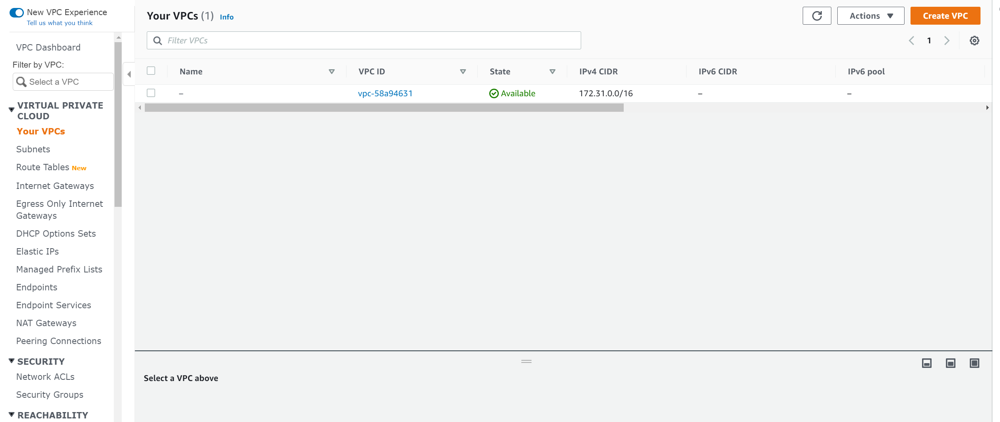
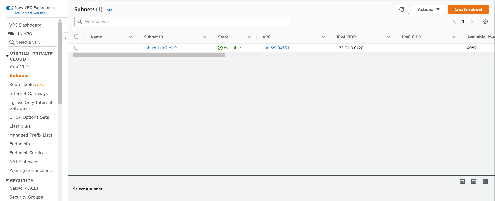
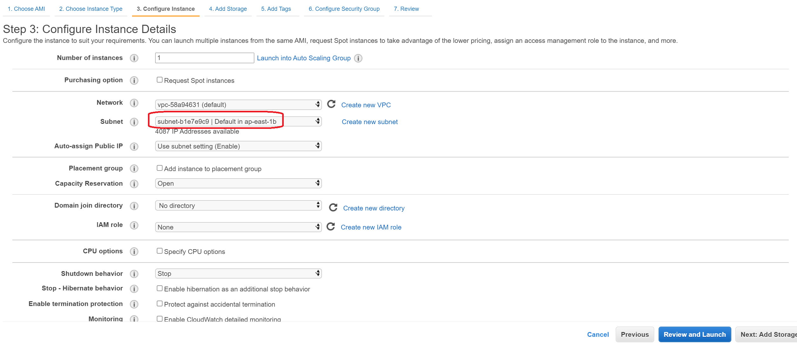
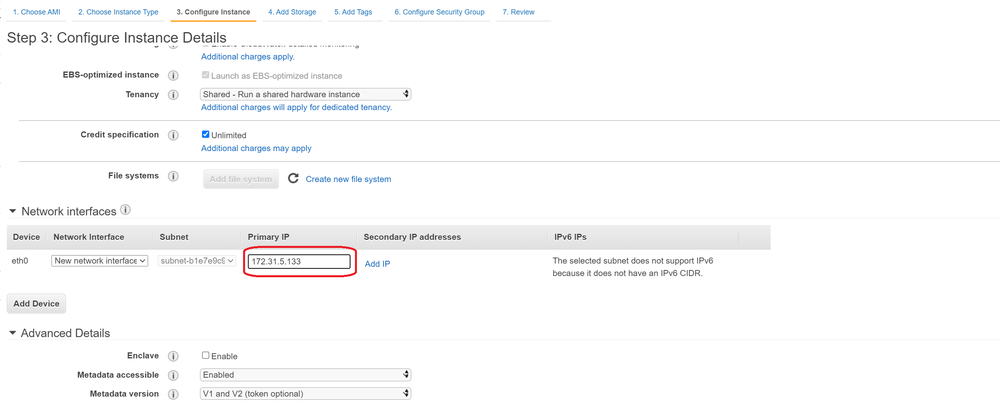
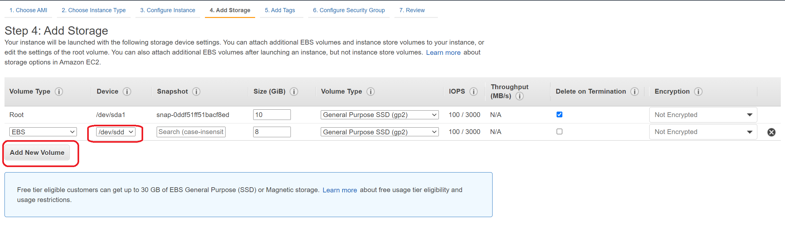
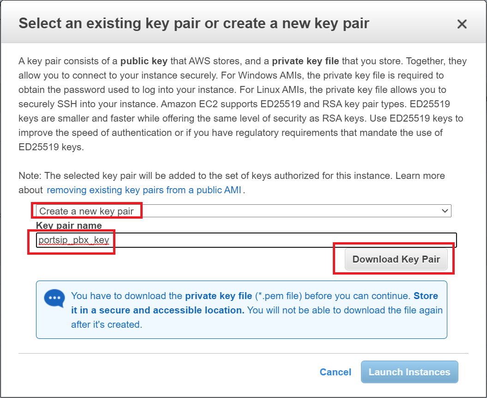
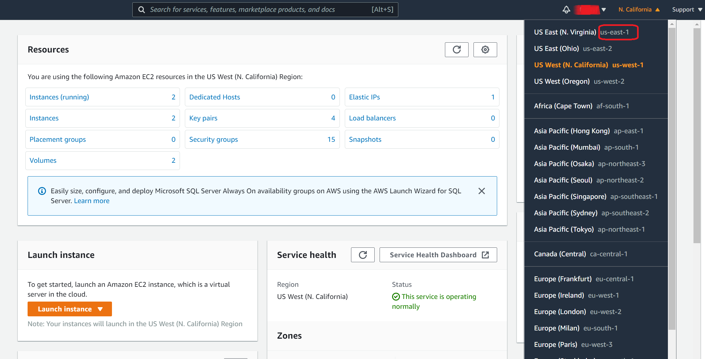
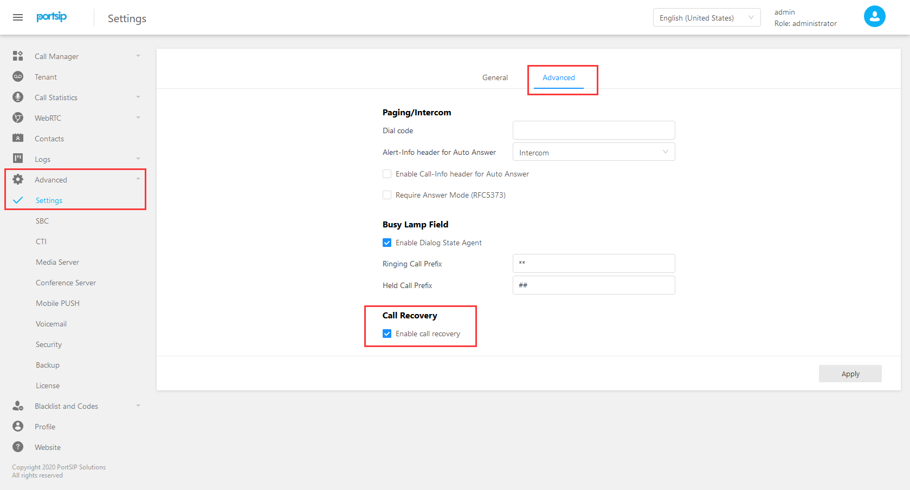

# Deploy the PortSIP PBX HA on AWS


**Note**: all Linux commands mentioned in this documentation, must be performed by the root user.


## Prerequisites

* **Ubuntu 20.04** or C**entOS 7.9**, 64 bit
* Three AWS EC2 instances (in this documentation, the “**EC2 server**“ and “**node**“ are the same thing, both referring to the AWS EC2 instance)
* The EC2 instance minimum requirements: 2 vCPU and 4G memory
* Must enable ‘**assign the public IP automatically**’ for each node
* Allocate the static private IP for each node
* All EC2 servers must be located within the same Region, VPC, and subnet
* An elastic IP
* Each EC2 server should have a disk mounted to the same path and be the same size
* Choose any one node as the “**master node**“, unless explicitly specified all operations are performed via the master node

## Example

### Create VPC and EC2

In the PortSIP PBX HA, all nodes will be deployed in the same VPC, subnet, we will need to assign the static private IP of the subnet to the nodes.

#### **1. Create VPC**

Open the AWS VPC menu, you can choose an existing VPC, or click the “**Create VPC**“ to create a new one. As the below screenshot, the VPC IP range is **172.31.0.0**.



#### **2. Create the subnet**

Click the “**Subnets**“ menu to list the subnets, if there are no subnets, please click “**Create subnet**“ to create a new one. As below screenshot, the “**Subnet ID**“ is “**subnet-b1e7e9c9**“, the IP range is **172.31.0.0/20**.

In this case, we assign **172.31.5.133** to node 1, **172.31.5.134** to node 2, **172.31.5.135** to node 3.



#### **3. Assign static private IP to EC2 instance**

When creating an EC2 instance, in step 3 “**Configure Instance, "** choose the subnet you created before, if it’s “**subnet-b1e7e9c9**“.&#x20;

The “**Auto-assign Public IP**“ should choose "**Enable**".



In the “**Network interfaces**“ section, enter the IP “**172.31.5.133**“ for the “**Primary IP**“ field for node 1; Enter the IP “**172.31.5.134**“ for “**Primary IP**“ field for node 2; Enter the IP “**172.31.5.135**“ for “**Primary IP**“ field for node 3.



####

#### **4. Add disk volume**

In step 4 “**Add Storage**“, click the “**Add New Volume**“ to add an extra disk volume.



**Note** you will need to add the new volume for each EC2 instance, they will have the same size, and the same mount path in the case is **/dev/sdd,** the new volume size suggests at least 50G GB.


**Important**: don't set encryption for the new volume.



#### 5. Check node information

The **Node Host Name** is setting up automatically by AWS in default after you created the EC2 instance.

| NODE HOST NAME  | PUBLIC IP       | PRIVATE IP   | DISK           | ENABLE ROOT USER |
| --------------- | --------------- | ------------ | -------------- | ---------------- |
| ip-172-31-5-133 | Assigned by AWS | 172.31.5.133 | /dev/sdd (8GB) | **YES**          |
| ip-172-31-5-134 | Assigned by AWS | 172.31.5.134 | /dev/sdd (8GB) | **YES**          |
| ip-172-31-5-135 | Assigned by AWS | 172.31.5.135 | /dev/sdd (8GB) | **YES**          |


_**Note**_ in this case we use the node “**ip-172-31-5-133**“ to act as the master node.


#### &#x20;<a href="#security-group" id="security-group"></a>

#### 6. Security group

**Inbound rule**

| **TYPE**   | **PROTOCOL** | **PORT RANGE** | **SOURCE** | **DESCRIPTION** - OPTIONAL |
| ---------- | ------------ | -------------- | ---------- | -------------------------- |
| Custom TCP | TCP          | 2224           | 0.0.0.0/0  | Resource manager           |
| SSH        | TCP          | 22             | 0.0.0.0/0  | ssh                        |
| Custom TCP | TCP          | 7789           | 0.0.0.0/0  | disk data sync             |
| Custom TCP | TCP          | 5065           | 0.0.0.0/0  | SIP WSS                    |
| Custom UDP | UDP          | 5060           | 0.0.0.0/0  | SIP Signaling              |
| Custom TCP | TCP          | 8899 - 8900    | 0.0.0.0/0  | REST API                   |
| Custom UDP | UDP          | 5404 - 5406    | 0.0.0.0/0  | corosync                   |
| Custom TCP | TCP          | 9333           | 0.0.0.0/0  | dfs port                   |
| Custom UDP | UDP          | 25000 - 34999  | 0.0.0.0/0  | RTP                        |
| Custom UDP | UDP          | 45000 - 65000  | 0.0.0.0/0  | RTP                        |
| Custom TCP | TCP          | 8881 - 8888    | 0.0.0.0/0  | Management                 |

**Outbound rule**

| **TYPE**    | **PROTOCOL** | **PORT RANGE** | **DESTINATION** | **DESCRIPTION - OPTIONAL** |
| ----------- | ------------ | -------------- | --------------- | -------------------------- |
| All traffic | All          | All            | 0.0.0.0/0       | –                          |


_**Note**_ configure the security group for all nodes


#### &#x20;<a href="#5-download-the-key-pair" id="5-download-the-key-pair"></a>

#### 7. Download the “key pair” <a href="#5-download-the-key-pair" id="5-download-the-key-pair"></a>

After clicking the “**Launch**“ button, AWS will pop up a window to select an existing key pair or create a new key pair.



In this case, we create a new key pair and name it as **“portsip\_pbx\_key”**, then click the “**Download**“ button, we get the certificate file “**portsip\_pbx\_key.pem**“.

After successfully launched the first EC2 instance, repeat the same steps to create another two EC2 instances, but select “**Choose an existing key pair**“ in this step, then another two instances also use the key pair “**portsip\_pbx\_key.pem**“.


**Note** all EC2 nodes should use the same key pair.


#### &#x20;<a href="#configure-aws" id="configure-aws"></a>

#### 8. Configure AWS <a href="#configure-aws" id="configure-aws"></a>

**Create the user group and user**

1. Click the menu “**Identity and Access Management(IAM) > Access management > User group**“
2. Click “**Create group**“ button to create a new group. Then name it as “**hagroup**”. You will need to also grant the “**AmazonEC2FullAccess**“ and “**AmazonS3FullAccess**“ permissions.
3. In the “**hagroup**“, add an user “**hauser**“
4. After the user successfully added, note the “**Access key ID**“ and “**Secret access key**“ which will be used in later steps.


**Note**: In this case, we use the group name as “**hagroup**“, and the user is “**hauser**“, you can feel free to change it.


**Enable the root user**

Use the SSH client to connect to each EC2 instance and perform the below commands to set the password for root user and su root password.

```
$ sudo passwd root
$ su root
```


**Install AWS CLI**

Perform the below commands on all nodes.

**Ubuntu**

```
[root@ip-172-31-5-133:~]# apt install -y unzip
[root@ip-172-31-5-133:~]# curl "https://awscli.amazonaws.com/awscli-exe-linux-x86_64.zip" -o "awscliv2.zip"
[root@ip-172-31-5-133:~]# unzip awscliv2.zip
[root@ip-172-31-5-133:~]# ./aws/install
```

**CentOS**

```
[root@ip-172-31-5-133:~]# yum install -y unzip
[root@ip-172-31-5-133:~]# curl "https://awscli.amazonaws.com/awscli-exe-linux-x86_64.zip" -o "awscliv2.zip"
[root@ip-172-31-5-133:~]# unzip awscliv2.zip
[root@ip-172-31-5-133:~]# ./aws/install
```


**Configure AWS IAM**

First, take the region name like the screenshot, in case the region name is “**us-east-1**“.




Perform the below command on all nodes

```
aws configure
```

Enter the information by the prompt.

```
AWS Access Key ID [None]: type your Access Key ID here
AWS Secret Access Key [None]: type your Secret Access Key Here
Default region name [None]: type region name here
Default output format [None]: text
```

#### &#x20;<a href="#setup-login-in-with-ssh-certificate-with-password" id="setup-login-in-with-ssh-certificate-with-password"></a>

#### 9. Setup login in with SSH certificate with **the** password <a href="#setup-login-in-with-ssh-certificate-with-password" id="setup-login-in-with-ssh-certificate-with-password"></a>

Perform the below commands on the master node (`ip-172-31-5-133`)

```
[root@ip-172-31-5-133:~]# ssh-keygen -t rsa
Generating public/private rsa key pair.
Enter file in which to save the key (/root/.ssh/id_rsa): press Enter
Enter passphrase (empty for no passphrase): press Enter
Enter same passphrase again: Press Enter
Your identification has been saved in /root/.ssh/id_rsa.
Your public key has been saved in /root/.ssh/id_rsa.pub.
The key fingerprint is:
SHA256:zEsSndOuTmwMChtQXPDlMoYHELlIKq5HOxwIR1x+zO4 root@ip-172-31-5-133
The key's randomart image is:
+---[RSA 2048]----+
|o*++o . |
|.o+= = . o |
|=o. B * + . |
|*..o = + o |
|+oo + S . |
|..o+ o * o |
|.o.o. E B |
|. = + |
| . . . |
+----[SHA256]-----+
[root@ip-172-31-5-133:~]#
```

Upload the **portsip\_pbx\_key.pem** file to the **/root** directory of master node **ip-172-31-5-133**, the certificates file **portsip\_pbx\_key.pem** is the key pair that is created when launching the EC2 instances.

Perform the below command on master node **ip-172-31-5-133** only.

```
[root@ip-172-31-5-133:~]# chmod 600 portsip_pbx_key.pem
```


Perform commands on master node **ip-172-31-5-133** only, enter the “**yes**“ if appears “**yes/no**“.

**Ubuntu**

```
[root@ip-172-31-5-133:~]# cat ~/.ssh/id_rsa.pub | ssh -i portsip_pbx_key.pem ubuntu@ip-172-31-5-133 "cat - | sudo tee -a  /root/.ssh/authorized_keys"

[root@ip-172-31-5-133:~]# cat ~/.ssh/id_rsa.pub | ssh -i portsip_pbx_key.pem ubuntu@ip-172-31-5-134 "cat - | sudo tee -a  /root/.ssh/authorized_keys"

[root@ip-172-31-5-133:~]# cat ~/.ssh/id_rsa.pub | ssh -i portsip_pbx_key.pem ubuntu@ip-172-31-5-135 "cat - | sudo tee -a  /root/.ssh/authorized_keys"
```

**CentOS**

```
[root@ip-172-31-5-133:~]# cat ~/.ssh/id_rsa.pub | ssh -i portsip_pbx_key.pem centos@ip-172-31-5-133 "cat - | sudo tee -a  /root/.ssh/authorized_keys"

[root@ip-172-31-5-133:~]# cat ~/.ssh/id_rsa.pub | ssh -i portsip_pbx_key.pem centos@ip-172-31-5-134 "cat - | sudo tee -a  /root/.ssh/authorized_keys"

[root@ip-172-31-5-133:~]# cat ~/.ssh/id_rsa.pub | ssh -i portsip_pbx_key.pem centos@ip-172-31-5-135 "cat - | sudo tee -a  /root/.ssh/authorized_keys"
```

#### &#x20;<a href="#elastic-ip" id="elastic-ip"></a>

#### Elastic IP <a href="#elastic-ip" id="elastic-ip"></a>

Allocate an Elastic IP, for example:

```
Elastic IP: 18.167.16.89
ID：eipalloc-0acba672sa61bf1f6
```

###

### Download resource

Perform command on the master node **`ip-172-31-5-133`** only.

```
[root@ip-172-31-5-133:~]# cd /root
[root@ip-172-31-5-133:~]# wget https://www.portsip.com/downloads/ha/aws/portsip-pbx-ha-on-aws-guide-12.tar.gz
[root@ip-172-31-5-133:~]# tar vxf portsip-pbx-ha-on-aws-guide-12.tar.gz
```

### &#x20;<a href="#install-ansible" id="install-ansible"></a>

### Install ansible <a href="#install-ansible" id="install-ansible"></a>

Perform command on the master node `ip-172-31-5-133` only.

**Ubuntu**

```
[root@ip-172-31-5-133:~]# apt update -y
[root@ip-172-31-5-133:~]# apt install -y ansible
[root@ip-172-31-5-133:~]# sed -i 's#\#log_path = /var/log/ansible.log#log_path = /var/log/ansible.log#g' /etc/ansible/ansible.cfg
```

**CentOS**

```
[root@ip-172-31-5-133:~]# yum install epel-release -y && yum install ansible -y && yum remove -y epel-release
[root@ip-172-31-5-133:~]# sed -i 's#\#log_path = /var/log/ansible.log#log_path = /var/log/ansible.log#g' /etc/ansible/ansible.cfg
```

###

### Setup ansible resource group

Perform command on the master node `ip-172-31-5-133` only.

```
[root@ip-172-31-5-133:~]# cat <<EOF >>/etc/ansible/hosts
[master]
ip-172-31-5-133
[node]
ip-172-31-5-134
ip-172-31-5-135
EOF
```

### &#x20;<a href="#configure-variables" id="configure-variables"></a>

### Configure variables

Perform the below command on the master node `ip-172-31-5-133` only.

```
[root@ip-172-31-5-133:~]# fdisk -l
```

There will output the disk volumes information, in the case is the **/dev/nvme0n1** and **/dev/nvme1n1**, please note “ **/dev/nvme1n1**“ - this is the new volume which you added to the EC2 ( it’s maybe not same as /dev/nvme1n1 in your EC2, please replace it then).


**Important:** In the below commands, ensure the value of “**pbx\_datapath\_disk**“ by “**/dev/nvme1n1**“.


The “**pbx\_datapath\_size**“ is the new volume size but should be less than the actual size. In case we added the new volume with 8 GB, here we specify the “**pbx\_datapath\_size**“ is 7900 M.

Please prepare the value for the below Variables:

| VARIABLES           | TYPE   | DESCRIPTION                                                                            |
| ------------------- | ------ | -------------------------------------------------------------------------------------- |
| pbx01\_hostname     | string | The hostname of the EC2 instance, in this case, is ip-172-31-5-133                     |
| pbx02\_hostname     | string | The hostname of the EC2 instance, in this case, is ip-172-31-5-134                     |
| pbx03\_hostname     | string | The hostname of the EC2 instance, in this case, is ip-172-31-5-135                     |
| pbx01\_private\_ip  | string | The private IP of the EC2 instance, in this case, is 172.31.5.133                      |
| pbx02\_private\_ip  | string | The private IP of the EC2 instance, in this case, is 172.31.5.134                      |
| pbx03\_private\_ip  | string | The private IP of the EC2 instance, in this case, is 172.31.5.135                      |
| eip                 | string | Elastic IP                                                                             |
| eip\_allocation\_id | string | The “**Allocation ID**” of the elastic IP                                              |
| pcs\_hacluster\_pwd | string | The password of “hacluster” in the HA cluster                                          |
| pbx\_image          | string | PortSIP PBX docker image                                                               |
| pbx\_datapath\_disk | string | The disk mount path                                                                    |
| pbx\_datapath\_size | string | The newly added volume disk size, should be (volume size - 100 M), in case it’s 49900M |


Perform the below command on the master node `ip-172-31-5-133` only, replace the values of the variables by your actual values in the previous step:

```
[root@ip-172-31-5-133:~]# cd /root/portsip-pbx-ha-guide

cat <<EOF >/root/portsip-pbx-ha-guide/vars.yml
pbx01_hostname: ip-172-31-5-133
pbx02_hostname: ip-172-31-5-134
pbx03_hostname: ip-172-31-5-135
pbx01_private_ip: 172.31.5.133
pbx02_private_ip: 172.31.5.134
pbx03_private_ip: 172.31.5.135
eip: 18.167.16.89
eip_allocation_id: eipalloc-0acba672sa61bf1f6
pcs_hacluster_pwd: 123456
db_pwd: 123456
pbx_image: portsip/pbx:12
pbx_datapath_disk: /dev/nvme1n1
pbx_datapath_size: 49900M
EOF
```

###

### Initialize resources

Perform command on the master node `ip-172-31-5-133` only.

(This part of the installation process may take a long time to complete, dependent on your VM resources allocated, please be patient, do not either terminate, shutdown or reboot as those actions will corrupt the installation process and fail).

```
[root@ip-172-31-5-133:~]# ansible-playbook install.yml
```

### &#x20;<a href="#reboot" id="reboot"></a>

### Reboot

Perform command on the master node `ip-172-31-5-133` only.

```
[root@ip-172-31-5-133:~]# ssh ip-172-31-5-134 "reboot"
[root@ip-172-31-5-133:~]# ssh ip-172-31-5-135 "reboot"
[root@ip-172-31-5-133:~]# reboot
```

### &#x20;<a href="#start-pcs" id="start-pcs"></a>

### Start pcs <a href="#start-pcs" id="start-pcs"></a>

After restarted, perform command on the master node `ip-172-31-5-133` only.

```
[root@ip-172-31-5-133:~]# pcs cluster enable --all
[root@ip-172-31-5-133:~]# pcs cluster start --all
```

### &#x20;<a href="#configure-the-resources" id="configure-the-resources"></a>

### Configure the resources <a href="#configure-the-resources" id="configure-the-resources"></a>

Perform command on the master node `ip-172-31-5-133` only.

(This part of the installation process may take a long time to complete, dependent on your VM resources allocated, please be patient, do not either terminate, shutdown or reboot as those actions will corrupt the installation process and fail).

```
[root@ip-172-31-5-133:~]# cd /root/portsip-pbx-ha-guide
[root@ip-172-31-5-133:~]# ansible-playbook config.yml
```

After successfully configured, in your browser you can set up your PBX by access the Elastic IP:\
[http://18.167.16.89:8888](http://18.167.16.89:8888/) or [https://18.167.16.89:8887](https://18.167.16.89:8887/).

You can also resolve your web domain to the elastic IP.

### **PBX Setup Wizard**

In the setup wizard step 1, just enter the Elastic IP as the Public IP only.

After entering the web portal of PBX, under the menu, **advanced > Settings > Advanced** page, selected **enable call recovery** and click the "**apply**" button.



