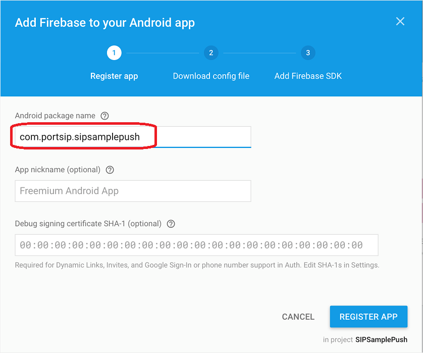
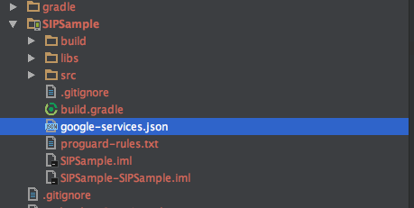
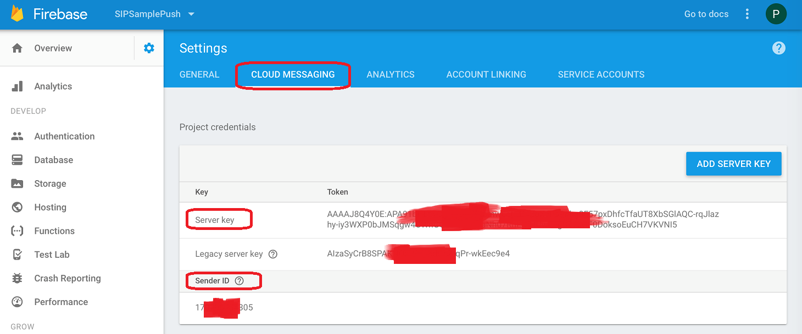

# Implement PUSH notifications in Android APP with PortSIP PBX 12.x

This guide gives you step-by-step instructions on how to create an Android App based on [PortSIP VoIP SDK](https://www.portsip.com/portsip-voip-sdk) to receive VoIP push notifications sent from [PortSIP PBX](https://www.portsip.com/portsip-pbx).

### **1. VoIP notifications**

The official documentation can be found [here](https://developer.apple.com/library/content/documentation/Performance/Conceptual/EnergyGuide-iOS/OptimizeVoIP.html). Some of the advantages include:

* The App is automatically relaunched if it’s not running when a VoIP push is received
* The device is woken up only when VoIP push occurs (to save battery)
* VoIP pushes go straight to your app for processing and are delivered without delay
* The App is automatically relaunched if it’s not running when a VoIP push is received

### **2. Prerequisite settings**

Since PortSIP PBX uses the Google Firebase to send PUSH notifications, we need to configure some settings to get this working.

### **3. Creating an App ID**

Add a new project to [Firebase console](https://firebase.google.com/).\
You will need to set the project name and country. For example, I will call my project **SIPSamplePush**.

.png>)

Select "**Add Firebase to your Android app**".\
Set a package name for your app. I only set my package name and omit the SHA-1 because I don't use Firebase for my app's authentication.



Click the **REGISTER APP** button here to download **google-services.json**. This is an important file and you will need to put it into your app.

**Important**: Please note that the Android package name is also referred to as “**App ID**”. We will use it in future settings.

### **4. Add google-services.json to your app folder**

Now please download the [PortSIP VoIP SDK Sample project](https://www.portsip.com/downloads/sdk/AndroidSample.zip) and open it (PUSH SIPSample project) with Android Studio.\
Replace _google-services.json_ in **SIPSample** folder. The Google services plugin for Gradle will load the _google-services.json_ file you just downloaded.



### **5. Configure Gradle files**

Open Android Studio and modify your build.gradle files to use the Google services plugin.

(1) Update the project-level build.gradle (the one in your project folder)\
Add the following line to the build.gradle file:

```
buildscript {
dependencies {
classpath 'com.google.gms:google-services:3.1.0' // Add this line
}
}
```


(2) Update the app-level build.gradle (the one in your project/SIPSample)

\
**a. Add below line to the bottom of the build.gradle file:**

```
apply plugin: 'com.google.gms.google-services'
```

#### **b. Add Firebase related dependencies:**

\
And Firebase related dependencies under dependencies in the same build.gradle file.

```
dependencies {
// this line must be included to integrate with Firebase
compile 'com.google.firebase:firebase-core:20.0.0'
// this line must be included to use FCM
compile 'com.google.firebase:firebase-messaging:20.0.0'
}
```

#### **c. Update services by using** **com.google.android.gms:play-services:**

\
If you add Firebase into an existing project that uses any function of gms:play-services, such as GPS location, you have to update their versions as well. Upon writing this tutorial, 20.0.0 works well. If you get compilation problems, you need to check to find out the correct version number.

> _compile 'com.google.android.gms:play-services-auth:20.0.0'_\
> &#xNAN;_&#x63;ompile 'com.google.android.gms:play-services-identity:20.0.0'_

#### **d. Add applicationId to defaultConfig section:**

```
android {
defaultConfig {
applicationId "com.portsip.sipsamplepush" // this is the id that your app has
} }
```


### **6. Add services to app**

Two services should be added to use Firebase Cloud Messaging service: a basic code for testing if push notification works, and other codes for receiving messages or sending messages in your app according to your design.

**Add a service that extends FirebaseMessagingService**

To receive any notification in your app, you should add a service that extends **FirebaseMessagingService** as below:

```
public class MyFirebaseMessagingService extends FirebaseMessagingService {
	private static final String TAG = "FCM Service";
	@Override
	public void onMessageReceived(RemoteMessage remoteMessage) {
		// TODO: Handle FCM messages here.
		// If the application is in the foreground handle both data and notification messages here.
		// Also if you intend on generating your own notifications as a result of a received FCM
		// message, here is where that should be initiated.
		Map<String, String> data = remoteMessage.getData();
		String type=data.get("msg_type")//”audio” ”video” ”im”
		String content = data.get("msg_content");
		String from = data.get("send_from");
		String to = data.get("send_to");
		String xpushid = data.get("x-push-id");
		//new version (Portsip pbx>12.0)
		String mimeType = data.get("mime_type");
	}
	@Override
	public void onNewToken(String s) {
		sendRegistrationToServer(s);
	}
	private void sendRegistrationToServer(String token) {
		Intent intent = new Intent(this,MyService.class);
		intent.setAction(MyService.ACTION_TOKENREFRESH );
		intent.putExtra(MyService.DEVICE_TOKEN,token);
		startService(intent);
	}
}
```

Add it into the AndroidManifest.xml file.

```
<service android:name=".MyFirebaseMessagingService">
<intent-filter>
<action android:name="com.google.firebase.MESSAGING_EVENT"/>
</intent-filter>
</service>
```

**7. Test and send your first push notification**

To see if the setup works, run a test by sending a test message to your own mobile.

In the Firebase console, write down your message and choose an app. Click "**SEND MESSAGE**".


Now you should get a PUSH notification on your Android mobile. If your app is running in the background, you will get it on the mobile's notification center; otherwis&#x65;**，** you can see it in your Android Monitor log (we have to put a code to log incoming messages) like this.

If the setup is successful, you should get a notification on your mobile. Sometimes, it may take a couple of minutes for the message to be sent and received, so just be patient and wait for a little while.

### **8. Enable PUSH in App**

Adding SIP header "**x-p-push**” to **REGISTER** message. We use it to inform PortSIP PBX that this client has enabled PUSH.

```
import android.app.Service;
import android.content.Intent;
import android.text.TextUtils;
import android.util.Log;
import com.google.android.gms.tasks.OnCompleteListener;
import com.google.android.gms.tasks.Task;
import com.google.firebase.iid.FirebaseInstanceId;
import com.google.firebase.iid.InstanceIdResult;
import com.portsip.PortSipSdk;
import androidx.annotation.NonNull;
public class MyService extends Service implements OnPortSIPEvent
{
	String pushToken = null ;
	public static final String ACTION_TOKENREFRESH = "token_refresh";
	public static final String DEVICE_TOKEN = "deviceToken";
	public PortSipSdk mSipSdk;
	String appid=”com.portsip.sipsamplepush”;
	//you app id
	@Override
	public void onCreate() {
		...
		//get device token
		try {
			//
			FirebaseInstanceId.getInstance().getInstanceId()
			.addOnCompleteListener(new OnCompleteListener<InstanceIdResult>() {
				@Override
				public void onComplete(@NonNull Task<InstanceIdResult> task) {
					if (!task.isSuccessful()) {
						return;
					}
					pushToken =task.getResult().getToken();
				}
			}
			);
		}
		catch (IllegalStateException e){
			Log.d("",e.toString());
		}
	}
	@Override
	public int onStartCommand(Intent intent, int flags, int startId) {
		if (intent != null && ACTION_TOKENREFRESH.equals(intent.getAction())) {
			pushToken = intent.getStringExtra(DEVICE_TOKEN);
			Boolean supportPush = true;
			setPushHeader(supportPush);
		}
		return START_REDELIVER_INTENT;
	}
	/**
* @param support true enable Push, false disable Push.
*/
	private void setPushHeader(Boolean support){
		if(TextUtils.isEmpty(pushToken )){
			String pushMessage = "device-os=android;device-uid=" + pushToken +";allow-call-push=”+support+”;allow-message-push=”+support+”;app-id=”+appid;
mSipSdk.addSipMessageHeader(-1,"REGISTER",1,"x-p-push",pushMessage);
if(sdk is online){
mSipSdk.refreshRegistration(0);
}
}
}
}
```

### **9. Possible problems**

* Compilation problems can be related to wrong version numbers in your build.gradle files.
* If you see a message like "com.google.firebase.crash.FirebaseCrash is not linked. Skipping initialization." in your Android Monitor log, it is OK as we don't use this Firebase Crash Analytics service.
* [Firebase initialization is not starting](http://stackoverflow.com/questions/37724761/android-firebaseapp-firebase-initialization-is-not-starting)

### **10. Get server key and sender ID**

(1) In the Firebase console, click the “**Settings**” button and choose “**Project settings**” menu.


(2). In the “**Settings**” tab, click “**Cloud Messaging**” tab. You will see the “**Server key**” and “**Sender ID**”, please note it down.




### **11. PortSIP PBX**

Now sign in PortSIP PBX 12.0 Management Console, select menu “**Settings**” > “**Mobile PUSH**”.

Click “**Add New App**” button, you will see below screen:


.png>)

**Please set the following items:**

1. **Enabled** – check it to enable PUSH and un-check to disable PUSH.
2. Apple and Google both are provided with the production PUSH server and development PUSH server for sending PUSH notifications. The development production server is usually used for your development stage. Once your app is released, you can change this setting to the production server.
3. **App ID** – the ID that you created in step 3. Note: This ID is case-sensitive.
4. **Google Server Key** and **Google sender ID** – the key and ID are the ones you noted in step 10.2.

Click the “**Apply**” button and the PUSH service is enabled in PBX.
