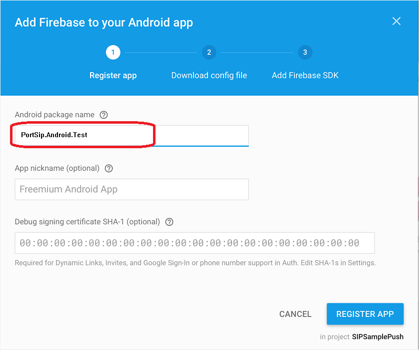
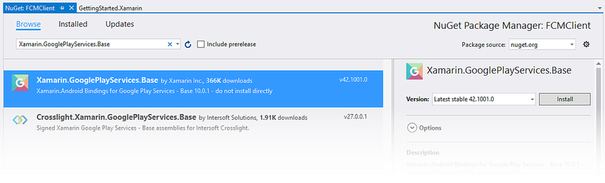
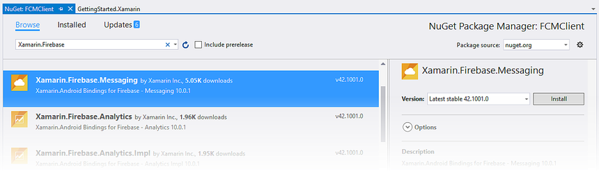
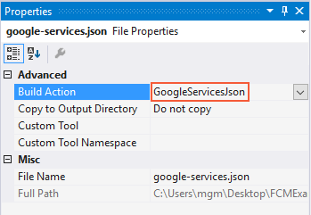
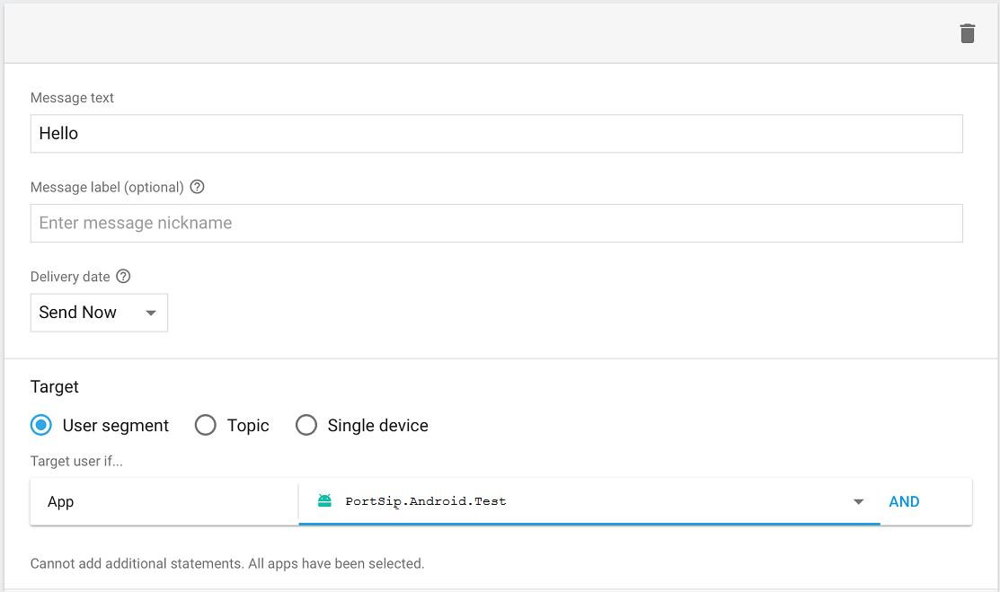
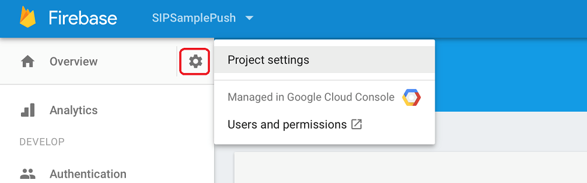
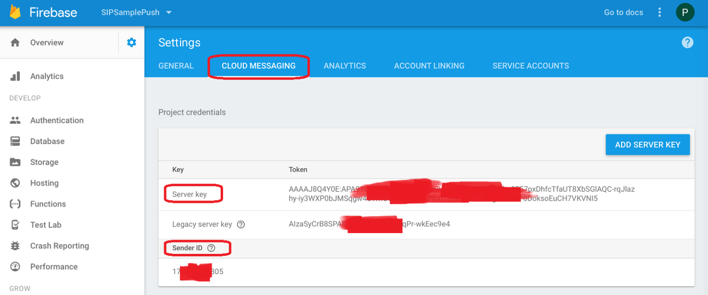
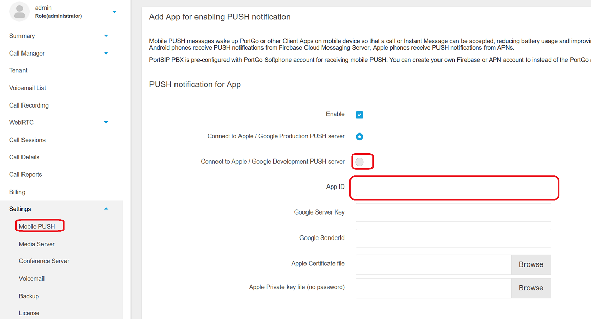

# Implement PUSH notifications in Xamarin Android APP with PortSIP PBX 12.x

This guide gives you step-by-step instructions on how to implement the PUSH notifications in the **SIPSample** project of [PortSIP VoIP SDK](https://www.portsip.com/portsip-voip-sdk/) which can receive VoIP push notifications sent with PortPBX 12.x.

### **1. VoIP notifications**

The official documentation can be found [here](https://developer.apple.com/library/content/documentation/Performance/Conceptual/EnergyGuide-iOS/OptimizeVoIP.html). Some of the advantages are:

* The App is automatically relaunched if it’s not running when a VoIP push is received
* The Device is woken up only when VoIP push occurs (to save battery)
* VoIP pushes go straight to your app for processing and are delivered without delay
* The App is automatically relaunched if it’s not running when a VoIP push is received

### **2. Prerequisite settings**

Since PortSIP PBX uses the Google Firebase to send PUSH notifications, we need to configure some settings to get this working.

### **3. Creating a new App project in Firebase**

Add a new project to the [Firebase console](https://firebase.google.com/).\
You will need to set the project name and country. For example, I will call my project **SIPSamplePush**.


.png>)

Select "**Add Firebase to your Android app**".\
Set a package name for your app. I only set my package name and omit the SHA-1 because I don't use Firebase for my app's authentication.




Click the **REGISTER APP** button here to download **google-services.json**. This is an important file and you will need to put it into your app.

**Important**: Please note that the Android package name is also referred to as “**App ID**”. We will use it in future settings.

### **4. Add the Xamarin Google Play Services Base Package**

Since Firebase Cloud Messaging is dependent on Google Play Services, the [Xamarin Google Play Services - Base](https://www.nuget.org/packages/Xamarin.GooglePlayServices.Base/) package must be added to the Xamarin.Android project. You will need version 212.0.0.2 or later.

1. In Visual Studio, right-click **References > Manage NuGet Packages ...**&#x20;
2. Click the Browse tab and search for **Xamarin.GooglePlayServices.Base.**
3. Install this package into the **Portsip.Android.Test project**:




If you get an error during the installation of the NuGet, please close the **Portsip.Android.Test** the project, open it again, and retry the NuGet installation.

Note: If the problem persists with the error message “**Unable to install package: “Xamarin.GooglePlayServices.Base xx.xxxx.x**”, it indicates that you are trying to install this package into the target project “MonoAndroid,Version=vx.0”, while the package does not include any assembly references or content files to be compatible to this framework. For more details, please contact the package author. Please start the Visual Studio installer to upgrade to the latest version. Once upgraded, right-click the project, click **Properties** > **Target Framework** to choose the latest platform. After this, repeat Step 3.

When you install **Xamarin.GooglePlayServices.Base**, all of the necessary dependencies are also installed. Edit MainActivity.cs and add the following using statement:

> **usi**_**ng Android.Gms.Common;**_&#x20;

This statement makes the GoogleApiAvailability class in **Xamarin.GooglePlayServices.Base** available to **Portsip.Android.Test** code. **GoogleApiAvailability** is used to check for the presence of Google Play Services.

### **5. Add the Xamarin Firebase Messaging Package**

To receive messages from FCM, the [Xamarin Firebase - Messaging](https://www.nuget.org/packages/Xamarin.Firebase.Messaging/) package must be added to the app project. Without this package, an Android application cannot receive messages from FCM servers. \
1\. In Visual Studio, right-click **References > Manage NuGet Packages ...** \
2\. Check **Include prerelease** and search for **Xamarin.Firebase.Messaging.** \
3\. Install this package into the **Portsip.Android.Test** project:&#x20;




When you install **Xamarin.Firebase.Messaging**, all of the necessary dependencies are also installed.\
Next, edit **MainActivity.cs** and add the following using statements:

> _using Firebase.Messaging;_\
> &#xNAN;_&#x75;sing Firebase.Iid;_\
> &#xNAN;_&#x75;sing Android.Util;_

The first two statements make types in the **Xamarin.Firebase.Messaging** NuGet package available to **PortSip.Android.Test** code. **Android.Util** adds logging functionality that will be used to observe transactions with FMS.

### **6. Add the Google Services JSON File**

The next step is to add the **google-services.json** file to the root directory of your project:

1. Copy **google-services.json** to the project folder.
2. Add **google-services.json** to the app project (click Show All Files in the **Solution Explorer**, right click **google-services.json**, then select Include in Project).
3. Select **google-services.json** in the **Solution Explorer** window.
4. In the Properties pane, set the Build Action to **GoogleServicesJson** (if the **GoogleServicesJson** build action is not shown, save and close the Solution, and reopen it):




When **google-services.json** is added to the project (and the **GoogleServicesJson** build action is set), the build process extracts the client ID and API key and then adds these credentials to the merged/generated **AndroidManifest.xml** that resides at **obj/Debug/android/AndroidManifest.xml**. This merge process automatically adds any permissions and other FCM elements that are needed for connection to FCM servers.

### **7. Add services to app**

Two services should be added to use Firebase Cloud Messaging service: a basic code for testing if push notification works, and other codes to handle receiving message or sending message in your app according to your design.

**Add a service that extends FirebaseMessageService**

To be able to receive any notification in your app, you should add a service which extends **FirebaseMessageService** as below:

```
using Android.App;
using Android.Content;
using Android.Util;
using Firebase.Messaging;
namespace PortSip.AndroidSample.Test 
{
	[Service][IntentFilter(new[] 
	{
		"com.google.firebase.MESSAGING_EVENT"
	}
	)]public class MyFirebaseMessageService : FirebaseMessagingService 
	{
		const string TAG = "MyFirebaseMsgService";
		public override void OnNewToken(string p0) 
		{
			base.OnNewToken(p0);
			notifyTokenRefresh(p0);
		}
		public override void OnMessageReceived(RemoteMessage message) 
		{
			string type = p0.Data["msg_type"]string content = p0.Data["msg_content"];
			string from = p0.Data["send_from"];
			string to = p0.Data["send_to"];
			string pushid = p0.Data["x-push-id"];
		}
		private void notifyTokenRefresh(string token) 
		{
			Intent intent = new Intent(this, typeof(PortSipService));
			intent.SetAction(MyService.ACTION_TOKENREFRESH);
			intent.PutExtra(MyService.DEVICE_TOKEN, token);
			StartService(intent);
		}
	}
}
```

### **8. Test and send your first push notification**

To see if the setup works, run a test by sending a test message to your own mobile.

In the Firebase console, write down your message and choose an app. Click "**SEND MESSAGE**".




Now you should get a PUSH notification on your Android mobile. If your app is running in the background, you will get it on the mobile's notification center; otherwise, you can see it in your Android Monitor log (we have to put a code to log incoming messages) like this.

If the setup is successful, you should get a notification on your mobile. Sometimes, it can take a couple of minutes for the message to send and arrive, so just be patient for a little while.

### **9. Enable PUSH in App**

Adding SIP header "**x-p-push**” to **REGISTER** message. We use it to tell PortSIP PBX this client is enabled with PUSH.

```
namespace PortSip.AndroidSample.Test 
{
	[Service][IntentFilter(new string[] 
	{
		"PortSip.AndroidSample.Test.PortSipService"
	}
	)][IntentFilter(new string[] 
	{
		ACTION_TOKENREFRESH
	}
	)]public class MyService : Service,IPortSIPEvents, IOnCompleteListener 
	{
		public const string ACTION_TOKENREFRESH = "token_refresh";
		private string pushToken;
		private bool needPush = true;
		private PortSipLib mEngine;
		private string String appid=”com.portsip.sipsamplepush”;
		//you app id
		public override void OnCreate() 
		{
			base.OnCreate();
			...
			//get token
			FirebaseInstanceId.Instance.GetInstanceId().AddOnCompleteListener(this);
		}
		public void OnComplete(Task task) 
		{
			if(task.IsComplete&& task.IsSuccessful) 
			{
				pushToken = task.Result.ToString();
			}
		}
		public override StartCommandResult OnStartCommand(Intent intent, StartCommandFlags flags, int startId) 
		{
			if (intent != null) 
			{
				if(ACTION_TOKENREFRESH.Equals(intent.Action)) 
				{
					setPushHeader(needPush);
					if (online) 
					{
						mEngine.refreshRegistration(0);
					}
				}
				return StartCommandResult.Sticky;
			}
			/**
* @param support true enable Push, false disable Push.
*/
			private void setPushHeader(bool support) 
			{
				if (!String.IsNullOrEmpty(pushToken)) 
				{
					String pushMessage = "device-os=android;device-uid=" + pushToken + ";allow-call-push="+support+";allow-message-push=" + support + ";app-id=" + appid;
					mEngine.addSipMessageHeader(-1, "REGISTER", 1, "x-p-push", pushMessage);
				}
			}
		}
```

### **10. Possible problems**

* Compilation problems can be related to wrong version numbers in your build.gradle files.
* If you see a message like "_com.google.firebase.crash.FirebaseCrash is not linked. Skipping initialization._" in your Android Monitor log, it is ok because we don't use this Firebase Crash Analytics service.
* [Firebase initialization is not starting](http://stackoverflow.com/questions/37724761/android-firebaseapp-firebase-initialization-is-not-starting)

### **11. Get server key and sender ID**

(1). In the Firebase console, click the “**Settings**” button and choose the “**Project settings**” menu.




(2). In the “**Settings**” tab, click the “**Cloud Messaging**” tab, you will see the “**Server key**” and “**Sender ID**”, please note it.




### **12. PortSIP PBX**

Now sign in PortSIP PBX 12.0 Management Console, select menu “**Settings**” > “**Mobile PUSH**”.\
Click the “**Add New App**” button, you will see below screen:




Please setup the following items:

1. **Enabled** – check it to enable PUSH and un-check to disable PUSH.
2. Apple and Google both are provided with the production PUSH server and development PUSH server for sending PUSH notifications. The development production server is usually used for your development stage. Once your app is released, you can change this setting to the production server.
3. **App ID** – the ID that you created in step 3. Note: This ID is case-sensitive.
4. **Google Server Key** and **Google sender ID** – the key and ID are what you noted in step 9.2.

Click the “**Apply**” button and the PUSH service is enabled in PBX.
