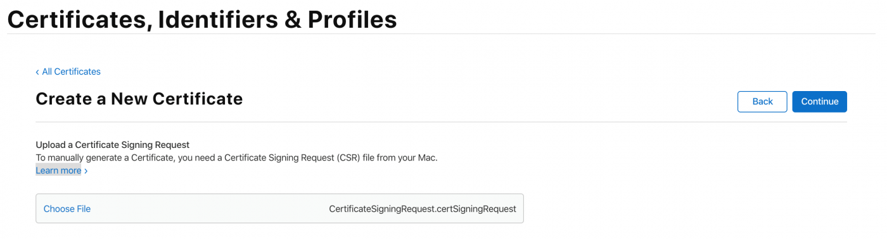
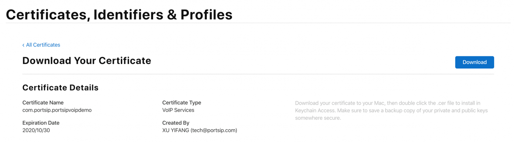
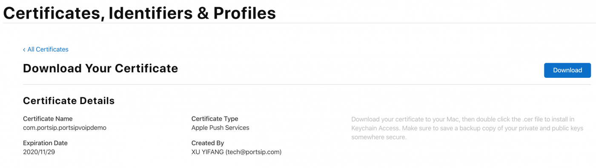
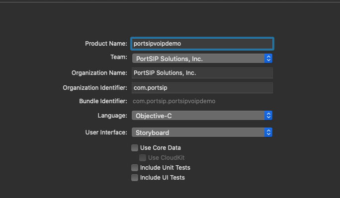
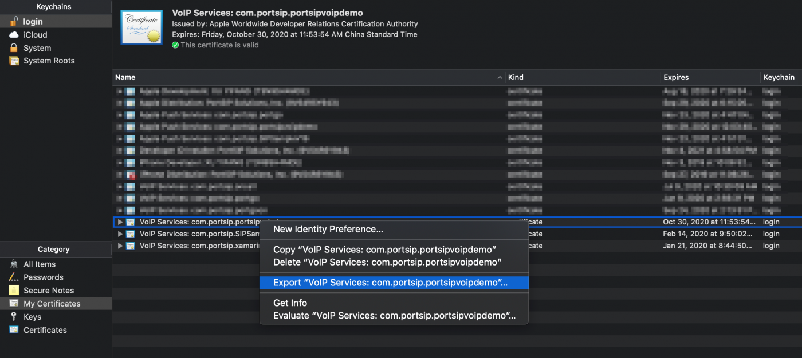

# Implement the PUSH notifications in native iOS APP with PortSIP PBX 12.x

This guide gives you step-by-step instructions on how to create a native iOS app based on [PortSIP VoIP SDK](https://www.portsip.com/portsip-voip-sdk), which could receive VoIP push notifications sent from [PortSIP PBX](https://www.portsip.com/portsip-pbx) 12.x.

This manual supports the new[ PushKit push notification policy](https://developer.apple.com/documentation/pushkit/pkpushregistrydelegate/2875784-pushregistry?language=objc) that is introduced in iOS 13 and Xcode 11.

For iOS 13.0 and later, if you fail to report a call to CallKit, the system will terminate your app. Repeatedly failing to report calls may cause the system to stop delivering any more VoIP push notifications to your app. If you want to initiate a VoIP call without using CallKit, register for PUSH notifications by using the UserNotifications framework instead of PushKit.

PortPBX 12.x uses VoIP PUSH for push VoIP calls, and APNs PUSH for IM messages.

### **1. VoIP notifications**

The official documentation can be found [here](https://developer.apple.com/library/content/documentation/Performance/Conceptual/EnergyGuide-iOS/OptimizeVoIP.html). Some of the advantages are:

• The device is woken up only when VoIP pushes occur, which saves energy.\
• Unlike standard push notifications, which the user must respond to before your app can perform an action, VoIP pushes go straight to your app for processing.\
• VoIP pushes are considered high-priority notifications and are delivered without delay.\
• VoIP pushes can include more data than what is provided with standard push notifications.\
• Your app is automatically relaunched if it’s not running when a VoIP push is received.\
• Your app is given runtime to process a push, even if your app is operating in the background

### **2. Prerequisite settings**

Apple provides us with a framework called PushKit to support using this VoIP push feature. However, we need to configure some additional settings to get this working.

### **3. Creating an App ID**

In case you don’t have an app (and consequently an App ID), you need to create one.\
First, login to your [Apple developer account](https://developer.apple.com/account/) and access **Certificates, Identifier & Profiles**:


Next, go to **Identifiers** and click on the **+** button.


Two important things to fill out here are: **App ID Description** and **so-called Bundle ID** (this will most likely be something like com.yourdomain.yourappname):

.png>)

Select “**Push Notifications**”


Although not seen in the screenshots above, I used **com.portsip.portsipvoipdemo** as Bundle ID. This will be important in the next step.

### **4. Generating a VoIP push certificate for VoIP Call**

Click on the **All** button in the **Certificates** section on the left-hand side and the + button:


.png>)

On the next page you need to select the VoIP Services Certificate:


.png>)

After this you need to select the App ID for which you’re creating this VoIP certificate:

.png>)


Next, you’ll be presented with instructions to choose CSR (Certificate Signing Request) file:




Once the file is created, you’ll select it for upload on the next screen. If everything goes well you’ll be given the certificate which you **have to** download:




After downloading the certificate, open it up, and this should open the Keychain Access application. Now you should see the certificate under the My Certificates section:


### **5. Generating an APNs push certificate for Instant Messaging**

Click on the **All** button in the **Certificates** section of the left navigation tree and the **+** button:


On the next page you need to select the Apple Push Notification service SSL (Sandbox & Production):


After this you need to select the App ID for which you’re creating this Apple Push Notification certificate:


Next, you’ll be presented with instructions to choose CSR (Certificate Signing Request) file:


Once the file is created, you’ll select it for uploading on the next screen. If everything goes well, you’ll be given the certificate which you **have to** download.



After you download the certificate, open it up, and this should open the Keychain Access application. Now you should see the certificate under the My Certificates section:


### **6. Adding PUSH support into the project**

As the feature has been implemented in our latest **SIPSample**, you can download it from our latest **SIPSample**.

Take special care when setting the **Product Name** as the **Bundle Identifier** is set automatically from it. We need to set this the same as the Bundle Identifier that we've set in the previous steps.



### **7. Setting the appropriate capabilities**

On the project’s **Signing & Capabilities** tab, add “**Push Notifications**” and “**Background Modes**”. Make sure that the “**Audio, AirPlay and Picture in Picture**”, “**Voice over IP**”, “**Remote notifications**” options are enabled.


### **8. Adding the code**

Open AppDelegate.m and add the _import PushKit and UserNotifications_ statement at the top of it.

> _#import \<PushKit/PushKit.h>_\
> _#import \<UserNotifications/UserNotifications.h>_\
> _@interfaceAppDelegate()PKPushRegistryDelegate,UNUserNotificationCenterDelegate>_\
> _@end_

Next, in the _didFinishLaunchingWithOptions_ part of the application function make sure you register for notifications like this:

```
-(BOOL) application: (UIApplication * ) application didFinishLaunchingWithOptions: (NSDictionary * ) launchOptions
{
    // Register VoIP PUSH
    PKPushRegistry * pushRegistry = [[PKPushRegistry alloc] initWithQueue: nil];
    pushRegistry.delegate = self;
    pushRegistry.desiredPushTypes = [NSSet setWithObject: PKPushTypeVoIP];
    // Register APNs PUSH
    if ([[[UIDevice currentDevice] systemVersion] floatValue] >= 10.0)
    {
        // iOS > 10
        UNUserNotificationCenter * center = [UNUserNotificationCenter currentNotificationCenter];
        center.delegate = self;
        [center requestAuthorizationWithOptions: (UNAuthorizationOptionBadge |
                UNAuthorizationOptionSound |
                UNAuthorizationOptionAlert)
completionHandler: ^ (BOOL granted
                , NSError * _Nullable error)
            {
                if (!error)
                {
                    NSLog(@ "request User Notification succeeded!");
                }
}];
    }
    else
    { // iOS 8-10
        if ([UIApplication instancesRespondToSelector:
@selector(registerUserNotificationSettings: )])
        {
            [[UIApplication sharedApplication] registerUserNotificationSettings: [UIUserNotificationSettings
settingsForTypes: UIUserNotificationTypeAlert |
UIUserNotificationTypeBadge |
UIUserNotificationTypeSound
categories: nil]];
        }
    }
    // Calling this will result in either
    // application:didRegisterForRemoteNotificationsWithDeviceToken: or
    // application:didFailToRegisterForRemoteNotificationsWithError: to be called
    // on the application delegate.[application registerForRemoteNotifications];
    return YES;
}

```

At this point, you will get an error on the pushRegistry.delegate = self; line saying "Cannot assign a value of type '**AppDelegate**' to type '**PKPushRegistryDelegate**!'".

The delegate for pushRegistry is of type **PKPushRegistryDelegate** which has three methods, two of which are required. (**didUpdatePushCredentials** and **didReceiveIncomingPushWithPayload**). We have to define a so-called extension of the **AppDelegate** class. We do that by adding the following code after all the current code in the AppDelegate.m file:

```
APNs methods:
#pragma mark - APNs message PUSH
-(NSString * ) stringFromDeviceToken: (NSData * ) deviceToken
    {
        if ([[[UIDevice currentDevice] systemVersion] floatValue] >= 13.0)
        {
            NSUInteger length = deviceToken.length;
            if (length == 0)
            {
                return nil;
            }
            const unsigned char * buffer = deviceToken.bytes;
            NSMutableString * hexString = [NSMutableString stringWithCapacity: (length * 2)];
            for (int i = 0; i < length; ++i)
            {
                [hexString appendFormat: @ "%02x", buffer[i]];
            }
            return [hexString copy];
        }
        else
        {
            NSString * token = [NSString stringWithFormat: @ "%@", deviceToken];
            token = [token stringByTrimmingCharactersInSet: [NSCharacterSet characterSetWithCharactersInString: @ "<>"]];
            return [token stringByReplacingOccurrencesOfString: @ " "
                withString: @ ""];
        }
    } -
    (void) application: (UIApplication * ) application
didRegisterForRemoteNotificationsWithDeviceToken: (NSData * ) deviceToken
    {
        _APNsPushToken = [self stringFromDeviceToken: deviceToken];
        NSLog(@ "_APNsPushToken :%@", deviceToken);
        [self refreshPushStatusToSipServer: YES];
    }
    // 8.0 < iOS version < 10.0
    -
    (void) application: (UIApplication * ) application
didReceiveRemoteNotification: (NSDictionary * ) userInfo
fetchCompletionHandler:
    (void( ^ )(UIBackgroundFetchResult)) completionHandler
    {
        NSLog(@ "didReceiveRemoteNotification %@", userInfo);
        completionHandler(UIBackgroundFetchResultNewData);
    }
    // iOS version > 10.0 Background
    -
    (void) userNotificationCenter: (UNUserNotificationCenter * ) center
didReceiveNotificationResponse: (nonnull UNNotificationResponse * ) response
withCompletionHandler: (nonnull void( ^ )(void)) completionHandler
    {
        NSDictionary * userInfo = response.notification.request.content.userInfo;
        NSLog(@ "Background Notification:%@", userInfo);
        completionHandler();
    }
    // iOS version > 10.0 foreground
    -
    (void) userNotificationCenter: (UNUserNotificationCenter * ) center
willPresentNotification: (UNNotification * ) notification
withCompletionHandler:
    (void( ^ )(UNNotificationPresentationOptions)) completionHandler
    {
        NSDictionary * userInfo = notification.request.content.userInfo;
        NSLog(@ "Foreground Notification:%@", userInfo);
        completionHandler(UNNotificationPresentationOptionBadge);
    }
VoIP PUSH methods:
    -(void) pushRegistry: (PKPushRegistry * ) registry
didUpdatePushCredentials: (PKPushCredentials * ) credentials
forType: (PKPushType) type
    {
        _VoIPPushToken = [self stringFromDeviceToken: credentials.token];
        NSLog(@ "didUpdatePushCredentials:%@", _VoIPPushToken);
        [self refreshPushStatusToSipServer: YES];
    }
    // iOS version > 11.0
    -
    (void) pushRegistry: (PKPushRegistry * ) registry
didReceiveIncomingPushWithPayload: (PKPushPayload * ) payload
forType: (PKPushType) type
withCompletionHandler: (void( ^ )(void)) completion
    {
[self processPushMessageFromPortPBX: payload.dictionaryPayload
withCompletionHandler: completion];
    }
    // 8.0 < iOS version < 11.0
    -
    (void) pushRegistry: (PKPushRegistry * ) registry
didReceiveIncomingPushWithPayload: (PKPushPayload * ) payload
forType: (PKPushType) type
{
    [self processPushMessageFromPortPBX: payload.dictionaryPayload
withCompletionHandler: nil];
};

```


After adding this extension you will note that the previously mentioned error disappears.

In the first function, we merely output the device token. We will need this token in the next section when we'll be testing our app with sending VoIP push notifications.

In the second one we 'act' on the received VoIP push notification. On iOS 13.0 and later, we must report a call to CallKit. The third function (didInvalidatePushTokenForType) is used for handling when the token is invalidated.

We need to notify PortPBX that this client has enabled PUSH by adding sip header "x-p-push” to REGISTER message.

```
-(void) addPushSupportWithPortPBX: (BOOL) enablePush
{
    if (_VoIPPushToken == nil || _APNsPushToken == nil ||
        !_enablePushNotification)
        return;
    // This VoIP Push is only work with
    // PortPBX(https://www.portsip.com/portsip-pbx/)
    // if you want work with other PBX, please contact your PBX Provider
    NSString * bundleIdentifier = [[NSBundle mainBundle] bundleIdentifier];
    [portSIPSDK clearAddedSipMessageHeaders];
    NSString * pushMessage;
    NSString * token = [[NSString alloc] initWithFormat: @ "%@|%@", _VoIPPushToken, _APNsPushToken];
    if (enablePush)
    {
        pushMessage = [[NSString alloc] initWithFormat: @ "device-os=ios;device-uid=%@;allow-call-push=true;"
@ "allow-message-push=true;app-id=%@"
, token, bundleIdentifier];
        NSLog(@ "Enable pushMessage:{%@}", pushMessage);
    }
    else
    {
        pushMessage = [[NSString alloc] initWithFormat: @ "device-os=ios;device-uid=%@;allow-call-push=false;"
@ "allow-message-push=false;app-id=%@"
, token, bundleIdentifier];
        NSLog(@ "Disable pushMessage:{%@}", pushMessage);
    } [portSIPSDK addSipMessageHeader: -1
methodName: @ "REGISTER"
msgType: 1
headerName: @ "x-p-push"
headerValue: pushMessage];
}

```

When app receives PUSH or APP is running, it should register to server automatically:

```
-(void) doAutoRegister
{
    if ([_textUsername.text length] > 1 && [_textPassword.text length] > 1 && [_textSIPserver.text length] > 1 && [_textSIPPort.text length] > 1 && [_textToken.text length] > 1)
    {
[self onLine];
    }
}

```

### **9. Preparing the certificate files**

The VoIP certificate file that we’ve downloaded and added to the KeyChain has to be converted to a different file format so that we’ll be able to use it with the tools and services that I’ve listed above.

First, you need to open the KeyChain app on your Mac and Export (right click and select Export) the VoIP Services certificate:




You will get a **YOUR\_CERT.p12** (e.g  voip\_push.p12) file. Now export the Apple Push Services certificate file.\
Navigate to the folder where you have exported this file to and execute the following command:

Creating a Push Credential with your VoIP Service Certificate.


```
$> openssl pkcs12 -in voip_push.p12 -nocerts -out voip_push_key.pem
Enter Import Password: (Enter the password when you export form Keychain)
MAC verified OK
Enter PEM pass phrase: (Must Enter the password, e.g:1234)
Verifying - Enter PEM pass phrase: (Must Enter the above password, e.g:1234)
$> openssl rsa -in voip_push_key.pem -out voip_push_key_nopws.pem
Enter pass phrase for voip_push_key.pem: (Must Enter the above password, e.g:1234)
$> openssl pkcs12 -in voip_push.p12 -clcerts -nokeys -out voip_push.pem
```

Creating a Push Credential with your Apple Push Service Certificate.

```
$> openssl pkcs12 -in apns_push.p12 -nocerts -out apns_push_key.pem
Enter Import Password: (Enter the password when you export form Keychain, empty is allowed)
MAC verified OK
Enter PEM pass phrase: (Must Enter the password, e.g:1234)
Verifying - Enter PEM pass phrase: (Must Enter the above password, e.g:1234)
$> openssl rsa -in apns_push_key.pem -out apns_push_key_nopws.pem
Enter pass phrase for apns_push_key.pem: (Must Enter the above password, e.g:1234)
$> openssl pkcs12 -in apns_push.p12 -clcerts -nokeys -out apns_push.pem
```

```
$> openssl pkcs12 -in apns_push.p12 -nocerts -out apns_push_key.pem
Enter Import Password: (Enter the password when you export form Keychain, empty is allowed)
MAC verified OK
Enter PEM pass phrase: (Must Enter the password, e.g:1234)
Verifying - Enter PEM pass phrase: (Must Enter the above password, e.g:1234)
$> openssl rsa -in apns_push_key.pem -out apns_push_key_nopws.pem
Enter pass phrase for apns_push_key.pem: (Must Enter the above password, e.g:1234)
$> openssl pkcs12 -in apns_push.p12 -clcerts -nokeys -out apns_push.pem
```

We need merge two Push Credential to one file:

```
$> cat voip_push.pem apns_push.pem > portpbx_push.pem
$> cat voip_push_key_nopws.pem apns_push_key_nopws.pem > portpbx_push_key.pem
```

This will generate _**`portpbx_push.pem`**_ and _**`portpbx_push_key.pem`**_ files that we’ll use in the PBX Server.

### **10. Houston**

The Houston will allows us to send the PUSH notifications for test from the terminal window.

The VoIP certificate file that we’ve downloaded and added to the KeyChain has to be converted to a different file format so that we’ll be able to use it with the tools and services I’ve listed above.\
Even though the docs say you can install it simply with _gem install houston_, you will most likely end up (after some StackOverflow searching) using this command to install it:

```
sudo gem install -n /usr/local/bin houston
```

This way you’ll install it to your local bin directory to which you have full rights.\
Houston installed one more tool that will help us send the notifications like this:\
With Terminal navigate to the folder where you have your certificate:

**Testing VoIP PUSH:**

```
$> openssl pkcs12 -in voip_push.p12 -out voippush_onlyone.pem -nodes -clcerts
```

Copy the device Token from **APP didUpdatePushCredentials** and execute a command as follows:

```
apn push "<40cc4209 d0f3ac25 95a7e937 3282897b 211231ef ba66764c 6fd2befa b42076cb>" -c voippush_onlyone.pem -m "Testing VoIP notifications!"
```

You should get the following output in your terminal:

> _1 push notification sent successfully_

And, you should see a push message for **APP didReceiveIncomingPushWithPayload** on your phone in case it was in the foreground.

**Test APNs PUSH:**

```
$> openssl pkcs12 -in apns_push.p12 -out apnspush_onlyone.pem -nodes -clcerts
```

Copy the device Token from **APP didUpdatePushCredentials** and execute the command as follows:

```
apn push "<40cc4209 d0f3ac25 95a7e937 3282897b 211231ef ba66764c 6fd2befa b42076cb>" -c voippush_onlyone.pem -m "Testing VoIP notifications!"
```

You should get the following output in your terminal:

> _1 push notification sent successfully_

And, you should see a push message for **APP didReceiveNotificationResponse** in the background or **willPresentNotification** in the foreground.

If you like UI, you can download [Knuff](https://github.com/KnuffApp/Knuff), the debug application for Apple Push Notification Service (APNs).

### **11. PortSIP PBX**

Now sign in PortSIP PBX 12.0 Management Console, select menu “**Settings**” > “**Mobile PUSH**”.

Click “**Add New App**” button, you will see below screen:

.png>)

**Please set the following items:**

1. **Enabled** – check it to enable PUSH and un-check to disable PUSH.
2. Apple and Google both are provided with the production PUSH server and development PUSH server for sending PUSH notifications. The development production server is usually used during the development stage. Once your app is released, you can change this setting to the production server.
3. **App ID** – the ID that you created in step 3. Note, this ID is case-sensitive.
4. Apple certificate file and private key file. The certificate files you generated in step 9. Please keep in mind that the private key file must be without the password (_**portpbx\_push.pem**_ and _**portpbx\_push\_key.pem**_).

Click the “**Apply**” button and the PUSH service is enabled in PBX.
