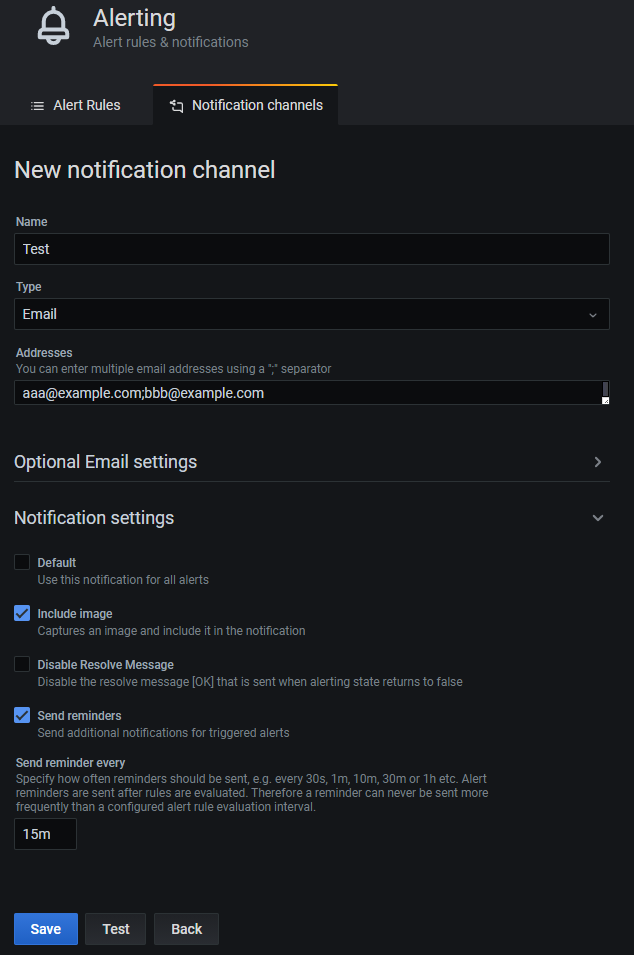
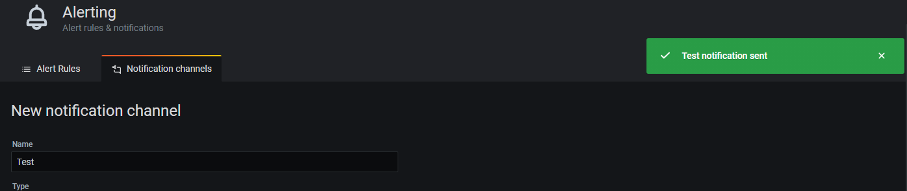
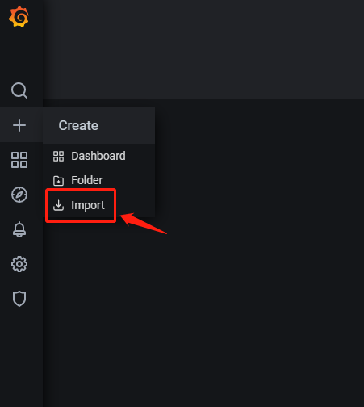
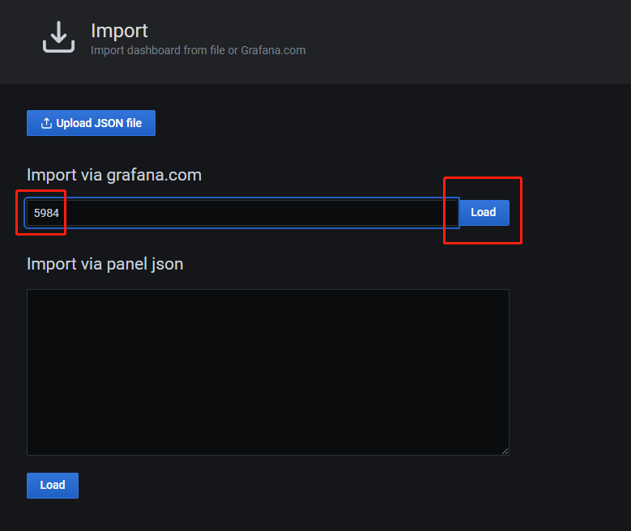
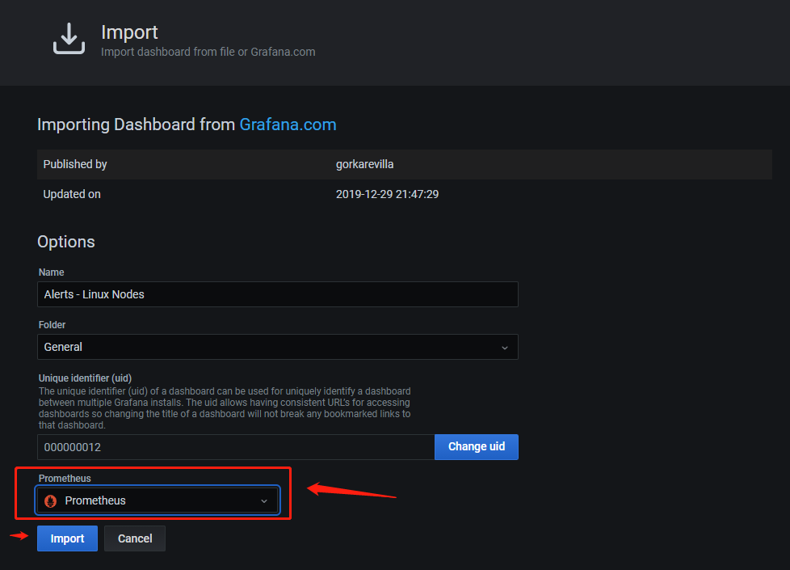
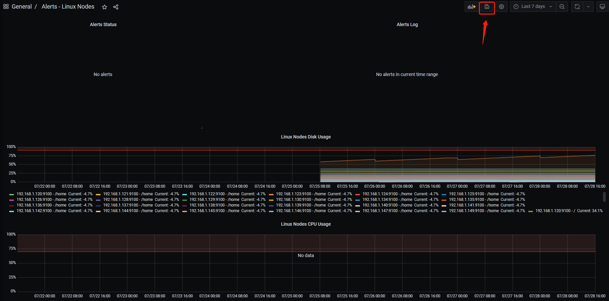
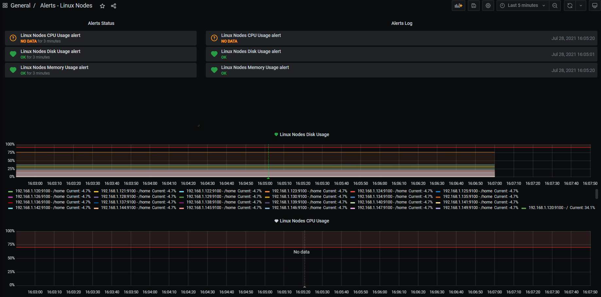
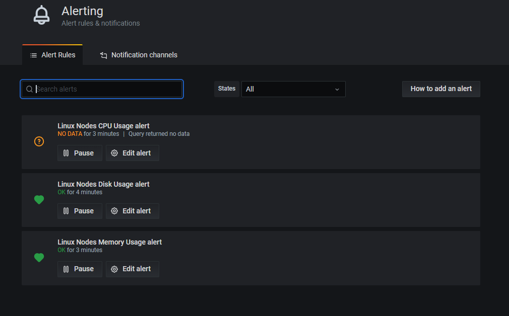

# Configure Notifications for Kubernetes

With the PortSIP UCaaS, its support send the alert notifications.

## Alert notifications <a href="#alert-notifications" id="alert-notifications"></a>

When an alert changes state, it sends out notifications. Each alert rule can have multiple notifications. In order to add a notification to an alert rule you first need to add and configure a `notification` channel (can be email, PagerDuty, or other integration).

This is done from the Notification channels page.

## List of supported notifiers <a href="#list-of-supported-notifiers" id="list-of-supported-notifiers"></a>

| Name                                                                                                       | Type                      | Supports images    | Support alert rule tags |
| ---------------------------------------------------------------------------------------------------------- | ------------------------- | ------------------ | ----------------------- |
| [DingDing](https://grafana.com/docs/grafana/v7.5/alerting/notifications/#dingdingdingtalk)                 | `dingding`                | yes, external only | no                      |
| Discord                                                                                                    | `discord`                 | yes                | no                      |
| [Email](https://grafana.com/docs/grafana/v7.5/alerting/notifications/#email)                               | `email`                   | yes                | no                      |
| [Google Hangouts Chat](https://grafana.com/docs/grafana/v7.5/alerting/notifications/#google-hangouts-chat) | `googlechat`              | yes, external only | no                      |
| Hipchat                                                                                                    | `hipchat`                 | yes, external only | no                      |
| [Kafka](https://grafana.com/docs/grafana/v7.5/alerting/notifications/#kafka)                               | `kafka`                   | yes, external only | no                      |
| Line                                                                                                       | `line`                    | yes, external only | no                      |
| Microsoft Teams                                                                                            | `teams`                   | yes, external only | no                      |
| [Opsgenie](https://grafana.com/docs/grafana/v7.5/alerting/notifications/#opsgenie)                         | `opsgenie`                | yes, external only | yes                     |
| [Pagerduty](https://grafana.com/docs/grafana/v7.5/alerting/notifications/#pagerduty)                       | `pagerduty`               | yes, external only | yes                     |
| Prometheus Alertmanager                                                                                    | `prometheus-alertmanager` | yes, external only | yes                     |
| [Pushover](https://grafana.com/docs/grafana/v7.5/alerting/notifications/#pushover)                         | `pushover`                | yes                | no                      |
| Sensu                                                                                                      | `sensu`                   | yes, external only | no                      |
| [Sensu Go](https://grafana.com/docs/grafana/v7.5/alerting/notifications/#sensu-go)                         | `sensugo`                 | yes, external only | no                      |
| [Slack](https://grafana.com/docs/grafana/v7.5/alerting/notifications/#slack)                               | `slack`                   | yes                | no                      |
| Telegram                                                                                                   | `telegram`                | yes                | no                      |
| Threema                                                                                                    | `threema`                 | yes, external only | no                      |
| VictorOps                                                                                                  | `victorops`               | yes, external only | yes                     |
| [Webhook](https://grafana.com/docs/grafana/v7.5/alerting/notifications/#webhook)                           | `webhook`                 | yes, external only | yes                     |
| [Zenduty](https://grafana.com/docs/grafana/v7.5/alerting/notifications/#zenduty)                           | `webhook`                 | yes, external only | yes                     |

\
Configure EMAIL Notifications
-----------------------------

### SMTP settings

On the Pod of `k8s-master-01`, edit `/root/prometheus/values.yaml` file, edit it as the below (You will need to replace the information by your actual SMTP settings):

```
650     smtp:
651       enabled: true
652       host: smtp.example.com:465
653       user: test
654       password: testtest
655       skip_verify: true
656       from_address: test@example.com
657       from_name: test
```

On the Pod of `k8s-master-01`, perform the below command:

```
cd /root/prometheus && helm upgrade --install prometheus ./ -f values.yaml
```

### Configure Alerting

#### **Add Notification Channels**

1. Sign in the Grafana, go to **`Alerting -> Notification channels`**

.png>)

2\. Click the "**Add channel**" button, you can enter the emails which will be alerted in the "**Addresses**" field.



3\. Test. After clicking the "**Test**" button, will popups "**Test Notification sent**" information. All emails of the "**Addresses**" filed will receive the email.




#### Alert Rules

1. Create a new dashboard. **`Create > Import.`**



In this example，we import the dashboard from `grafana.com`，in the production environment you will need to create your own custom`Dashboard.`

 

3\. Save the dashboard after successfully importing.

 

4\. Check Alert rule

As the below example, there have three rules.


