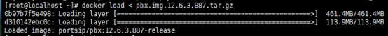
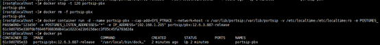

# Upgrade PortSIP PBX for offline

If the PortSIP PBX installation is running in a production environment that no internet connection, please follow the below steps to upgrade.

* Take the offline docker image from PortSIP. For example `pbx.img.12.6.3.887.tar.gz`
* Copy the `pbx.img.12.6.3.887.tar.gz` to the `/root` path of the PBX server
* Perform the below command:

```
docker load < pbx.img.12.6.3.887.tar.gz
```



* Perform the below commands, you will need to replace the IP with real PBX IP

```
docker stop -t 120 portsip-pbx
docker rm -f portsip-pbx
docker container run -d --name portsip-pbx --cap-add=SYS_PTRACE --network=host -v /var/lib/portsip:/var/lib/portsip -v /etc/localtime:/etc/localtime:ro -e POSTGRES_PASSWORD="123456" -e POSTGRES_LISTEN_ADDRESSES="*" -e IP_ADDRESS="192.168.1.205" portsip/pbx:12.6.3.887-release
```

&#x20; &#x20;



