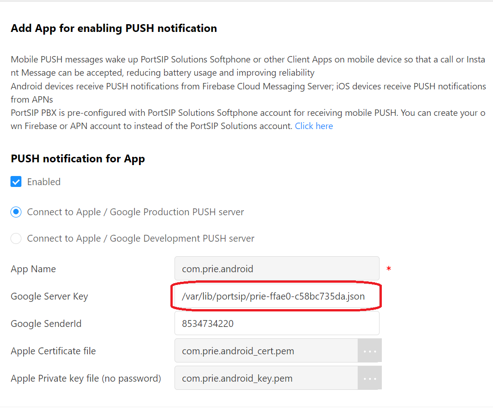

# Upgrade PortSIP PBX v12.x to the v12.8.7

As announced by Google, [support for the legacy push method will cease in June 20](https://firebase.google.com/docs/cloud-messaging/migrate-v1)24. PortSIP PBX v12.x, which utilizes this legacy push method for sending notifications, reached its end-of-life (EOL) approximately a year ago on March 30, 2023. Despite this, we’ve noticed that some customers continue to use PortSIP PBX v12.x and are unable to upgrade to v16.x in the near future.

In response to this, we’ve released PortSIP PBX v12.8.7. This version supports the new push method for Android notifications, even though v12.x is technically EOL.&#x20;


Please note that this will be the final update for v12.x, as it has been EOL for quite some time. We strongly urge all v12.x customers to upgrade to v16.x as soon as possible to benefit from enhanced features and support.


## **Back up**

Please backup your PBX before upgrading, the VM server snapshot or clone is recommended.

## **Upgrading for Windows**

1. Ensure your current installation **is v12.6.x/12.7.x/v12.8.x.**
2. Download the [PortSIP PBX v12.8.7 installer for Windows](https://www.portsip.com/downloads/pbx/v12/portsip-pbx-12.8.7.2683.exe).
3. After downloading the v12.8.7 installer for Windows, you only need to double-click the installer, which will guide you through the upgrade process.

## **Upgrading for Linux**

Please execute the below commands to upgrade.

> **Note:**
>
> * The **IP\_ADDRESS** is the IP address of your PBX server. In this case it is 66.175.222.20, you will need to change it by yourself, if your server is on public internet network, this IP should be the public IP.
> * The **POSTGRES\_PASSWORD** is used to specify the PortSIP DB password. In this case we will use 123456, you can change it by yourself.

> **The OS required:**
>
> * CentOS: 7.9
> * Ubuntu: 18.04, 20.04
> * Debian: 10.x
> * Only supports 64bit OS



From v12.6.1, the PortSIP PBX requires running with the above Linux OS versions. If there already installed the PortSIP PBX which is less than v12.6.1, and wish to upgrade to v12.6.1 or a later version, must upgrade the Linux OS to the above version before upgrading the PortSIP PBX.



Please replace the IP 66.175.222.20 with your PBX IP; feel free to choose a string for the POSTGRES\_PASSWORD


For CentOS/Ubuntu/Debian, use the below commands to perform the upgrade.

```
# su root
# docker stop -t 120 portsip-pbx
# docker rm -f portsip-pbx
# sudo curl https://raw.githubusercontent.com/portsip/portsip-pbx-sh/master/v12.6.x/install_pbx_docker.sh|bash
# docker pull portsip/pbx:12
# docker container run -d --name portsip-pbx \
         --restart=always --cap-add=SYS_PTRACE \
         --network=host -v /var/lib/portsip:/var/lib/portsip \
         -v /etc/localtime:/etc/localtime:ro \
         -e POSTGRES_PASSWORD="123456" \
         -e POSTGRES_LISTEN_ADDRESSES="*" \
         -e IP_ADDRESS="66.175.222.20" portsip/pbx:12
```

## **Changing Push Settings for Android**&#x20;

If you’re using the PortSIP softphone app, no action is required on your part. The upgraded PBX v12.8.7 will seamlessly integrate with the PortSIP softphone app.

### **Obtaining a New Push Profile JSON File**&#x20;

* If you’re using an Android app that PortSIP has rebranded, please contact us to receive the new push setting JSON file.&#x20;
* If you’re using an Android app that you’ve developed yourself, follow the steps below to obtain the new push setting JSON file. Refer to the Android Push Notifications guide and follow steps 1 through 3 (no need to follow the other steps) to download the push setting JSON file.

For the purposes of this guide, let’s assume the push setting JSON file is: `prie-ffae0-c58bc735da.json`.

### **Uploading the Push Setting JSON File**&#x20;

Next, we need to upload the push setting JSON file (in this example, `prie-ffae0-c58bc735da.json`) to the PortSIP PBX server.

* For Linux: Upload the file to the `/var/lib/portsip` folder.
* For Windows: Upload the file to the `C:\ProgramData\PortSIP` folder.

## **Adjusting Settings**&#x20;

* Sign in to the PortSIP PBX v12.8.7 Web portal, select the menu **Advanced > Mobile Push**, and double-click the app to change the settings.&#x20;
* Enter the path to the push setting JSON file in the Google Server Key field and save your changes.
* Restart the PortSIP PBX. This completes the process of changing push settings for Android.

Please reference the below screenshot.

<figure><figcaption></figcaption></figure>


