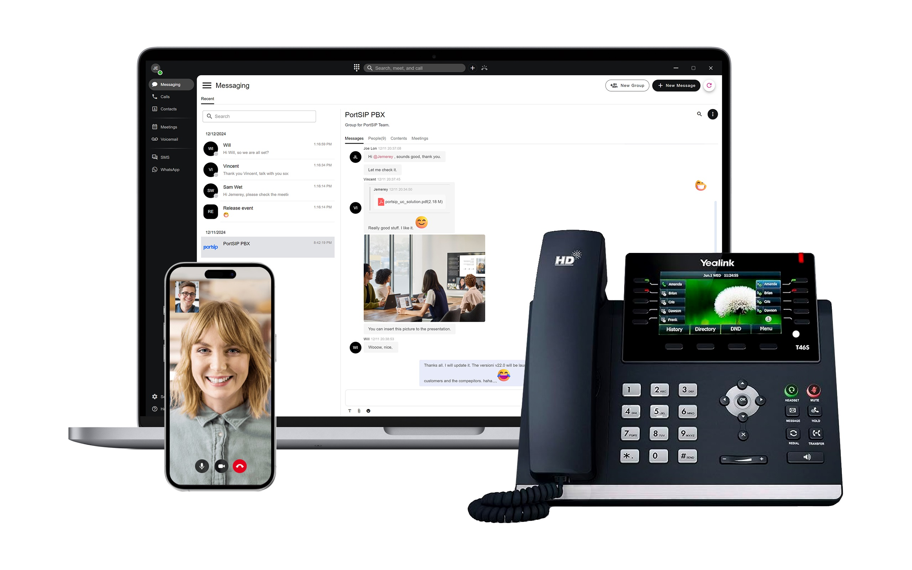
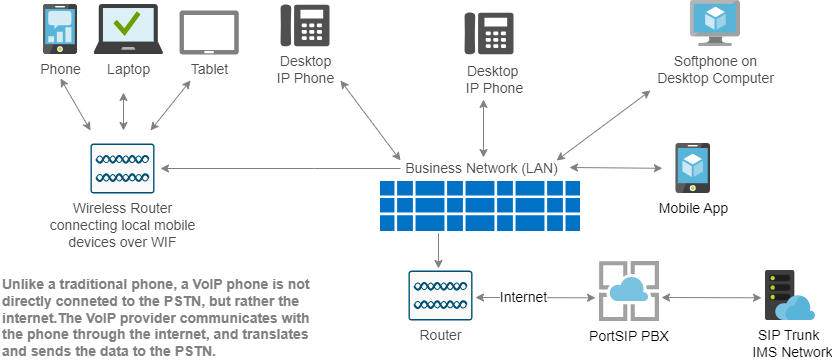

# Cloud PBX Empowering Service Provider

## Cloud PBX for UCaaS/CPaaS/CCaaS Providers

Cloud PBX has gained significant popularity in today’s cloud age, it's empowering service providers to establish and manage their own Cloud PBX business. Enjoy voice, video, messaging, and video meetings— all on your business phone and app.

<figure><figcaption></figcaption></figure>

## What is Cloud PBX (Private Branch Exchange)?

Cloud PBX (Cloud-based Private Branch Exchange) is a virtual phone system that operates over the internet. It uses cloud-based services to manage calls both to and from a business, delivering advanced calling features and unified communications through Voice over Internet Protocol (VoIP) technology.

You may also hear Cloud PBX referred to as a VoIP system, UCaaS (Unified Communications as a Service), or hosted PBX—essentially, these terms all describe the same concept.

Historically, PBX systems were on-premises—large machines that required dedicated space, significant capital investment, and ongoing maintenance. This made them inaccessible for many smaller businesses.

The advent of cloud computing has changed all of this. A Cloud PBX is hosted in secure, remote data centers and delivered over the internet. It offers the same call routing and management features as traditional on-premises PBX systems, but without the need for expensive hardware. Additionally, Cloud PBX solutions are typically offered on a subscription basis with flexible pricing plans, making it an affordable and scalable option for businesses of all sizes.

<figure><figcaption></figcaption></figure>

Today, every VoIP Service provider is looking for a good solution to host their Cloud PBX service. However, several crucial elements need to be considered when making this decision:

* **Multi-tenant.** A multi-tenant architecture is essential for a Cloud PBX, given its need to serve many businesses. In this setup, each business acts as a separate tenant within the Cloud PBX. These tenants are isolated from one another, each perceiving that they have their own dedicated PBX in the cloud. It’s hard to imagine a Cloud PBX solution that doesn’t support multi-tenancy. Without it, service providers would need to set up a separate PBX instance for each tenant. This approach would not only be challenging to manage and maintain but would also consume massive server resources. Therefore, multi-tenancy is a critical feature for any Cloud PBX solution.
* **High performance.**  High performance is a fundamental requirement for any Cloud PBX solution, since a Cloud PBX could be serving thousands of businesses (tenants) at any given time, and managing a high volume of calls is part of its daily operations. The performance of the service is vital to ensure a smooth call experience. The Cloud PBX must efficiently handle a variety of calls, including regular calls, group calls, queue calls, and meeting calls. The poor performance could lead to customer attrition.
* **Rich features.** The Cloud PBX offers not only the same features as an on-premise PBX, but also a suite of modern unified communication tools for businesses. These tools encompass audio, video, messaging, and presence, as well as sharing and collaboration capabilities. Additionally, Cloud PBX integrates with WebRTC and Microsoft Teams, and includes Session Border Controller (SBC) offerings.
* **Open and Integratable Platform**: The Cloud PBX should be an open platform that provides a full REST API, allowing service providers to build their own web portal page. It should also provide a webhook and PUB/SUB mechanism for seamless integration with customer's current business system. The solution should also include a client app SDK that enables service providers to build their own applications with ease.
* **All-In-One solution.**  Service providers are in search of an All-In-One solution that is ready to use out of the box. The Cloud PBX solution should include ready-to-use client apps for iOS, Android, Windows, and WebRTC, and offer rebranding with customer brands. This allows service providers to deliver a unified branding experience, all at no extra cost.

## Understanding the Differences Between PBX, Cloud PBX, and UCaaS

In today’s digital age, it’s essential to understand the various types of business phone systems available:

* **On-Premises PBX**: Starting with the traditional PBX model, the primary advantage is the granular control it offers over your system. However, these systems require a substantial investment in on-premise communications infrastructure, which can be expensive to maintain.
* **Cloud PBX**: In contrast, hosted cloud PBX systems unlock vital additional functionalities. Leveraging cloud-based management, you can utilize features like automated routing for inbound calls and intelligent Interactive Voice Response (IVR) menus. When considering a cloud PBX service, it’s crucial to clarify precisely what’s included in the package to ensure value for money.
* **UCaaS (Unified Communications as a Service)**: The pinnacle of modern technology is embodied in a comprehensive UCaaS solution. This platform consolidates all communication channels, allowing not only for inbound and outbound calls but also integrating key channels like web chat, SMS, and video. The outcome? Your business can enjoy a truly integrated business communications environment.

## Switching from legacy solutions to a cloud PBX phone system 

**Cloud PBX** serves as an affordable alternative to traditional business PBX phone systems, enabling seamless communication across various office locations using a multitude of devices.

If you find yourself weary of costly, outdated phone solutions that drain your IT resources, it might be the right moment to transition your communication systems to the cloud. Delivered via the internet, this service offers enhanced flexibility, efficiency, and cost-effectiveness.

### Easy setup & Maintenance 

Another big plus is the fast setup with minimal maintenance. Cloud PBXs can deploy in days without on-site infrastructure. You don’t need to hire dedicated staff to manage changes or troubleshoot issues.

The cloud-based nature makes the whole cloud pbx system simpler to implement & maintain.

### Cost efficiencies

Businesses of all sizes can now experience using an advanced internet-powered communications system through a simple subscription. In contrast to the traditional PBX, a cloud PBX phone system is significantly more cost-efficient, largely due to its incorporation of **Voice over Internet Protocol (VoIP)** technology. As VoIP calls are transmitted via the internet and handled by cloud PBX, businesses can avoid the international calling fees typically levied by carriers, resulting in substantial operational cost savings.

### Future-proofing

Cloud PBX systems combine the best of traditional phone services with a diverse range of integrations with your other tools and software. This means that your cloud PBX can flex and adjust to your business needs as they evolve—effectively future-proofing your company.

### Mobility & Remote workers

Today’s workforce is a mobile one. More people are working remotely and working on the go. Cloud PBX makes it easy to work from any device and from anywhere in the world.

The VoIP protocol lets employees use an app and immediately have calls forwarded to any number or device, anywhere in the world. All that’s needed is a cloud PBX provider and reliable internet. This accomplishes what an on-premises PBX typically can’t. Who says work has to be confined to the office or your desk?

### Better customization & Control 

With a [cloud PBX](https://www.portsip.com/2024/04/17/cloud-pbx-phone-system-for-service-provider/), call settings and routing can be adjusted instantly. Features like **call forwarding**, meeting lines, caller ID, and voicemail to SMS are easily toggled on/off. The days of calling the phone company for changes are over — cloud PBX platforms put businesses in charge.

### Enhanced reliability & Redundancy 

Arguably the most crucial benefit is reliability.

Since [cloud PBX](https://www.portsip.com/2024/05/19/white-label-cloud-pbx-phone-system/) isn’t tied to physical wiring or an on-site box, many infrastructure failure points are avoided. With built-in failover and interconnected data centers, cloud PBX offers redundancy that keeps companies running smoothly.

For businesses, increased reliability is arguably the most crucial benefit.

Even in the event of a critical situation requiring evacuation, you can configure the cloud PBX phone system for remote employees to alert customers with timely messages, forward calls to voicemail, or even forward calls to cell phones.

### Call security and encryption 

The calls transmit call data packets between the cloud PBX and IP phones/PC app/mobile app.

Leading business VoIP providers encrypt these voice packets using Secure Real-time Transport Protocol (SRTP) and Transport Layer Security (TLS), making it nearly impossible for data to be intercepted. Encryption secures all call data without impacting voice quality.

### What else can you expect from cloud PBX providers?

Transitioning to the cloud PBX not only enables seamless communication across various time zones and locations, irrespective of the device used but also offers the convenience of a centralized business number for all your office locations. You can easily assign extensions to different departments in the cloud PBX as needed.

Incoming calls arrived at the cloud PBX are managed by a highly customizable automated attendant that can instantly redirect calls to the appropriate party. With the right configurations, you can utilize advanced call forwarding features to direct calls straight to voicemail or to your mobile device, ensuring that your employees never miss important messages, even during holidays or while on the move.

Furthermore, customers are relieved from the burden of memorizing multiple phone numbers or extensions. There’s no need for you to disclose your personal mobile number to remain reachable when you’re away from the office.

Subscribing to a cloud PBX service streamlines maintenance and troubleshooting processes. Unlike traditional phone services that require dedicated staff to manage infrastructure and hardware, the cloud PBX upkeep is handled by the provider at an offsite location, promising enhanced security and uptime. Your communication system doesn’t need to go offline for repairs or updates, and any technical issues or glitches can be resolved simply by alerting your provider, who typically offers round-the-clock technical assistance or customer care services.

Lastly, cloud PBX offers high scalability. As your business grows, your cloud PBX phone system can expand accordingly. You only need to contact your provider when you need to add more phone lines to your subscription. Extensions can be added or removed via your online dashboard, and every setting can be adjusted to meet the evolving needs of your business.

Experience the limitless advantages and benefits of a cloud PBX system by reaching out to a PortSIP PBX solutions specialist today.

### Compare and Contrast

But how do cloud PBX solutions stack up against on-premises offerings?

| **Cloud PBX**                                                                                    | **On-Premises/Traditional PBX**                                                                   |
| ------------------------------------------------------------------------------------------------ | ------------------------------------------------------------------------------------------------- |
| No hardware needed on-site, so set-up and maintenance costs are low.                             | Requires on-premises hardware and equipment, causing high initial set-up and maintenance costs.   |
| Quick and easy to add new capabilities and stay up to date with changes in business needs.       | Difficult, time-consuming, and costly when it comes to scaling up or down.                        |
| On-the-go and flexible — staff can connect to the cloud and work from anywhere.                  | On-premises PBX is more restrictive, requiring staff to work from the office.                     |
| Features can be altered swiftly to stay up to date with advances in technology.                  | High risk of obsolescence thanks to hardware requirements and the need for copper phone lines.    |
| Does not require a dedicated IT team to maintain; your own staff can be trained in the software. | 
Often requires specialist training by the on-premises P BX provider.
                    |
| Additional features are typically included in your monthly fee.                                  | Upgrades need to be purchased.                                                                    |
| Lower overall monthly costs depending on plans, number of users, and additional features.        | 
 Higher overall monthly costs. Fees are also particularly high for international calls.
 |

## Cloud PBX FAQ

### How does a cloud PBX work?

Cloud PBX operates on a simple principle: it hosts your business phone system in the cloud, eliminating the need for physical hardware. This cloud PBX system operates entirely over the Internet. You have the flexibility to make and receive calls using various devices such as IP phones, desk phones, mobile phones, and even PCs (desktops, laptops, and tablets). This is made possible by “softphone” applications, which essentially transform these devices into telephones.

In essence, all you require is an Internet connection. This allows you to access your cloud PBX from any location, using any device, at any given time, all user data is securely stored and encrypted in various data centers located in different regions.

Cloud PBX providers typically maintain multiple data centers to safeguard your services against a single point of failure. This ensures the continuous operation of your voice services, even in the event of a server breakdown or loss of a specific connection. As a result, your customers and clients can always reach you when they need to.

Moreover, Cloud PBX providers continually update their software, introduce new features, and generally enhance your experience over time. This ensures that your communication system remains cutting-edge and efficient.

### Is it hard to set up a cloud PBX phone system?

Not at all. A Cloud PBX system is simpler to set up compared to an on-premises PBX. There’s no complex hardware to install - simply connect your IP phones and computers to the internet. The service provider handles the PBX configuration and functionality in the cloud.

Administrators can use an online portal to make changes, add extensions, manage call routing, etc. With just an internet connection, your team can start benefiting from Cloud PBX features immediately.

### Can I connect my existing PBX to the cloud?

Absolutely. You can link your current on-premises PBX to a cloud-based provider using SIP trunking. SIP trunks bridge your existing PBX to the public switched telephone network (PSTN) via the internet, replacing traditional phone lines or primary rate interfaces (PRI).

Combining SIP trunking with a cloud phone system offers cost savings, geographic flexibility, and business continuity. It also allows small businesses to access enterprise-level features like HD video meetings, unified messaging, mobility features, and more while leveraging your existing PBX investment. SIP trunking offers a hybrid solution to connect legacy systems to the cloud.

When transitioning from an on-site traditional PBX, you can implement your Cloud PBX in stages to ensure uninterrupted business communications.

### Is a cloud PBX service cost-effective?

Indeed, a cloud PBX system eliminates costly upfront hardware investments, ongoing maintenance fees, and real estate expenses. The monthly subscription is typically much lower than the cost of an on-prem PBX.

You pay only for what you use, avoiding excess capacity. Cloud PBX systems can scale seamlessly to match your evolving business needs, aligning costs with usage.

Productivity-enhancing features like auto-attendants, IVRs, call analytics, and integrations come standard, not as add-ons. A Cloud PBX delivers enterprise-level functionality at a small business price.

### Can enterprises use a cloud-based PBX?

Certainly, enterprises are increasingly transitioning from their legacy on-premises PBX to Cloud PBX systems due to their superior performance, reliability, and flexibility. Leading service providers offer robust SLAs with 99.999% uptime and redundancy across multiple data centers.

Cloud PBX solutions can scale to support numerous extensions, sites, and users. They offer mobility, unified communications, call encryption, and virtual phone number capabilities, making them suitable for large enterprises with distributed teams. The cost savings and management benefits of using a Cloud PBX service make it an attractive option for larger organizations.

Many Cloud PBX providers offer professional services (and collaborate with channel partners) to facilitate a seamless transition of your enterprise communications to the cloud.

## PortSIP PBX Solution Has Your Back

<figure><figcaption></figcaption></figure>

When weighing the solution for hosting the Cloud PBX, you have to look at your needs today and tomorrow. There are, of course, a number of factors to consider when choosing a phone system solution. Pricing is the most obvious one, but there’s also security, flexibility, and scalability... You have to ask yourself where you want to be in the next year or two and beyond.

Here at [PortSIP](https://www.portsip.com/portsip-pbx/), we’ll walk you through everything, including free porting of your existing solution. We’ll help you select the right VoIP desk phones that meet your client's budget and everyday business needs. We cover all of these bases, and its fast deployment means it can be set up in minutes, anywhere in the world. Add phone lines, swap numbers, and more—in real time, then you can run your cloud PBX service like some large service providers, for example[,](https://www.nextvia.com/) [Nextiva](https://www.nextvia.com/), [RingCentral](https://www.ringcentral.com/), [Vonage](https://www.vonage.com/), and [Dialpad](https://www.dialpad.com/).

In the age of the cloud, you cannot keep inching along with a legacy PBX. Your traditional PBX solution costs you more than it’s saving.

Take advantage of the [PortSIP Solution](https://www.portsip.com/portsip-pbx/) and the freedom to work from anywhere. [PortSIP PBX](https://www.portsip.com/2023/11/23/the-advantages-of-portsip-pbx-vs-other-pbxs/) lets you focus on serving your customers, not trying to figure out the system. You can leave the rest to us.

