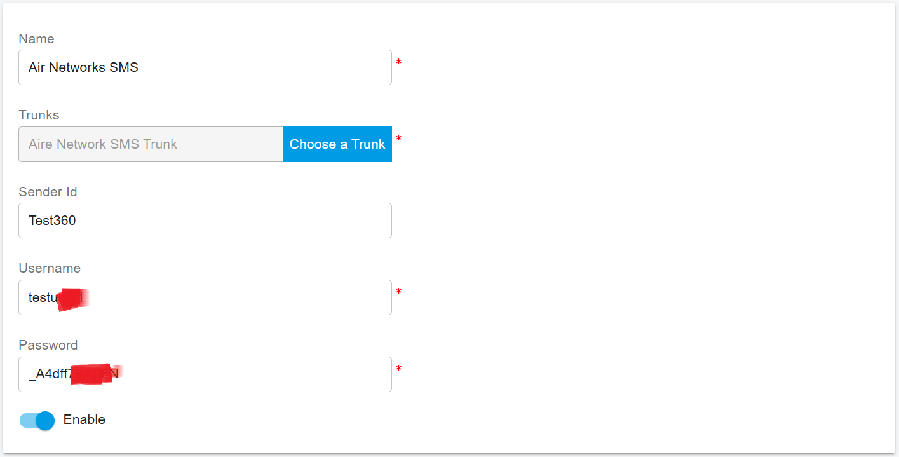
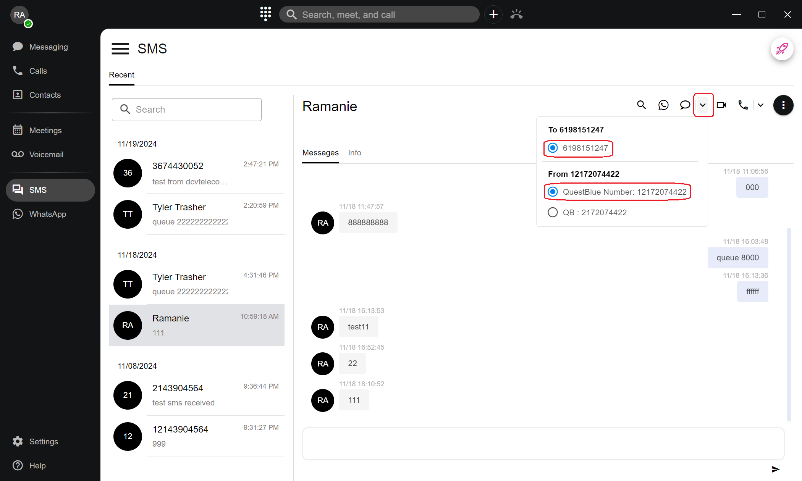

# Aire Networks SIP Trunk

[Aire Networks](https://airenetworks.es/) is a leading wholesale telecommunications operator in the Spanish market and part of Grupo Aire.

Using the Aire Networks SIP Trunk, you can send SMS messages to your customers directly from the PortSIP ONE app, enabling use cases such as marketing campaigns and customer notifications.

This guide explains how to configure the Aire Networks SIP Trunk in PortSIP PBX to enable outbound SMS.

***

### Sign Up and Purchase

To get started, contact **Aire Networks** to purchase an account and obtain your SMS credentials.

Typically, you will receive the following information:

* **Username**
* **Password**
* **Sender ID**

Keep these details available, as they are required during the SMS configuration process.

***

### Configure the Aire Networks SIP Trunk in PortSIP PBX

Follow the steps below to add the Aire Networks SIP trunk.

#### Add a Register-Based Trunk

1. Sign in to the PortSIP PBX Web Portal.
2. Navigate to **Call Manager > Trunks**.
3. Click the **Add** button and select **Register Based Trunk**.
4. Enter a **friendly name** for the trunk.
5. From the **Brand** drop-down list, select **Aire Networks** and keep the default settings.

<figure><figcaption></figcaption></figure>

6. Click **Next**, then:
   * Enter any value for **Username / Authentication Name**.
   * Enter any value for **Password**.
7. Click **Next** again and keep all remaining settings at their default values.
8. If you are logged in as a **System Administrator**, select one or more **tenants** in the final step to grant them access to this trunk.
9. Click **OK** to complete the trunk setup.

<figure><figcaption></figcaption></figure>

***

### Add an SMS Configuration

After the trunk is configured, add an SMS configuration for Aire Networks.

1. In the **PortSIP PBX Web Portal**, navigate to **SMS/MMS**.
2. Click **Add**.
3. Select your configured **Aire Networks Trunk**.
4. Enter the following values:
   * **Sender ID**\
     Enter the Sender ID provided by Aire Networks.
   * **Username**\
     Enter your Aire Networks **SMS account username**.
   * **Password**\
     Enter your Aire Networks **SMS account password**.
5. Click **OK** to save the configuration and return to the **SMS/MMS list** page.

<figure><figcaption></figcaption></figure>

***

### Grant SMS Permissions to an Extension

By default, extensions are **not allowed to send SMS**. A tenant administrator must explicitly enable this permission.

1. Sign in to the **PortSIP PBX Web Portal** as a tenant administrator.
2. Navigate to **Call Manager > Users**.
3. Double-click the target extension and open the **Extension** tab.
4.  Under **Send SMS/MMS**, select: **Allow Send SMS with Sender ID**

    > ❗Aire Networks always sends SMS messages using the configured **Sender ID**, so this option is required.
5. Save the changes.

<figure><figcaption></figcaption></figure>

***

### Send an SMS to a Contact (PortSIP ONE App)

To send an SMS to an existing contact:

1. Open the **PortSIP ONE** app.
2. Go to **Contacts**.
3. Select a contact and click the **SMS** icon to open the chat window.

<figure><figcaption></figcaption></figure>

4. Type your message and send it.&#x20;
5. You can also select the destination number and the sender's number to display to the recipient.

<figure><figcaption></figcaption></figure>

***

### Send an SMS Directly to a Phone Number

To send an SMS to a phone number that is not saved as a contact:

1. Open the **PortSIP ONE** app.
2. Click the **+** button at the top of the app and select **Send a Message**.
3. In the dialog:
   * Choose an extension (for internal IM), **or**
   * Enter a phone number directly to send an SMS.
4. Click the **message icon** to open the SMS chat interface.

<figure><figcaption></figcaption></figure>

5. Type and send your message.
6. You can also select the destination phone number and specify the sender's number that will appear to the recipient.

