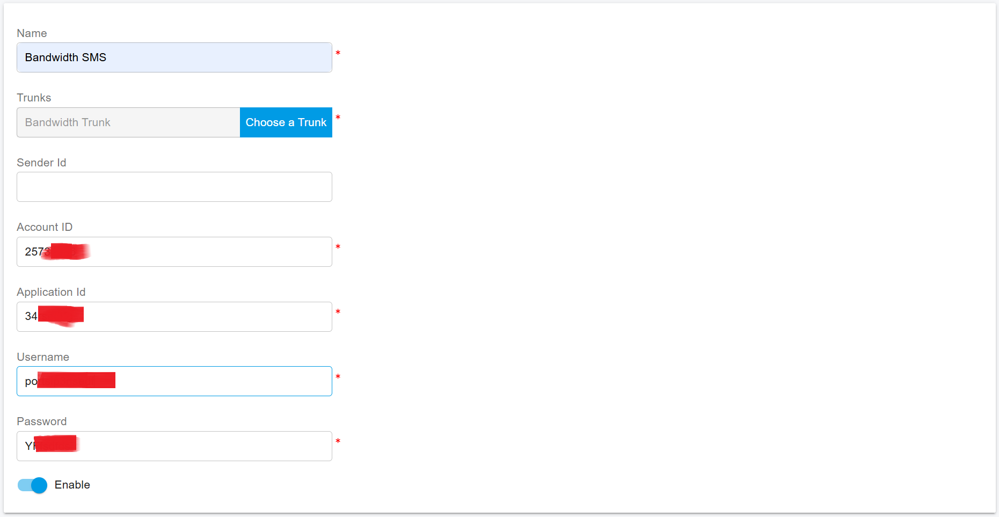

# Bandwidth SMS Integration

Before proceeding with the next steps, you need to [purchase a DID on the Bandwidth platform](purchase-a-did-on-bandwidth-platform.md) with the SMS feature activated.

Note: If you are using a newly added phone number or carrier account or have had messaging stop working unexpectedly, please make sure you have completed your carrier's 10DLC registration process before attempting to utilize PortSIP PBX. 10DLC registration is required by ALL supported carriers due to the requirements set by the wireless carriers.

## Obtaining Integration Details from Bandwidth

### 1. Obtaining the User ID

To retrieve your Bandwidth User ID:

* Log in to your Bandwidth account at [dashboard.bandwidth.com](https://dashboard.bandwidth.com).
* Once logged in, locate the User ID either in the **Overview** section or at the top right corner, next to the **Account Settings**.

### 2. Obtaining the Application ID

The Application ID is generated automatically when creating a new application. To obtain it:

* Go to the **Applications** section and click on **Create New Application**.
* Enter a descriptive name in the **Application Name** field, and select **Messaging** as the application type.
*   Set the **Callback URL** for the application, ensuring it matches the required format. At this moment, let us set **a fake URL** first, for example:

    `https://portsip.com/sms/bandwidth`
* Save your settings. The system will generate an **Application ID**, which you can now use.

### 3. Obtaining API Token and Secret

Once the application is created, you’ll need to generate your API credentials. Here’s how:

* In the upper right corner of the dashboard, click on **API Credentials** and select **Create New**.
* The system will generate a new **API Token** and **API Secret**. Make sure to copy these for future use.
* Save these credentials in a secure location.

## Configure SMS with VoIP Innovations Trunk in PortSIP PBX

Before configuring SMS in PortSIP PBX, you must have already configured a VoIP Innovation SIP trunk using one of the following guides:

* [Configuring Bandwidth IP Authentication Trunk](configuring-bandwidth-ip-authentication-trunk.md)

### Sign in PortSIP PBX Web Portal

You can sign in to the PortSIP PBX Web portal using one of the following methods:

1. Sign in as the PBX system administrator, navigate to the **Tenants** menu, choose a tenant, and click the **Manage** button to switch to that tenant.
2. Sign in as a tenant admin to manage the tenant.

For more details, please reference [Tenant Management](../../portsip-pbx-administration-guide/3-tenant-management.md).

### Add an SMS configuration

Please follow the below steps:

1. In the PortSIP PBX Web portal, navigate to the left menu, select **SMS/MMS**, and click the **Add** button.&#x20;
2. Choose your configured VoIP Innovations Trunk:
   * **Sender ID**: If you want to use the Sender ID that you created in the Bandwidth platform, please enter that Sender ID in this field. Otherwise, leave it empty, and the PortSIP PBX will use the DID number you configured for that VoIP Innovation trunk as the Sender ID.
   * **Account ID**: Enter the **User ID** you get in the step Obtaining the User ID.
   * Application ID: Enter the Application ID you get in the step Obtaining the Application ID.
   * Username: Enter the username&#x20;
   * Password:

<figure><figcaption></figcaption></figure>

4. Click **OK** to be brought to the SMS/MMS list page. You can select that SMS configuration and click the **Copy Webhook** button to copy it. Or Double-click the SMS configuration you created and copy the Webhook URL.

## Adding an SMS DID on VoIP Innovations

1. Log in to your VoIP Innovations account at [backoffice.voipinnovations.com](https://backoffice.voipinnovations.com).
2. Navigate to **SMS >** **Add New SMS DID**.
3. Set the **Destination Type** to **API POST**.
4. Enter the **SMS Number** you wish to add.
5. In the **URL** field, enter your copied Webhook URL from PortSIP PBX for this number.
6. Click **Configure** button to save the settings.

<figure><figcaption></figcaption></figure>

## Verify Configuration

Now you can [create the outbound and inbound rules](../wavix-sip-trunk/configuring-outbound-and-inbound-calls.md) in PortSIP PBX for sending and receiving SMS/MMS using the VoIP Innovation Trunk, just like you create the rules for making and receiving calls.

