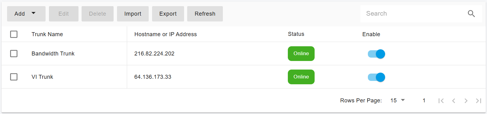

# Configuring Bandwidth IP Authentication Trunk

Before proceeding with the next steps, you need to purchase a DID on the [Bandwidth ](https://www.bandwidth.com/)platform.

***

### Overview

Bandwidth must be configured as an **IP-Based Trunk** at the PortSIP PBX System Administrator level.\
Once the trunk is successfully created, it can be shared with one or more tenants, and DIDs can be assigned through a DID Pool.

***

### Configure a Bandwidth IP Authentication Trunk in PortSIP PBX

#### Step 1: Create an IP-Based Trunk

1. Sign in to the **PortSIP PBX Web Portal** as a **System Administrator**.
2. From the left-hand menu, navigate to:\
   **Call Manager > Trunks**
3. Click **Add** to open the trunk type menu.
4. Select **IP Based Trunk**.

<figure><figcaption></figcaption></figure>

***

#### Step 2: Configure Basic Trunk Settings

1. Enter the following information:
   * **Name**\
     Enter a friendly name for the trunk (for example, _Bandwidth Trunk_).
   * **Brand**\
     Select **Bandwidth**.
   *   **Hostname or IP Address**

       * Contact the **Bandwidth Support Team** to obtain the IP addresses for your Bandwidth SIP trunk.
       * Bandwidth typically provides **two or more IP addresses**.
       * Enter the **primary IP address** in the **Hostname or IP Address** field.
       * Add the remaining IP addresses under **Associated IP Addresses**.

       **Example**

       ```
       216.82.224.202
       216.82.225.202
       ```
2. Click **Next**.

<figure><figcaption></figcaption></figure>

***

#### Step 3: Configure Trunk Options

1. Review the trunk options and adjust settings as needed.
2. Configure the following field if required:
   * **Max Concurrent Calls**\
     Defines the maximum number of simultaneous calls PortSIP PBX can establish using this trunk.\
     Set this value based on your capacity planning and service agreement with Bandwidth.

> **Best Practice**\
> Keep all other options at their default values unless Bandwidth has provided specific requirements.

3. Click **Next**.

<figure><figcaption></figcaption></figure>

***

#### Step 4: Assign Tenants and Configure the DID Pool

1. Select one or more **tenants** to grant access to this trunk.
2. Configure the **DID Pool** to assign Bandwidth DIDs to tenants.

> **Important**
>
> * Each DID can be assigned to **only one tenant**.
> * A tenant can use **only the DIDs in its assigned DID Pool** to:
>   * Create inbound rules
>   * Create outbound rules
>   * Configure outbound caller ID for extensions

**DID Pool Format Examples**

The DID Pool may include:

*   A single number

    ```
    16468097065
    ```
*   Multiple individual numbers

    ```
    16468097065;16468097066
    ```
*   A range of numbers

    ```
    16468097065-16468097066
    ```
*   A combination of ranges and individual numbers

    ```
    16468097065-16468097066;16468097070-16468097080
    ```

3. Click **OK** to save the configuration.

<figure><figcaption></figcaption></figure>

***

#### Expected Result

* The Bandwidth IP-Based Trunk is created successfully.
* In the trunk list, the status displays as **Online.**\
  (for **IP-Based Trunks**, the status always shows _Online_).

<figure><figcaption></figcaption></figure>

***

### Next Steps

The Bandwidth Register Authentication Trunk is now ready for use.

You can proceed to:

* Configure outbound call routing rules
* Configure inbound DID routing
* Assign outbound caller IDs

Refer to the next guide section: [Configuring Outbound & Inbound Calls](configuring-outbound-and-inbound-calls.md).<br>


