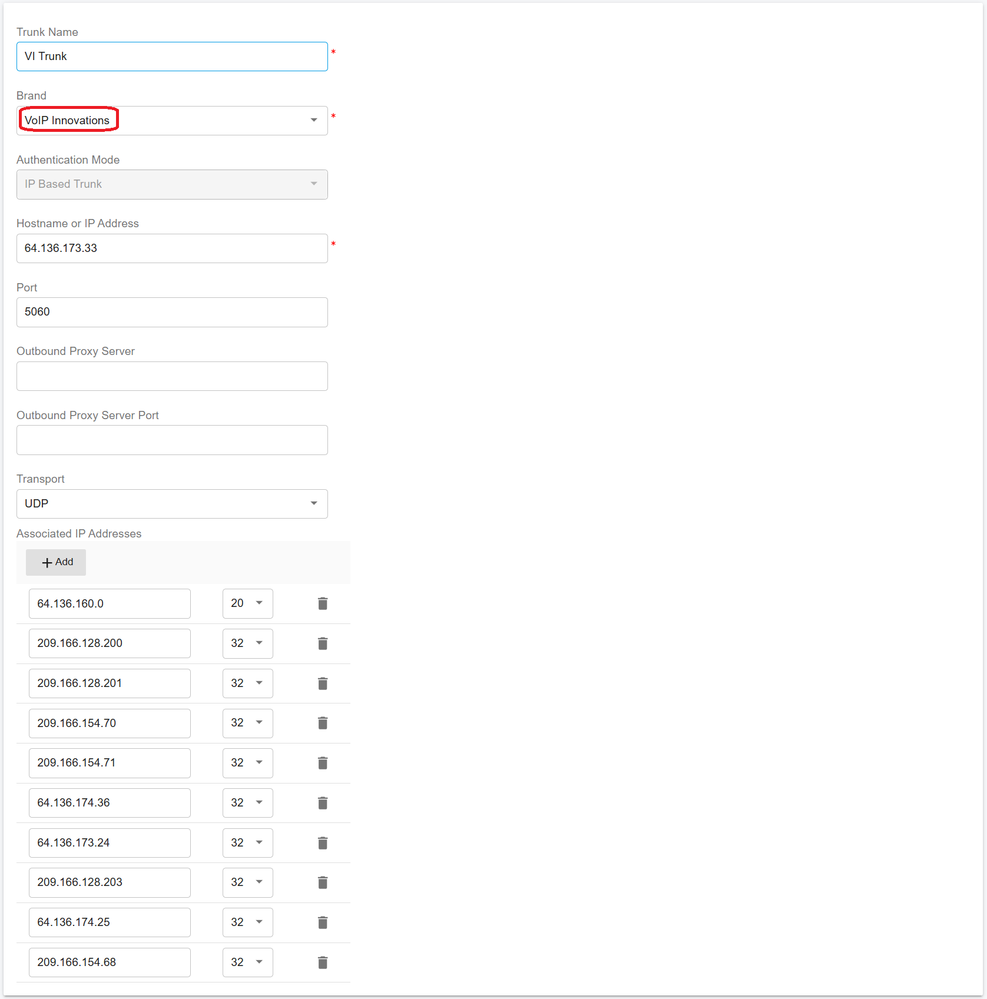
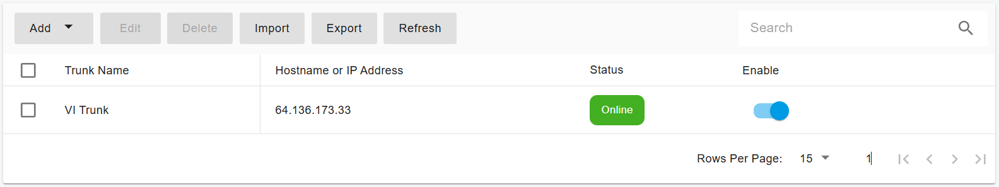

# Configuring Bandwidth IP Authentication Trunk

Before proceeding with the next steps, you need to purchase a DID on the [VoIP Innovations](../voip-innovations-sip-trunk/purchase-a-did-on-voip-innovations-platform.md) platform.

## Configure IP Authentication Trunk in PortSIP PBX

You must configure the VoIP Innovations as **IP Based Trunk** at the PortSIP PBX system administrator level. Once successfully configured, you can share this trunk with tenants.

Please follow the below steps:

1. Sign in to the PortSIP PBX Web Portal as a System Administrator. Navigate to the left menu and select **Call Manager > Trunks**.&#x20;
2. Click the **Add** button to open a menu. From the menu, choose **IP Based Trunk**.

<figure><figcaption></figcaption></figure>

3. Enter the trunk name and choose the brand:
   * **Name**: Enter a friendly name for the trunk.
   * **Brand**: Select **VoIP Innovations**.

<figure><figcaption></figcaption></figure>

4. Click the **Next** button, you can adjust the options for the trunk.
   * &#x20;**Max Concurrent Calls:** This field sets the maximum number of calls that PortSIP can establish with this trunk. You can adjust it to an appropriate value.
   * We recommend keeping the default settings for other options unless you have specific requirements.

<figure><figcaption></figcaption></figure>

5. Click the **Next** button to assign this trunk to the tenants and provide your VoIP Innovations DIDs/Numbers to them with the DID Pool (DID numbers). A DID can be only assigned to one tenant.

A tenant assigned to this trunk can only use the DID numbers within the DID pool range to create inbound and outbound rules and configure the outbound caller ID for extensions.

<figure><figcaption></figcaption></figure>

* DID Pool: The DID pool can consist of a single number, a range of numbers, or a combination of both. For example:
  * `16468097065`
  * `16468097065;16468097066`
  * `16468097065-16468097066;16468097069`&#x20;
  * `16468097065-16468097066;16468097070-16468097080`

Click the **OK** button to save the changes. The trunk configuration is now complete.

In the trunk list, you will see the status displayed as **Registered** (for IP Based Trunk it always displays Registered).

<figure><figcaption></figcaption></figure>

Now you can follow the article to [Configuring inbound and outbound calls](../voip-innovations-sip-trunk/configuring-outbound-and-inbound-calls.md).
