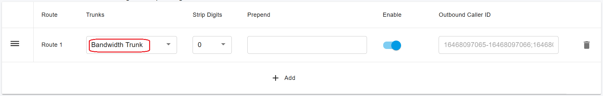
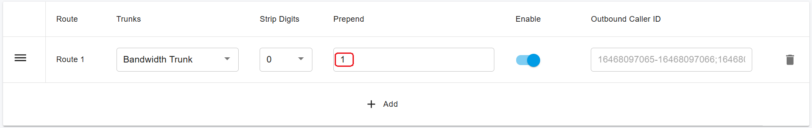
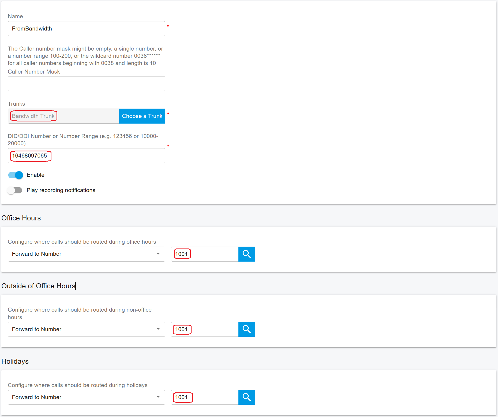

# Configuring Outbound & Inbound Calls

You need to sign in to the PortSIP PBX web portal to create the outbound and inbound rules for making & receiving calls.

***

### Sign in to the PortSIP PBX Web Portal

To configure outbound and inbound call routing, you must first sign in to the PortSIP PBX Web Portal.

You can access a tenant in one of the following ways:

#### Option 1: Sign in as System Administrator

1. Sign in to the PortSIP PBX Web Portal as a **System Administrator**.
2. Navigate to **Tenants**.
3. Select the desired tenant and click **Manage** to switch to that tenant’s administration context.

#### Option 2: Sign in as Tenant Administrator

* Sign in directly as a **Tenant Administrator** to manage that tenant.

> ❗**Note**\
> For more information about tenant roles and access control, refer to [Tenant Management](../../portsip-pbx-administration-guide/3-tenant-management/).

***

### Configure Outbound Rules

To place outbound calls, you must create **at least one Outbound Rule**.

***

#### Step 1: Add an Outbound Rule

1. From the left-hand navigation menu, go to: **Call Manager > Outbound Rules**
2. Click **Add**.
3. Enter a **Name** for the outbound rule\
   (for example, _Bandwidth-Outbound_).
4. In the **Apply this rule to the following calls** section, configure **at least one condition** to define which calls this rule applies to\
   (for example, number length or dialing prefix).

<figure><figcaption></figcaption></figure>

***

#### Step 2: Select the Trunk Route

1. Scroll to **Place outbound calls using the following trunk routes**.
2. Click the **Add (+)** icon.
3. Select the **Bandwidth Trunk**.
4. Click **Save** to apply the outbound rule.

<figure><figcaption></figcaption></figure>

***

#### Dialing Normalization (Optional)

Depending on your users’ dialing habits, you may need to:

* Strip leading digits, or
* Prepend a country code

**Example**\
If users dial U.S. domestic numbers without the leading `1`, you can configure the outbound rule to automatically **prepend `1`**, ensuring calls are sent to Bandwidth in the correct format.

<figure><figcaption></figcaption></figure>

***

### Configure Inbound Rules

To receive inbound calls, you must create **at least one Inbound Rule**.

***

#### Step 1: Add an Inbound Rule

1. From the left-hand navigation menu, go to: **Call Manager > Inbound Rules**
2. Click **Add**.
3. Enter a **Name** for the inbound rule\
   (for example, _Bandwidth-Inbound_).
4. Click **Choose a Trunk** and select the **Bandwidth Trunk**.
5. In the **DID/DDI Number** or **Number Range** field, enter the DID(s).
   * The number must fall within the **DID Pool range** of the selected trunk.
6. Select the **Extension** (or destination) to route inbound calls to.
7. Click **OK** to save the inbound rule.

<figure><figcaption></figcaption></figure>

#### Step 2: (Optional) Configure Time-Based Routing

Depending on your business requirements, you can further enhance the inbound rule by:

* Defining **office hours** or schedules
* Routing calls to **different extensions** based on time of day
* Sending calls to **voicemail** outside business hours
* Automatically **rejecting or dropping calls** based on the schedule

For more details, refer to [Call Route Management](../../portsip-pbx-administration-guide/8-call-route-management/).

