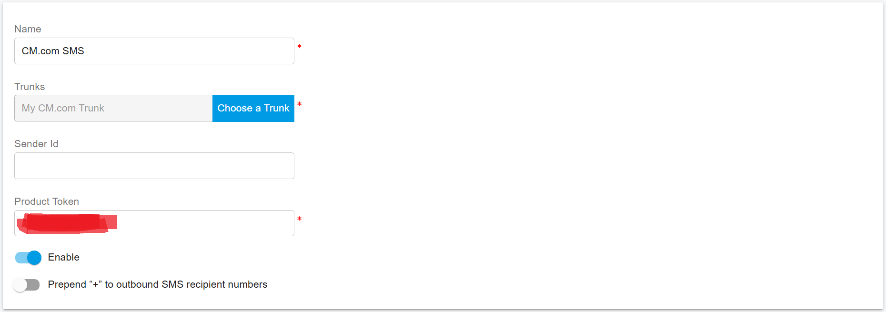

# CM.COM SMS Integration

Before proceeding with the next steps, ensure that you have [purchased an SMS-enabled DID number on the CM.com platform](purchase-a-did-on-cm.com-platform.md).

> **Important — U.S. A2P 10DLC Compliance**
>
> Under U.S. regulations for **A2P 10DLC (Application-to-Person SMS)**, SMS-enabled numbers must be **registered with mobile carriers** to avoid message blocking.
>
> * This requirement applies **only to A2P messaging** (application-generated messages sent to users).
> * It does **not** apply to **P2P (Person-to-Person)** messaging.
>
> Make sure your messaging use case is properly registered and approved on the CM.com platform before sending production SMS traffic.

***

### Obtain Integration Details from CM.com

To integrate the CM.com SMS Gateway with PortSIP PBX, you must obtain a **Product Token**, which is used to authenticate communication between PortSIP PBX and the CM.com platform.

#### Obtain the Product Token

1. Sign in to the **CM.com platform**.
2. Follow the CM.com guide [Where can I find my Product Token?](https://knowledgecenter.cm.com/knowledge-center/communications-platform/sms/business-messaging-api/where-can-i-find-my-product-token)
3. Copy the **Product Token** and keep it available for later configuration in PortSIP PBX.

The Product Token is required to securely authenticate API requests between **PortSIP PBX** and **CM.com**.

<figure><figcaption></figcaption></figure>

***

### Configure SMS with a CM.com Trunk in PortSIP PBX

Before configuring SMS in PortSIP PBX, ensure that you have already configured a CM.com SIP trunk using one of the following guides:

* [Configuring a CM.com IP Authentication Trunk](configuring-cm.com-ip-authentication-trunk.md)
* [Configuring a CM.com Register Authentication Trunk](configuring-cm.com-register-authentication-trunk.md)

***

### Sign In to the PortSIP PBX Web Portal

You can sign in to the PortSIP PBX Web Portal using one of the following methods:

* **System Administrator**\
  Sign in as a PBX system administrator, navigate to **Tenants**, select a tenant, and click **Manage** to switch to that tenant’s management view.
* **Tenant Administrator**\
  Sign in directly as a tenant administrator to manage your own tenant.

For more information, refer to [Tenant Management](../../portsip-pbx-administration-guide/3-tenant-management/).

***

### Add an SMS Configuration

Follow the steps below to configure SMS using the **CM.com** trunk:

1. Sign in to the PortSIP PBX Web Portal.
2. From the left-hand menu, navigate to **SMS/MMS**.
3. Click **Add**.
4. Configure the following settings:
   * **Trunk**\
     Select your previously configured **CM.com Trunk**.
   * **Sender ID**
     * If you have configured a **Sender ID in the CM.com platform**, enter it here.
     * If left empty, PortSIP PBX will use the **DID number associated with the CM.com trunk** as the Sender ID.
   * **Product Token**\
     Enter the **Product Token** obtained in the [Obtaining the Product Token](cm.com-sms-integration.md#obtain-the-product-token) step.
5. Click **OK** to save the configuration.

After saving, you will be redirected to the **SMS/MMS list** page.

<figure><figcaption></figcaption></figure>

***

### Copy the Webhook URL

To complete the integration:

* Select the SMS configuration you just created and click **Copy Webhook**, **or**
* Double-click the SMS configuration and manually copy the **Webhook URL**.

This Webhook URL is required for receiving inbound SMS/MMS messages from the CM.com platform.

#### Configure the Webhook in the CM.com Portal

* Log in to the [CM.com Portal](https://www.google.com/search?q=https://gateway.cm.com/\&authuser=2), navigate to the **SMS channel** settings.
* Configure the **Webhook URL** by pasting the Webhook copied from **PortSIP PBX**.
* Set the HTTP method to **POST**.
* Save the configuration.

***

### Verify the Configuration

Once the SMS configuration is complete:

* [Create Outbound Rules and Inbound Rules](configuring-outbound-and-inbound-calls.md) in PortSIP PBX for sending and receiving SMS/MMS using the CM.com trunk.
* The rule creation process is the same as configuring call routing rules.

