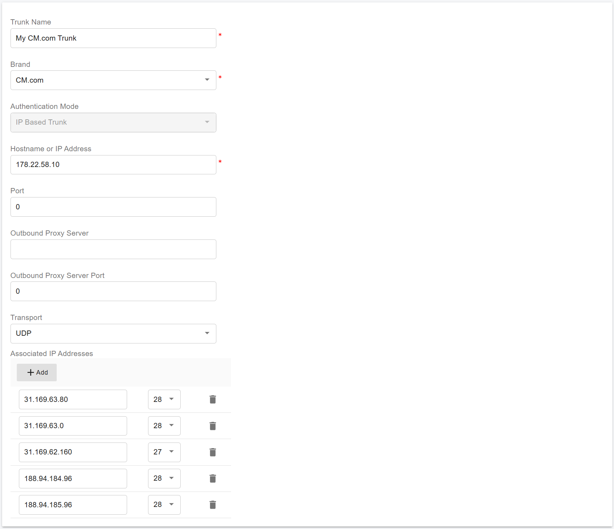
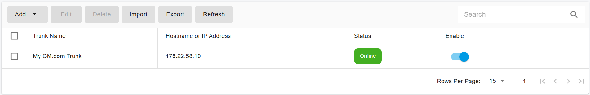

# Configuring COM.com IP Authentication Trunk

Before proceeding with trunk configuration, ensure that you have purchased at least one DID on the [CM.com](https://www.cm.com) platform.

***

### CM.com Setup Guide

To enable inbound calling, you must first complete the required configuration on the CM.com platform.

1. Sign in to your [CM.com](https://www.cm.com) account.
2. Follow the CM.com guide to configure inbound DIDs: [How do I configure a DDI for incoming calls?](https://knowledgecenter.cm.com/knowledge-center/communications-platform/sip-trunking/ddi-numbers/how-do-i-configure-a-ddi-for-incoming-calls)
3. Confirm that the DID is active and ready for SIP trunking.

Once completed, continue with the trunk configuration in PortSIP PBX.

***

### Configure a CM.com IP Authentication Trunk in PortSIP PBX

You can configure [CM.com](https://www.cm.com) as an **IP-Based Trunk** at the **system administrator** level. After configuration, this trunk can be shared with one or more tenants.

***

#### Step 1: Create the IP-Based Trunk

1. Sign in to the PortSIP PBX Web Portal as a System Administrator.
2. Navigate to **Call Manager > Trunks**.
3. Click **Add**, then select **IP Based Trunk**.

<figure><figcaption></figcaption></figure>

***

#### Step 2: Enter Trunk Details

Configure the trunk with the following settings:

* **Name**: Enter a friendly name for the trunk (for example, `CM.com SIP Trunk`)
* **Brand**: Select **CM.com**
* **Hostname or IP Address**: 178.22.58.10

Click **Next** to continue.

<figure><figcaption></figcaption></figure>

***

#### Step 3: Configure Trunk Options

* **Max Concurrent Calls**\
  Set the maximum number of concurrent calls allowed on this trunk. Adjust this value based on your CM.com subscription and expected traffic.

> ❗**Recommendation**\
> Keep the default values for other options unless you have specific requirements.

Click **Next** to continue.

<figure><figcaption></figcaption></figure>

***

#### Step 4: Assign the Trunk to Tenants and Configure the DID Pool

1. Assign the trunk to one or more **tenants**.
2. Configure the **DID Pool**(DID numbers) using the CM.com DIDs you purchased.

> ❗**Important**
>
> A DID number can be assigned to **only one tenant**.

A tenant assigned to this trunk can:

* Use **only** the DID numbers defined in the **DID Pool**
* Create **inbound and outbound routing rules** based on the assigned DID numbers
* Configure **outbound caller IDs** for extensions using the assigned DID numbers

***

**DID Pool Format Examples**

The DID Pool can include a single number, multiple numbers, or number ranges, separated by semicolons.

For example:

```
16468097065
16468097065;16468097066
16468097065-16468097066;16468097069
16468097065-16468097066;16468097070-16468097080
```

***

#### Step 5: Save the Configuration

1. Click **OK** to save the trunk configuration.

<figure><figcaption></figcaption></figure>

***

### Expected Result

* The [CM.com](https://www.cm.com) IP-based trunk is successfully created.
* The trunk status displays **Registered**\
  &#xNAN;_(IP-Based Trunks always show “Registered” in PortSIP PBX)_.
* Assigned tenants can immediately use the configured DIDs for inbound and outbound calls.

***

> ❗**Note**\
> Ensure that CM.com allows traffic from your PBX IP address when using IP authentication.


Now you can follow the article on [Configuring inbound and outbound calls](../flowroute-sip-trunk/configuring-outbound-and-inbound-calls.md).<br>
