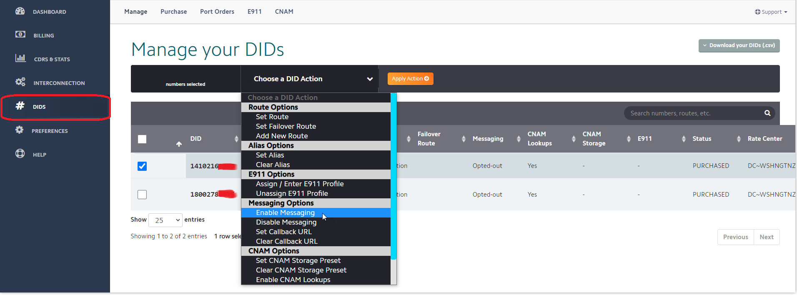
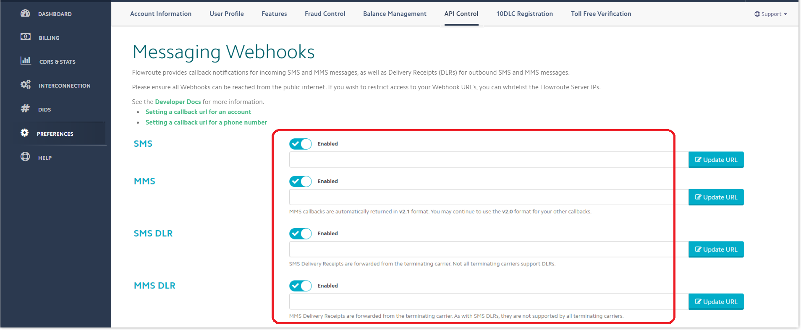

# Flowroute SMS Integration

Before proceeding with the next steps, you need to [purchase a DID on the Flowroute platform](../flowroute-sip-trunk/purchase-a-did-on-flowroute-platform.md) with the SMS feature activated.

**Important**: According to US legislation (A2P 10DLC SMS), SMS numbers must be registered with a wireless carrier to avoid being blocked. This only applies to A2P numbers (Application to People) and not P2P (People to People). Follow [this guide](https://support.flowroute.com/265034-Messaging-Guidelines---10DLC-Carrier-Fees-and-Registration) to register your phone numbers.

## Obtaining Integration Details from Flowroute

### Create the API Key

To create your Flowroute API Key:

* Log in to the [Flowroute Portal](https://manage.flowroute.com/).
* Select the menu **PREFERENCES** and click on the **API Control** tab. Enter the name for your API and click the **Add new** button to create it.

<figure><figcaption></figcaption></figure>

### Obtaining the Access Key and Secret Key

To retrieve your Flowroute Access Key and Secret Key:

* After you create the new API Key, you will be on the page as shown in the below screenshot
* Copy the note down the **Access Key** and **Secret Key**.

<figure><figcaption></figcaption></figure>

## Configure SMS with Flowroute Trunk in PortSIP PBX

Before configuring SMS in PortSIP PBX, you must have already configured a Flowroute SIP trunk using one of the following guides:

* [Configuring Flowroute IP Authentication Trunk](../flowroute-sip-trunk/configuring-flowroute-ip-authentication-trunk.md)

### Sign in PortSIP PBX Web Portal

You can sign in to the PortSIP PBX Web portal using one of the following methods:

1. Sign in as the PBX system administrator, navigate to the **Tenants** menu, choose a tenant, and click the **Manage** button to switch to that tenant.
2. Sign in as a tenant admin to manage the tenant.

For more details, please reference [Tenant Management](../../portsip-pbx-administration-guide/3-tenant-management/).

### Add an SMS configuration

Please follow the below steps:

1. In the PortSIP PBX Web portal, navigate to the left menu, select **SMS/MMS**, and click the **Add** button.&#x20;
2. Choose your configured Flowroute Trunk:
   * **Sender ID**: If you want to use the Sender ID that you created in the Flowroute platform, please enter that Sender ID in this field. Otherwise, leave it empty, and the PortSIP PBX will use the DID number you configured for that Flowroute trunk as the Sender ID.
   * **Access Key**: Enter the **Access Key** you obtained in the [Obtaining the Access Key and Secret Key](flowroute-sms-integration.md#id-2.-obtaining-the-access-key-and-secret-key) step.
   * **Secret Key**: Enter the **Secret Key** you obtained in the [Obtaining the Access Key and Secret Key](flowroute-sms-integration.md#id-2.-obtaining-the-access-key-and-secret-key) step.

<figure><figcaption></figcaption></figure>

4. Click **OK** to be brought to the SMS/MMS list page. You can select that SMS configuration and click the **Copy Webhook** button to copy it. Or Double-click the SMS configuration you created and copy the Webhook URL.

## Configure SMS for a Number in Flowroute

To enable SMS functionality for a specific number in Flowroute, follow these steps:

1. **Log in to the Flowroute Portal**: Access your account at the [Flowroute Portal](https://manage.flowroute.com/).
2. **Navigate to the DIDs Section**: From the main menu, select **DIDs**, then click on the **Manage** tab.
3. **Select the Number**: Choose the phone number for which you want to enable SMS.
4. **Enable SMS**: From the "**Choose a DID Action"** dropdown, select **Enable Messaging** to activate the SMS feature for that number.

<figure><figcaption></figcaption></figure>

You can configure a webhook for SMS callback notifications in one of two ways, depending on your needs:

* **For Specific Numbers**: If you want to receive inbound message notifications only for a particular number, configure a messaging webhook for that number individually. Use the PBX’s Webhook URL to receive these notifications.

<figure><figcaption></figcaption></figure>

* **For All Numbers in Your Account**: If you need to receive inbound message notifications for all numbers under your account, set up a **global messaging webhook** with the PBX’s Webhook URL, as illustrated below.

<figure><figcaption></figcaption></figure>

## Verify Configuration

Now you can [create the outbound and inbound rules](../wavix-sip-trunk/configuring-outbound-and-inbound-calls.md) in PortSIP PBX for sending and receiving SMS/MMS using the Flowroute Trunk, just like you create the rules for making and receiving calls.

