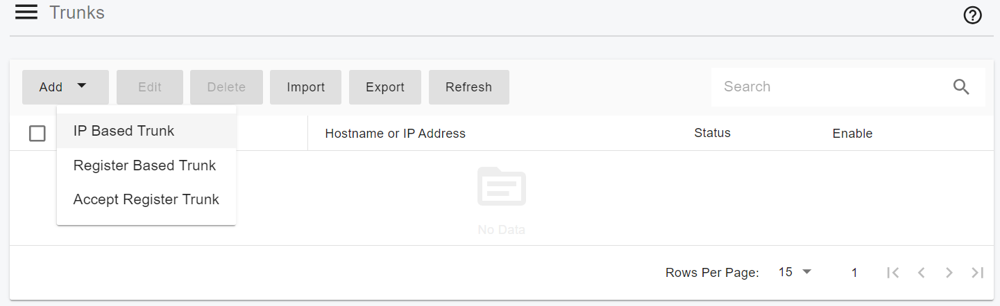

# Configuring Flowroute IP Authentication Trunk

Before proceeding with the next steps, you need to purchase a DID on the [Flowroute ](https://www.flowroute.com)platform.

This section explains how to configure **IP Authentication** and **Inbound Routes** in the Flowroute portal so the trunk can successfully interoperate with PortSIP PBX.

***

### Configure IP Authentication

The **IP Authentication** section defines which PBX is allowed to send and receive SIP traffic and provides key information used later in PortSIP PBX.

#### Steps

1. Log in to your Flowroute portal.
2. Navigate to the **IP Authentication** section.
3. Add the **public static IP address** of your PortSIP PBX server.

After configuring IP authentication, Flowroute will provide:

* **SIP Host** for the trunk
* **Call Prefix**

> **Important**\
> Make a note of the **Call Prefix**. You will need it later when configuring **Outbound Rules** in PortSIP PBX.

<figure><figcaption></figcaption></figure>

***

### Configure Inbound Routes

Inbound routes define where incoming calls from Flowroute are delivered.

#### Steps

1. In the Flowroute portal, navigate to **Inbound Routes**.
2. Create a new inbound route.
3. Set the **Route Type** to **Host**.
4.  In the **Route** field, enter your PortSIP PBX address using the following format:

    ```
    sip:<PBX-IP>:<PORT>
    ```

    **Example (default SIP port):**

    ```
    sip:1.2.3.4:5060
    ```

    **Example (custom SIP port):**

    ```
    sip:1.2.3.4:5081
    ```

    > Replace `1.2.3.4` with the **actual static public IP address** of your PBX.
5. In the **Edge Strategy** drop-down list, select the **SIP Proxy Host** noted earlier in the **IP Authentication** section.
6. Save the inbound route.

<figure><figcaption></figcaption></figure>

***

### Associate DIDs with Inbound Routes

To ensure inbound calls reach your PBX, each DID must be linked to the correct inbound route.

#### Steps

1. In the Flowroute portal, navigate to the **DIDs** section.
2. Select your purchased DID(s).
3. Associate the DID(s) with the **inbound route** you just created.
4. Save the changes.

***

### Configure an IP Authentication Trunk in PortSIP PBX

To integrate Flowroute with PortSIP PBX, you must configure Flowroute as an **IP-Based Trunk** at the **System Administrator** level.\
Once configured, the trunk can be **shared with one or more tenants**.

***

#### Step 1: Create an IP-Based Trunk

1. Sign in to the PortSIP PBX Web Portal as a **System Administrator**.
2. From the left-hand navigation menu, go to:\
   **Call Manager > Trunks**
3. Click **Add**.
4. From the menu, select **IP Based Trunk**.

<figure><figcaption></figcaption></figure>

***

#### Step 2: Configure Basic Trunk Settings

Enter the following information:

* **Name**\
  Enter a friendly name for the trunk\
  (for example, _Flowroute-Trunk_).
* **Brand**\
  Select **Flowroute**.
*   **Hostname or IP Address**\
    Enter the Flowroute SIP host:

    ```
    us-west-or.sip.flowroute.com
    ```
*   **Associated IP Addresses**

    * Contact [Flowroute Support](https://flowroute.com/contact-us/) to obtain the IP addresses for your SIP trunk.
    * Flowroute typically provides **one or more IP addresses**.
    * Add all provided IP addresses in this field.

    **Example:**

    ```
    210.82.221.12
    210.82.221.13
    ```

5. Click **Next**.

<figure><figcaption></figcaption></figure>

***

#### Step 3: Configure Trunk Options

1. Review the trunk options.
2. Configure the following field if required:
   * **Max Concurrent Calls**\
     Sets the maximum number of simultaneous calls PortSIP PBX can establish using this trunk.\
     Adjust this value according to your capacity planning and Flowroute service agreement.

> **Best Practice**\
> Keep all other options at their default values unless Flowroute has provided specific requirements.

3. Click **Next**.

<figure><figcaption></figcaption></figure>

***

#### Step 4: Assign Tenants and Configure the DID Pool

1. Select one or more **tenants** to grant access to this trunk.
2. Configure the **DID Pool** to assign Flowroute DIDs to tenants.

> **Important**
>
> * Each DID can be assigned to **only one tenant**.
> * A tenant can use **only the DIDs in its assigned DID Pool** to:
>   * Create inbound rules
>   * Create outbound rules
>   * Configure outbound caller ID for extensions

**DID Pool Format Examples**

*   Single number

    ```
    16468097065
    ```
*   Multiple individual numbers

    ```
    16468097065;16468097066
    ```
*   Range of numbers

    ```
    16468097065-16468097066
    ```
*   Combination of ranges and individual numbers

    ```
    16468097065-16468097066;16468097070-16468097080
    ```

3. Click **OK** to save the configuration.

<figure><figcaption></figcaption></figure>

***

#### Expected Result

* The Flowroute IP-Based Trunk is created successfully.
* In the trunk list, the status displays as **Online.**\
  (for IP-Based Trunks, the status always shows _On line_).

<figure><figcaption></figcaption></figure>

***

### Next Steps

The VoIP.ms Register Authentication Trunk is now ready for use.

You can proceed to:

* Configure outbound call routing rules
* Configure inbound DID routing
* Assign outbound caller IDs

Refer to the next guide section: [Configuring Outbound & Inbound Calls](configuring-outbound-and-inbound-calls.md).


<br>
