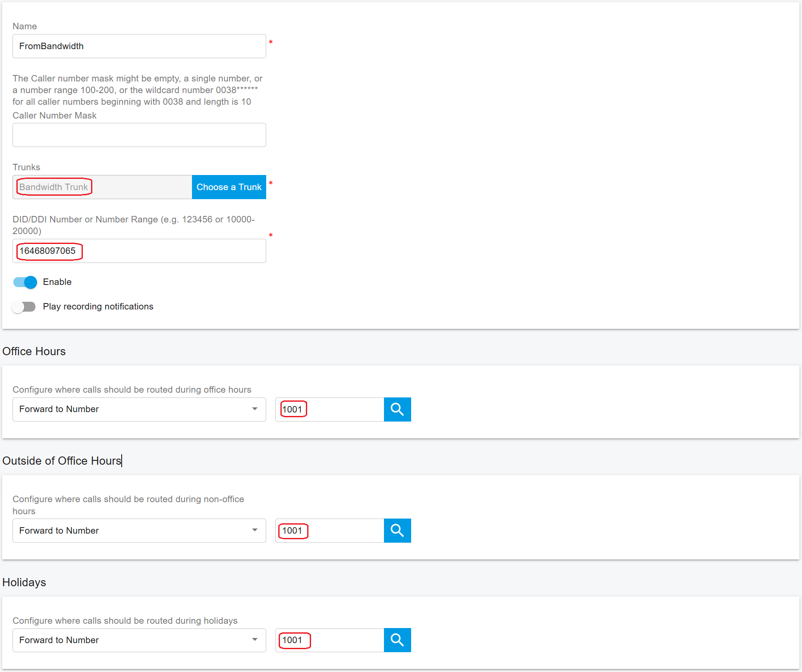

# Configuring Outbound & Inbound Calls

You need to sign in to the PortSIP PBX web portal to create the outbound and inbound rules for making & receiving calls.

## Sign in PortSIP PBX Web Portal

You can sign in to the PortSIP PBX Web portal using one of the following methods:

1. Sign in as the PBX system administrator, navigate to the **Tenants** menu, choose a tenant, and click the **Manage** button to switch to that tenant.
2. Sign in as a tenant admin to manage the tenant.

For more details please reference [Tenant Management](../../portsip-pbx-administration-guide/3-tenant-management.md).

## Configure Outbound Rules

### Add Outbound Rule in PortSIP PBX

In order to place outbound calls you need to configure Outbound Rules. Go to **Call Manager > Outbound Rules** in the left hand side menu and click the **Add** button:

1. Give your Outbound Rule a name
2. Set up at least one condition for this outbound rule in the section **Apply this rule to the following calls**

<figure><figcaption></figcaption></figure>

3. Scroll to the Place outbound calls using the following trunk routes section, click the Add icon, then select **Flowroute Trunk** and save the Outbound Rule.

In the **IP Authentication** section of the Flowroute portal, you will find a **Tech Prefix**. This prefix must be prepended to every outbound call when using the IP Authentication method.&#x20;

The Tech Prefix should be added to the outbound rules for outbound calls to ensure they are correctly processed by the Flowroute trunk. As the below screnshot shown up, enter the tech prefix **52709417\*** for the **Prepend** field.

<figure><figcaption></figcaption></figure>

## Configure Inbound Rules

### Add Inbound Rule in PortSIP PBX

In order to receive inbound calls, you need to configure Inbound Rules. Go to **Call Manager > Outbound Rules** in the left hand side menu and click the **Add** button:

1. Give your Inbound Rule a name
2. Click the **Choose a Trunk** button to select the trunk
3. Enter the number for **DID/DDI Number or Number Range** field, the entered number must in the DID pool range of the selected trunk
4. Set the extension to route calls to.

<figure><figcaption></figcaption></figure>

Click **OK** to save the rule. Depending on your business needs, you may set specific office hours for the rule and route calls to different extensions, and voice mailbox or automatically drop the call based on the schedule. Please reference the article [Office Hours and Holiday Schedule](../../portsip-pbx-administration-guide/office-hours-and-holiday-schedule/) for more details.

Please make sure that all your Flowroute DIDs are set up in the DID Pool of the Flowroute Trunk you configured in the PortSIP PBX.

For more details about the outbound and inbound rule configuration, please refer to the article [Call Route Management](../../portsip-pbx-administration-guide/8-call-route-management/).

