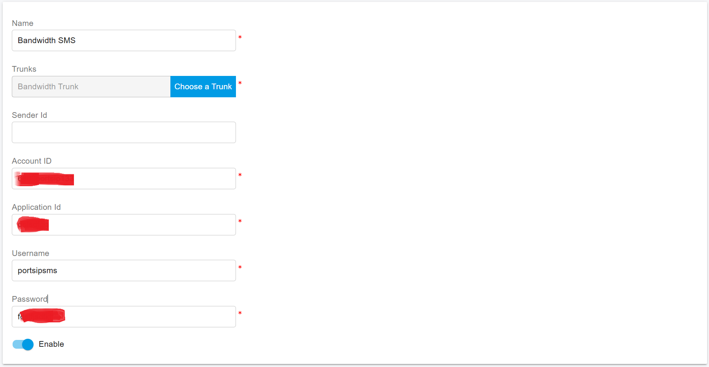

# Flowroute SMS Integration

Before proceeding with the next steps, you need to purchase a DID on the Flowroute platform with the SMS feature activated.

Note: If you are using a newly added phone number or carrier account or have had messaging stop working unexpectedly, please make sure you have completed your carrier's 10DLC registration process before attempting to utilize PortSIP PBX. 10DLC registration is required by ALL supported carriers due to the requirements set by the wireless carriers.

## Obtaining Integration Details from Bandwidth

### 1. Obtaining the User ID

To retrieve your Bandwidth User ID:

* Log in to your Bandwidth account at [dashboard.bandwidth.com](https://dashboard.bandwidth.com).
* Once logged in, locate the User ID either in the **Overview** section or at the top right corner, next to the **Account Settings**.

### 2. Obtaining the Application ID

The Application ID is generated automatically when creating a new application. To obtain it:

* Go to the **Applications** section and click on **Create New Application**.
* Enter a descriptive name in the **Application Name** field, and select **Messaging** as the application type.
*   Set the **Callback URL** for the application, ensuring it matches the required format. At this moment, let us set **a fake URL** first, for example:

    `https://portsip.com/sms/bandwidth`
* Save your settings. The system will generate an **Application ID**, which you can now use.

### 3. Obtaining API Token and Secret

Once the application is created, you’ll need to generate your API credentials. Here’s how:

* In the upper right corner of the dashboard, click on **API Credentials** and select **Create New**.
* The system will generate a new **API Token** and **API Secret**. Make sure to copy these for future use.
* Save these credentials in a secure location.

Here is the Bandwidth official documentation for your reference: [How do I set up a Messaging API account in the Bandwidth App?](https://support.bandwidth.com/hc/en-us/articles/360033658613-How-do-I-set-up-a-Messaging-API-account-in-the-Bandwidth-App)

## Configure SMS with Bandwidth Trunk in PortSIP PBX

Before configuring SMS in PortSIP PBX, you must have already configured a Bandwidth SIP trunk using one of the following guides:

* [Configuring Bandwidth IP Authentication Trunk](../bandwidth-sip-trunk/configuring-bandwidth-ip-authentication-trunk.md)

### Sign in PortSIP PBX Web Portal

You can sign in to the PortSIP PBX Web portal using one of the following methods:

1. Sign in as the PBX system administrator, navigate to the **Tenants** menu, choose a tenant, and click the **Manage** button to switch to that tenant.
2. Sign in as a tenant admin to manage the tenant.

For more details, please reference [Tenant Management](../../portsip-pbx-administration-guide/3-tenant-management.md).

### Add an SMS configuration

Please follow the below steps:

1. In the PortSIP PBX Web portal, navigate to the left menu, select **SMS/MMS**, and click the **Add** button.&#x20;
2. Choose your configured Bandwidth Trunk:
   * **Sender ID**: If you want to use the Sender ID that you created in the Bandwidth platform, please enter that Sender ID in this field. Otherwise, leave it empty, and the PortSIP PBX will use the DID number you configured for that Bandwidth trunk as the Sender ID.
   * **Account ID**: Enter the **User ID** you obtained in the [Obtaining the User ID step](flowroute-sms-integration.md#id-1.-obtaining-the-user-id).
   * **Application ID**: Enter the **Application ID** you obtained in the [Obtaining the Application ID](flowroute-sms-integration.md#id-2.-obtaining-the-application-id) step.
   * **API Token**: Enter the **API Token** you obtained in the [Obtaining API Token and Secret](flowroute-sms-integration.md#id-3.-obtaining-api-token-and-secret) step.
   * **API Secret**: Enter the **API Secret** you obtained in the [Obtaining API Token and Secret](flowroute-sms-integration.md#id-3.-obtaining-api-token-and-secret) step.

<figure><figcaption></figcaption></figure>

4. Click **OK** to be brought to the SMS/MMS list page. You can select that SMS configuration and click the **Copy Webhook** button to copy it. Or Double-click the SMS configuration you created and copy the Webhook URL.
5. **Sign in** to your Bandwidth dashboard. Go to the **Applications** section.
6. Find the **Webhook URL** field and replace the old fake URL with the new **Webhook URL** you copied from PortSIP PBX.
7. **Save** the changes.

## Verify Configuration

Now you can [create the outbound and inbound rules](../wavix-sip-trunk/configuring-outbound-and-inbound-calls.md) in PortSIP PBX for sending and receiving SMS/MMS using the Bandwidth Trunk, just like you create the rules for making and receiving calls.

