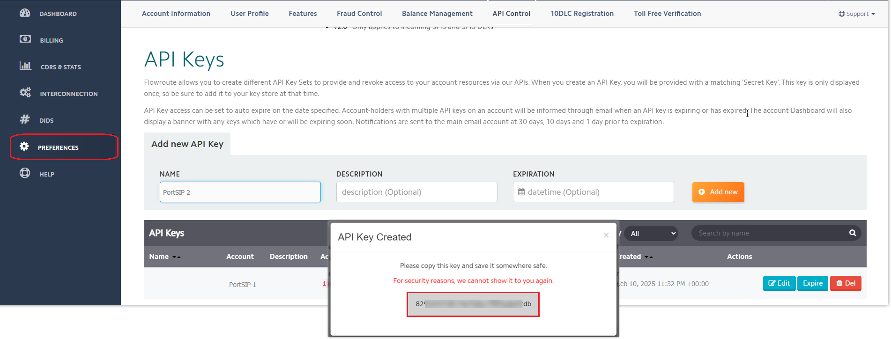
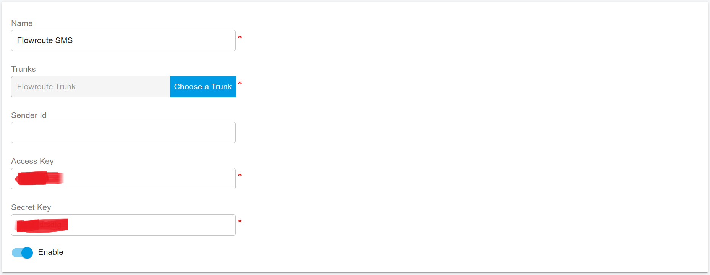

# Flowroute SMS Integration

Before proceeding with the next steps, ensure that you have [purchased a DID on the Flowroute ](purchase-a-did-on-flowroute-platform.md)platform with SMS enabled.

### Important: A2P 10DLC Registration (U.S.)

> **Compliance Notice**\
> Under U.S. regulations (**A2P 10DLC – Application-to-Person SMS**), SMS-capable phone numbers **must be registered with wireless carriers** to avoid message blocking or filtering.

* This requirement applies **only to A2P messaging** (application-generated messages).
* It does **not** apply to **P2P (Person-to-Person)** messaging.
* Failure to complete registration may result in:
  * SMS delivery failures
  * Message throttling
  * Complete blocking by carriers

Follow Flowroute’s [official guide](https://support.flowroute.com/265034-Messaging-Guidelines---10DLC-Carrier-Fees-and-Registration) to complete **A2P 10DLC registration** before enabling SMS in PortSIP PBX.

***

### Obtain Integration Details from Flowroute

PortSIP PBX requires API credentials from Flowroute to enable SMS/MMS integration.

***

#### Step 1: Create an API Key

1. Log in to the [Flowroute Portal](https://manage.flowroute.com/).
2. From the top menu, select **Preferences**.
3. Open the **API Control** tab.
4. Enter a **name** for your API key.
5. Click **Add New** to create the API key.

<figure><figcaption></figcaption></figure>

***

#### Step 2: Obtain the Access Key and Secret Key

1. After creating the API key, remain on the API Control page.
2. Locate the newly generated credentials.
3. **Copy and securely store** the following values:
   * Access Key
   * Secret Key

> **Security Best Practice**\
> Treat the Access Key and Secret Key as sensitive credentials.\
> Do not expose them publicly or store them in plaintext files.

<figure><figcaption></figcaption></figure>

***

### Configure SMS with Flowroute Trunk in PortSIP PBX

This section explains how to configure **SMS messaging** in PortSIP PBX using a Flowroute SIP trunk.

***

#### Prerequisites

Before configuring SMS in PortSIP PBX, ensure that:

* A Flowroute SIP trunk has already been configured using the guide:
  * [Configuring Flowroute IP Authentication Trunk](configuring-flowroute-ip-authentication-trunk.md)
* A Flowroute DID with SMS enabled is available
* You have obtained the Flowroute Access Key and Secret Key

***

#### Sign in to the PortSIP PBX Web Portal

You can sign in using one of the following methods:

* **System Administrator**
  * Sign in as a PBX System Administrator.
  * Navigate to **Tenants**.
  * Select the tenant and click **Manage** to switch into that tenant.
* **Tenant Administrator**
  * Sign in directly as a **Tenant Admin** to manage the tenant.

> **Note**\
> For more details, see [Tenant Management](../../portsip-pbx-administration-guide/3-tenant-management/).

***

### Add an SMS Configuration in PortSIP PBX

#### Step 1: Create the SMS Configuration

1. In the **PortSIP PBX Web Portal**, navigate to: **Message Channel > SMS/MMS**
2. Click **Add**.
3. Select your configured **Flowroute Trunk**.
4.  Configure the following fields:

    **Sender ID**

    * Enter the **Sender ID** created on the Flowroute platform if you want to use a custom sender.
    * Leave this field empty to use the **DID associated with the Flowroute trunk** as the Sender ID.

    **Access Key**

    * Enter the **Access Key** obtained from Flowroute.

    **Secret Key**

    * Enter the **Secret Key** obtained from Flowroute.
5. Click **OK** to save the configuration.

<figure><figcaption></figcaption></figure>

***

#### Step 2: Copy the PortSIP PBX Webhook URL

Inbound SMS messages are delivered to PortSIP PBX through a webhook.

1. On the **Message Channel > SMS/MMS** list page, select the SMS configuration you just created.
2. Click **Copy Webhook**,\
   **or**
3. Double-click the configuration and manually copy the **Webhook URL**.

***

### Configure SMS for a Number in Flowroute

This section explains how to enable SMS for a specific DID in Flowroute and configure SMS webhook callbacks so inbound messages are delivered to PortSIP PBX.

***

#### Step 1: Enable SMS for a DID in Flowroute

1. Log in to the [Flowroute Portal](https://manage.flowroute.com/).
2. From the main menu, navigate to: **DIDs > Manage**
3. Select the phone number for which you want to enable SMS.
4. From the **Choose a DID Action** drop-down list, select **Enable Messaging**.

<figure><figcaption></figcaption></figure>

***

#### Configure SMS Webhook Callbacks

Flowroute delivers inbound SMS messages to your system using **webhook callbacks**.\
You can configure the webhook **per number** or **globally**, depending on your requirements.

***

**Option 1: Configure a Webhook for a Specific Number**

Use this option if you want to receive inbound SMS messages **only for selected DIDs**.

1. In the Flowroute Portal, navigate to: **DIDs > Manage**
2. Select the DID you want to configure.
3. Configure the **Messaging Webhook URL** for that number.
4. Paste the **PortSIP PBX Webhook URL** copied from the SMS configuration.
5. Save the changes.

**Use Case**

* Recommended when only certain numbers should deliver SMS to PortSIP PBX.

<figure><figcaption></figcaption></figure>

***

**Option 2: Configure a Global Messaging Webhook (All Numbers)**

Use this option if you want to receive inbound SMS messages for **all DIDs** under your Flowroute account.

1. In the Flowroute Portal, navigate to the **Messaging / Webhooks** configuration area.
2. Configure the **Global Messaging Webhook URL**.
3. Paste the **PortSIP PBX Webhook URL**.
4. Save the configuration.

**Use Case**

* Recommended when all SMS-enabled numbers should be handled by PortSIP PBX.

<figure><figcaption></figcaption></figure>

***

### Verify the Configuration

At this point, the Flowroute SMS/MMS integration is complete.

You can now [create outbound and inbound rules](configuring-outbound-and-inbound-calls.md) in PortSIP PBX to send and receive SMS/MMS messages using the Flowroute, just as you would configure rules for voice calls.

