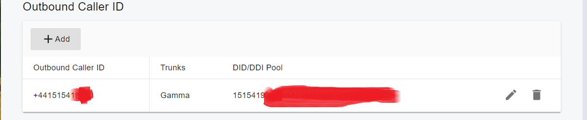

# Gamma SIP Trunk

[Gamma ](https://gammagroup.co/products/sip-trunking-call-management/)is the UK’s leading SIP trunk provider. [Gamma SIP Trunks](https://gammagroup.co/products/sip-trunking-call-management/) connect cloud PBX and on-premises PBX systems directly to the Gamma network over an Internet connection, enabling call origination and termination on the public telephone network (PSTN).

Configuring a Gamma SIP trunk in PortSIP PBX is straightforward. Follow the steps below.

***

### Step 1: Sign Up and Purchase Numbers

* Create an account with [Gamma](https://gammagroup.co/products/sip-trunking-call-management/).
* Purchase your **DID numbers** from Gamma.
* Ensure your PortSIP PBX has a **static public IP address**, as Gamma uses **IP-based authentication**.

***

### Step 2: Configure the Gamma Trunk in PortSIP PBX

1. Sign in to the PortSIP PBX Web Portal as System Administrator.
2. Navigate to **Call Manager > Trunks**.
3. Click **Add** and select **IP Based Trunk**.

> **Note**\
> Gamma SIP trunks are configured in PortSIP PBX as **IP-Based Trunks** (not Register-Based Trunks).

4. Complete the basic trunk settings according to the **Configuring the SIP Trunk** guide:
   * Trunk name (for example, `Gamma-IP-Trunk`)
   * Brand: **Gamma**
   * Hostname or IP address: Provided by Gamma
5. Save the trunk configuration.

\
The Gamma trunk appears in the trunk list with the status **Online** (expected for IP-Based Trunks).

***

### Step 3: Set Up Inbound Rules

After the Gamma trunk is successfully added:

1. Navigate to **Call Manager > Inbound Rules**.
2. Click **Add**.
3. Select the **Gamma IP-Based Trunk**.
4. Enter the **DID or DID range** provided by Gamma.
5. Choose the destination (extension, ring group, queue, etc.).
6. Save the rule.

***

### Step 4: Adjust Outbound Parameters (Required for Gamma)

Gamma requires specific SIP header formatting for outbound calls. You must adjust the **Outbound Parameters** of the trunk.

#### Steps

1. Navigate to **Call Manager > Trunks**.
2. **Double-click** the configured **Gamma trunk**.
3. Open the **Outbound Parameters** tab.
4. Configure the following fields:

**Contact: User part**\
Select **OutboundCallerID**\
&#xNAN;_(Outbound caller ID taken from the PortSIP Web Portal)_

<figure><figcaption></figcaption></figure>

**From: User part**\
Select **OutboundCallerID**\
&#xNAN;_(Outbound caller ID taken from the PortSIP Web Portal)_

<figure><figcaption></figcaption></figure>

**P-Asserted-Identity: User part**\
Select **OutboundCallerID**\
&#xNAN;_(Outbound caller ID taken from the PortSIP Web Portal)_

**P-Asserted-Identity: Host part**\
Select **TrunkHostPort**\
&#xNAN;_(Trunk host and port)_

<figure><figcaption></figcaption></figure>

5. Save the changes.

> **Important**\
> These settings are **mandatory** for Gamma to correctly identify and accept outbound calls.

***

### Step 5: Set Up Outbound Caller ID (CLI)

Gamma requires the **CLI (Outbound Caller ID)** to be presented in **E.164 format**.

* The number **must include a leading `+`**
*   Example (UK):

    ```
    +4415154108
    ```

When configuring the **Outbound Caller ID** for an extension in PortSIP PBX, ensure the number is entered in this format.

<figure><figcaption></figcaption></figure>

***

### Step 6: Create Outbound Rules

You can now configure outbound call routing:

1. Navigate to **Call Manager > Outbound Rules**.
2. Click **Add**.
3. Define the dialing conditions (number patterns, call type, etc.).
4. Select the **Gamma trunk** as the outbound route.
5. Save the rule.

For more details, please refer to [Call Route Management](../portsip-pbx-administration-guide/8-call-route-management/).


