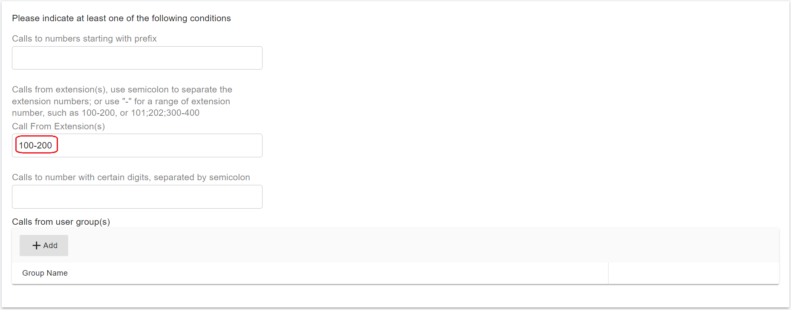

# Configuring Outbound & Inbound Calls

### Sign in to the PortSIP PBX Web Portal

To create outbound and inbound call rules, you must first sign in to the PortSIP PBX Web Portal.

You can access a tenant in one of the following ways:

#### Option 1: Sign in as System Administrator

1. Sign in to the PortSIP PBX Web Portal as a **System Administrator**.
2. Navigate to **Tenants**.
3. Select the desired tenant and click **Manage** to switch into that tenant’s administration context.

#### Option 2: Sign in as Tenant Administrator

* Sign in directly as a **Tenant Administrator** to manage settings for that tenant.

> ❗**Note**\
> For more information about tenant access and roles, see [Tenant Management](../../portsip-pbx-administration-guide/3-tenant-management/).

***

### Configure Outbound Rules

To place outbound calls through the QuestBlue trunk, you must create at least one **Outbound Rule**.

#### Add an Outbound Rule

1. In the left-hand navigation menu, go to **Call Manager > Outbound Rules**.
2. Click **Add**.
3. Enter a **Name** for the outbound rule (for example, `QuestBlue-Outbound`).

#### Define Matching Conditions

4. In the **Apply this rule to the following calls** section, configure **at least one condition** that determines when this rule should be applied (for example, destination number patterns).

<figure><figcaption></figcaption></figure>

#### Select the Trunk Route

5. Scroll to **Place outbound calls using the following trunk routes**.
6. Click the **Add (+)** icon.
7. Select the **QuestBlue trunk**, then save the outbound rule.

<figure><figcaption></figcaption></figure>

***

#### Number Format (Dial Plan Normalization)

Depending on your users’ dialing habits, you may need to **modify the dialed number format** before sending calls to the SIP trunk.

For example, if users typically dial **US national numbers** without a country code, you can configure the outbound rule to **prepend the country code `1`** to all dialed numbers before routing the call to QuestBlue.

> ❗**Best Practice**\
> Normalizing numbers to **E.164 format** (for example, `+1XXXXXXXXXX`) improves compatibility with SIP trunks and ensures consistent caller ID and routing behavior.

<figure><figcaption></figcaption></figure>

***

### Configure Inbound Rules

To receive inbound calls from the SIP trunk, you must create at least one **Inbound Rule**.

#### Add an Inbound Rule in PortSIP PBX

Follow these steps to create an inbound routing rule:

1. Sign in to the **PortSIP PBX Web Portal** as a **System Administrator** or **Tenant Administrator**.
2. From the left-hand navigation menu, go to **Call Manager > Inbound Rules**.
3. Click **Add**.

#### Configure Basic Inbound Rule Settings

4. Enter a **Name** for the inbound rule (for example, `QuestBlue-Inbound`).
5. Click **Choose a Trunk**, then select the **QuestBlue trunk**.
6. In the **DID/DDI Number or Number Range** field, enter the destination number(s).
   * The number must be within the **DID pool range** assigned to the selected trunk.
7. Select the **Extension**, **Ring Group**, **Queue**, or other destination to which inbound calls should be routed.
8. Click **OK** to save the inbound rule.

<figure><figcaption></figcaption></figure>

***

#### Advanced Routing (Optional)

Depending on your business requirements, you can further enhance the inbound rule by:

* Defining **office hours** or schedules
* Routing calls to **different destinations** based on time of day
* Sending calls to **voicemail** when offices are closed
* Automatically **rejecting or dropping calls** outside of business hours

For detailed configuration options, refer to the article [Office Hours and Holiday Schedule](../../portsip-pbx-administration-guide/office-hours-and-holiday-schedule/) and the article [Call Route Management](../../portsip-pbx-administration-guide/8-call-route-management/) documentation.

