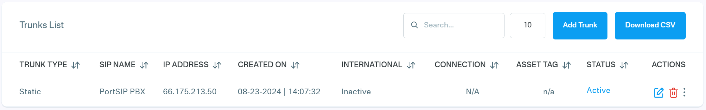
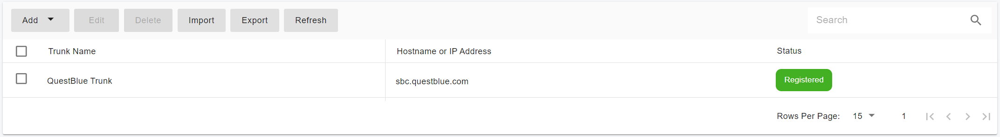

# Configuring QuestBlue IP Authentication Trunk

Before proceeding with the next steps, ensure that at least one DID has been [purchased on the QuestBlue platform](purchase-a-did-on-questblue-platform.md).

### Create a SIP Trunk on the QuestBlue Platform

To create a new SIP trunk on the QuestBlue platform, follow these steps:

1. **Sign in** to your QuestBlue account.
2. From the left-hand navigation menu, select **SIP Trunks > Trunks**.
3. Click **Add Trunk**.
4. Enter a **friendly name** for the trunk (for example, `PortSIP-Trunk`).
5. For **Trunk Type**, select **Static IP Trunk**.
6. For **Trunk Region**, choose the appropriate location.
   * Note the **SBC domain** for the selected region. QuestBlue typically recommends using `sbc.questblue.com`.
7. For **Max Channels**, leave the default value unless your service plan requires a different setting.
8. In the **IP Address** field, enter the **public static IP address of your PortSIP PBX**, then click **Create Trunk**.

<figure><figcaption></figcaption></figure>

After the SIP trunk is successfully created, it will appear in the **SIP Trunks > Trunks** list in your QuestBlue account and will be ready to use in PortSIP PBX configuration.

<figure><figcaption></figcaption></figure>

***

### Assign a DID to a SIP Trunk

To assign a DID number to a SIP trunk on the QuestBlue platform, follow these steps:

1. Sign in to your QuestBlue account.
2. Navigate to **Telephone Numbers > Telephone Numbers**.
   * All active DID numbers will be displayed in the list.
3. Click the **Edit (pencil)** icon next to the DID you want to assign.
4. In the pop-up window, select the desired SIP trunk from the **Trunk** drop-down list.
5. Click **Submit** to save the changes.

You can repeat these steps to assign additional DIDs to the same or different SIP trunks as needed.

***

### Configure the IP Authentication Trunk in PortSIP PBX

The **QuestBlue IP Authentication Trunk** corresponds to an **IP-Based Trunk** in PortSIP PBX.

> ❗**Note**\
> IP-Based Trunks must be configured at the **System Administrator** level. Once created, the trunk can be shared with one or more tenants.

#### Step 1: Create the IP-Based Trunk

1. Sign in to the **PortSIP PBX Web Portal** as a **System Administrator**.
2. From the left-hand navigation menu, go to **Call Manager > Trunks**.
3. Click **Add**, then select **IP Based Trunk**.

<figure><figcaption></figcaption></figure>

#### Step 2: Configure Basic Trunk Settings

Enter the following information:

* **Name**\
  Enter a friendly name for the trunk (for example, `QuestBlue-IP-Trunk`).
* **Brand**\
  Select **QuestBlue** from the **Brand** drop-down list.
* **Hostname or IP Address**\
  Enter the QuestBlue SBC domain noted earlier when [creating the SIP trunk on the QuestBlue](configuring-questblue-ip-authentication-trunk.md#create-a-sip-trunk-on-the-questblue-platform) platform, for example: **sbc.questblue.com**

Click **Next** to continue.

<figure><figcaption></figcaption></figure>

#### Step 3: Configure Call Capacity

* **Max Concurrent Calls**\
  Defines the maximum number of simultaneous calls that PortSIP PBX can establish through this trunk.
  * Adjust this value based on your QuestBlue service plan and expected call volume.
  * For most deployments, the default value is sufficient.

Leave all other options at their default values unless you have specific requirements.

Click **Next** to continue.

<figure><figcaption></figcaption></figure>

#### Step 4: Assign Tenants and DID Pool

1. Assign this trunk to one or more tenants.
2. Provide QuestBlue DID numbers to each tenant using the **DID Pool**.

> ❗**Important**
>
> * Each DID can be assigned to **only one tenant**.

A tenant assigned to this trunk can use **only the DID numbers in its DID pool** to:

* Create inbound and outbound call rules
* Configure outbound caller IDs for extensions

<figure><figcaption></figcaption></figure>

**DID Pool Format Examples**

The DID pool can include a single number, multiple numbers, ranges, or a combination. Use a semicolon to separate them:

```
16468097065
16468097065;16468097066
16468097065-16468097066;16468097069
16468097065-16468097066;16468097070-16468097080
```

Click **OK** to save the configuration.

***

#### Expected Result

* The trunk configuration is now complete.
* In the trunk list, the status will display **Registered**.
  * This is expected behavior for **IP-Based Trunks**, which always show a Registered status.

<figure><figcaption></figcaption></figure>

You can now proceed with [configuring inbound and outbound call routing rules](configuring-outbound-and-inbound-calls.md) using the QuestBlue trunk.

