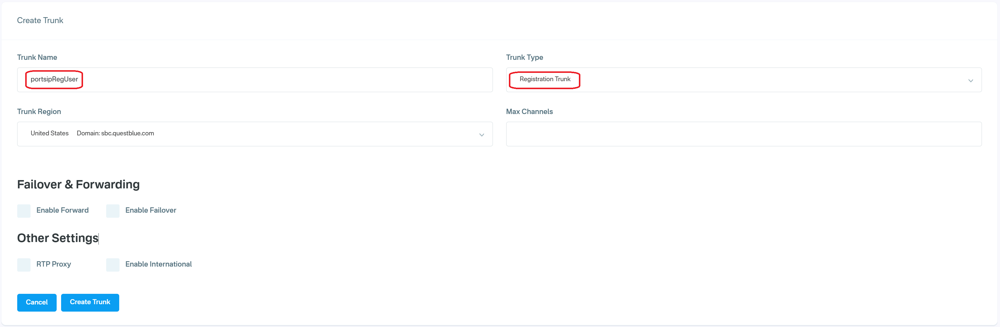
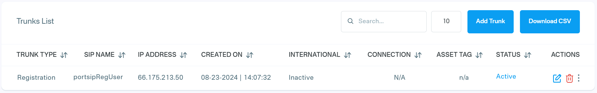
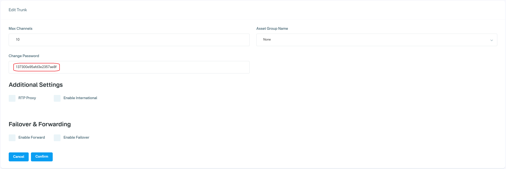
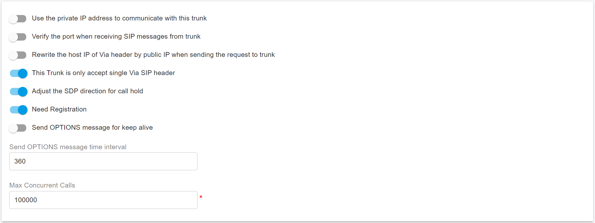

# Configuring QuestBlue Register Authentication Trunk

Before proceeding with the next steps, ensure that at least one DID has been [purchased on the QuestBlue platform](purchase-a-did-on-questblue-platform.md).

### Create a SIP Trunk on the QuestBlue Platform

To create a new SIP trunk on the QuestBlue platform, follow these steps:

1. **Sign in** to your QuestBlue account.
2. From the left-hand navigation menu, select **SIP Trunks > Trunks**.
3. Click **Add Trunk**.
4. Enter a **friendly name** for the trunk (for example, `PortSIP-Trunk`).
5. For **Trunk Type**, select **Static IP Trunk**.
6. For **Trunk Region**, choose the appropriate location.
   * Note the **SBC domain** for the selected region. QuestBlue typically recommends using `sbc.questblue.com`.
7. For **Max Channels**, leave the default value unless your service plan requires a different setting.
8. In the **IP Address** field, enter the **public static IP address of your PortSIP PBX**, then click **Create Trunk**.

<figure><figcaption></figcaption></figure>

After the SIP trunk is successfully created, it will appear in the **SIP Trunks > Trunks** list in your QuestBlue account and will be ready to use in PortSIP PBX configuration.

<figure><figcaption></figcaption></figure>

***

### Retrieve the Trunk Password

To retrieve the password for a SIP trunk on the QuestBlue platform, follow these steps:

1. Go to the **Trunks** list page.
2. Click the **Edit (pencil)** icon next to the trunk.
3. Copy and securely record the **trunk password** displayed on the configuration page.

<figure><figcaption></figcaption></figure>

***

### Assign a DID to a SIP Trunk

To assign a DID number to a SIP trunk, follow these steps:

1. Navigate to **Telephone Numbers > Telephone Numbers**.
   * All active DID numbers will be displayed.
2. Click the **Edit (pencil)** icon next to the DID you want to assign.
3. In the pop-up window, select the desired SIP trunk from the **Trunk** drop-down list.
4. Click **Submit** to save the changes.

You can repeat these steps to assign additional DIDs as needed.

***

### Configure a Register-Based Trunk in PortSIP PBX

The **QuestBlue Registration Trunk** corresponds to a **Register-Based Trunk** in PortSIP PBX.

You can configure a Register-Based Trunk at **either** of the following levels:

* **System Administrator level**
  * The trunk can be **shared with one or more tenants**.
* **Tenant Administrator level**
  * The trunk can be **used only by that tenant** and cannot be shared.

***

#### Step 1: Create the Register-Based Trunk

1. Sign in to the PortSIP PBX Web Portal as a **System Administrator** or **Tenant Administrator**.
2. From the left-hand navigation menu, go to **Call Manager > Trunks**.
3. Click **Add**, then select **Register Based Trunk**.

<figure><figcaption></figcaption></figure>

***

#### Step 2: Configure Basic Trunk Settings

Enter the following information:

* **Name**\
  Enter a friendly name for the trunk (for example, `QuestBlue-Reg-Trunk`).
* **Brand**\
  Select **QuestBlue**.
* **DID Pool** _(Tenant Admin level only)_\
  If you are configuring this trunk at the **Tenant Administrator level**, specify the QuestBlue DID numbers assigned to this tenant.

The tenant can use **only the DID numbers in its DID pool** to:

* Create inbound and outbound call rules
* Configure outbound caller IDs for extensions

<figure><figcaption></figcaption></figure>

**DID Pool Format Examples**

The DID pool may include a single number, multiple numbers, ranges, or a combination. Use a semicolon to separate them:

```
16468097065
16468097065;16468097066
16468097065-16468097066;16468097069
16468097065-16468097066;16468097070-16468097080
```

Click **Next** to continue.

***

#### Step 3: Configure Trunk Credentials

Enter the credentials provided by QuestBlue:

* **Authentication Name**\
  Enter the QuestBlue trunk username specified when creating the SIP trunk on the QuestBlue platform\
  (for example, `portsipRegUser`).
* **Password**\
  Enter the trunk password retrieved earlier from the QuestBlue platform.

Click **Next** to continue.

<figure><figcaption></figcaption></figure>

***

#### Step 4: Configure Call Capacity and Options

* **Max Concurrent Calls**\
  Specifies the maximum number of simultaneous calls that PortSIP PBX can establish using this trunk.
  * Adjust this value based on your QuestBlue service plan and expected call volume.
  * For most deployments, the default value is sufficient.

Leave all other settings at their default values unless you have specific requirements.

Click **Next** to continue.

<figure><figcaption></figcaption></figure>

***

#### Step 5: Assign Tenants and DID Pool _(System Admin level only)_

> ❗**Note**\
> This step is available **only** when configuring the Register-Based Trunk at the **System Administrator level**.

1. Assign the trunk to one or more tenants.
2. Provide QuestBlue DID numbers to each tenant using the **DID Pool**.

> ❗**Important**
>
> * Each DID can be assigned to **only one tenant**.

A tenant can use **only the DID numbers in its assigned DID pool** to:

* Create inbound and outbound call rules
* Configure outbound caller IDs for extensions

<figure><figcaption></figcaption></figure>

**DID Pool Format Examples**

```
16468097065
16468097065;16468097066
16468097065-16468097066;16468097069
16468097065-16468097066;16468097070-16468097080
```

Click **OK** to save the configuration.

***

#### Expected Result

* The trunk configuration is now complete.
* Once PortSIP PBX successfully registers to the QuestBlue platform, the trunk status will display **Registered** on the trunk list page.

<figure><figcaption></figcaption></figure>

You can now proceed to [configure inbound and outbound call routing rules](configuring-outbound-and-inbound-calls.md) using the QuestBlue Register-Based trunk.


