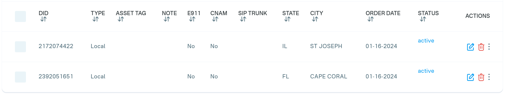

# Purchase a DID on QuestBlue Platform

Before placing or receiving calls, you must have **at least one active DID (Direct Inward Dialing) number** on your QuestBlue account.\
If you already have one or more active DIDs, you may skip this section.

### Purchase a DID from QuestBlue

To purchase a DID number on your QuestBlue account, follow these steps:

1. **Sign in** to your account on the [QuestBlue ](https://customer.questblue.com/)platform.
2. From the left-hand navigation menu, go to **Telephone Numbers > Order Telephone Numbers**.
3. **Search for available numbers**, then click **Order** to purchase the desired DID.
4. After the purchase is complete, you can view all your DID numbers under **Telephone Numbers > Telephone Numbers**.

<figure><figcaption></figcaption></figure>

***

### Next Steps

Once the DID number has been successfully purchased, follow one of the guides below to configure the QuestBlue trunk in PortSIP PBX:

* [Configuring QuestBlue IP Authentication Trunk](configuring-questblue-ip-authentication-trunk.md)
* [Configuring QuestBlue Register Authentication Trunk](configuring-questblue-register-authentication-trunk.md)

