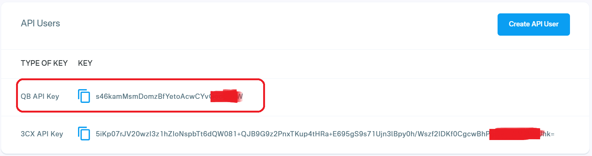

# QuestBlue SMS Integration


As you are looking to integrate SMS, It is required that for outbound messaging, you must also register a Brand and Campaign through your QuestBlue customer portal as required by the TCR.


### Prerequisite: Purchase an SMS/MMS-Enabled DID

Before proceeding, ensure that you have [purchased a DID on the QuestBlue platform with SMS/MMS capability enabled](purchase-a-did-on-questblue-platform.md).\
This is required for PortSIP PBX to send and receive SMS or MMS messages through QuestBlue.

***

### Obtain the QuestBlue API Key

PortSIP PBX uses the **QuestBlue API key** to authenticate and send SMS/MMS messages.

To retrieve your QuestBlue API key, follow these steps:

1. Sign in to your [QuestBlue online account](https://customer.questblue.com/).
2. Navigate to **API Management**.
3. Locate and securely record the **QB API Key**.

> ❗**Security Note**\
> Treat the API key as sensitive credentials. Do not share it publicly, and store it securely. If the key is compromised, regenerate it immediately from the QuestBlue portal.

<figure><figcaption></figcaption></figure>

***

### Configure SMS with a QuestBlue Trunk in PortSIP PBX

Before configuring SMS in PortSIP PBX, ensure that a **QuestBlue SIP trunk** has already been configured using **one of the following guides**:

* [Configuring QuestBlue Register Based Trunk](configuring-questblue-register-authentication-trunk.md)
* [Configuring QuestBlue IP Based Trunk](configuring-questblue-register-authentication-trunk.md)

***

#### Sign in to the PortSIP PBX Web Portal

You can access the tenant configuration in one of the following ways:

**Option 1: Sign in as System Administrator**

1. Sign in to the PortSIP PBX Web Portal as a **System Administrator**.
2. Navigate to **Tenants**.
3. Select the desired tenant and click **Manage** to switch to that tenant’s administration context.

**Option 2: Sign in as Tenant Administrator**

* Sign in directly as a **Tenant Administrator** to manage the tenant.

> ❗**Note**\
> For more information about tenant roles and access, see [Tenant Management](../../portsip-pbx-administration-guide/3-tenant-management/).

***

### Add an SMS Configuration

Follow these steps to configure SMS/MMS using the QuestBlue trunk:

1. In the PortSIP PBX Web Portal, navigate to **SMS/MMS** from the left-hand menu.
2. Click **Add**.
3. From the **Trunk** drop-down list, select your **QuestBlue trunk**.
4. Enter the QuestBlue credentials:
   * **User**: Enter your QuestBlue username.
   * **Password**: Enter your QuestBlue account password.
   * **Security Key**: Paste the [QuestBlue QB API Key](questblue-sms-integration.md#obtain-the-questblue-api-key) obtained earlier.
5. Click **OK** to save the configuration.

<figure><figcaption></figcaption></figure>

***

#### Copy the Webhook URL

After the SMS configuration is created:

* You will be returned to the **SMS/MMS list** page.
* Select the SMS configuration and click **Copy Webhook** to copy the Webhook URL.

Alternatively:

* Double-click the SMS configuration to open its details page, then copy the **Webhook URL** from there.

> ❗**Important**\
> The Webhook URL is required for QuestBlue to deliver inbound SMS/MMS messages to PortSIP PBX. Do not modify this URL unless instructed.

***

### Configure SMS in the QuestBlue Platform

To enable inbound SMS delivery to PortSIP PBX, you must configure the SMS webhook for the DID on the QuestBlue platform.

Follow these steps:

1. Sign in to your [QuestBlue account](https://customer.questblue.com/).
2. Navigate to **Messaging > SMS Settings**.
   * A list of SMS-enabled DIDs will be displayed.
3. Click the **Edit (pencil)** icon next to the DID for which you want to enable SMS.

<figure><figcaption></figcaption></figure>

#### Configure the SMS Webhook

4. On the **SMS Settings** page:
   * From the **SMS Handling** (or equivalent) drop-down list, select **Post SMS to URL**.
   * In the **URL to post SMS Message** field, paste the **PortSIP PBX Webhook URL** that you copied earlier.
5. Click **Update Settings** to save the configuration.

<figure><figcaption></figcaption></figure>

### Verify the Configuration

At this point, the QuestBlue SMS/MMS integration is complete.

You can now [create outbound and inbound rules](configuring-outbound-and-inbound-calls.md) in PortSIP PBX to send and receive SMS/MMS messages using the QuestBlue trunk—just as you would configure rules for outbound and inbound voice calls.

