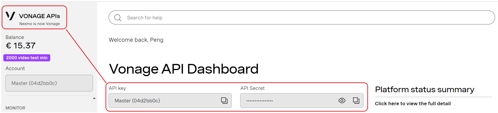
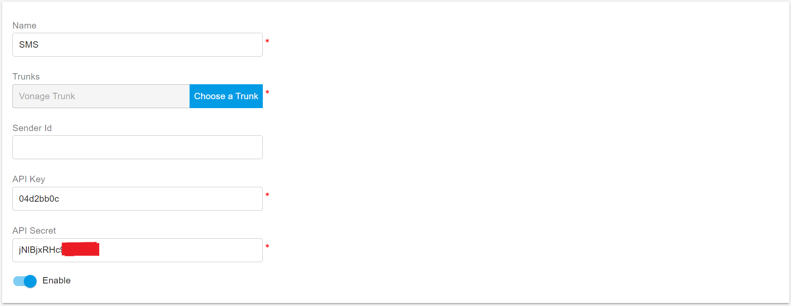
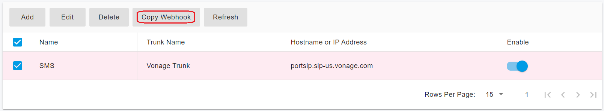
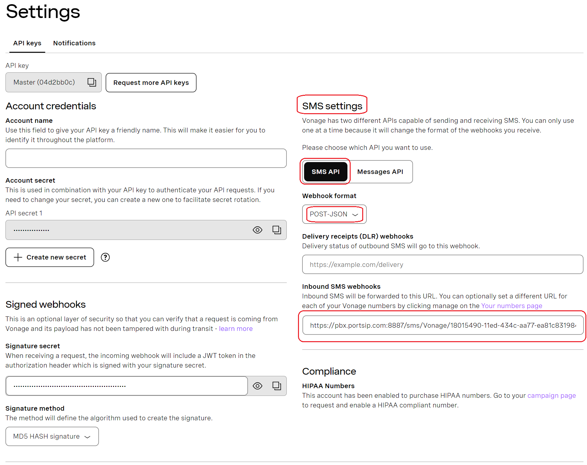
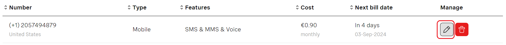
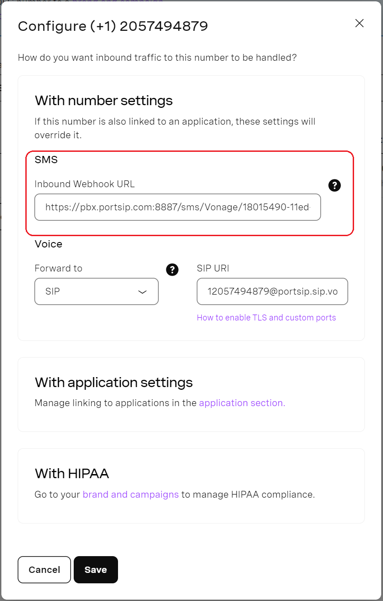

# Vonage SMS Integration

Before proceeding, ensure that you have[ purchased at least one DID on the Vonage platform](purchase-a-did-on-vonage-platform.md) that supports SMS/MMS.

***

### Obtain the Vonage API Key

PortSIP PBX uses the **Vonage API Key and API Secret** to send SMS and MMS messages.

#### Steps

1. Log in to your **Vonage account**.
2. Click the **Vonage logo** in the top-left corner to open the **Vonage API Dashboard**.
3. Copy and securely record the following values:
   * **API Key**
   * **API Secret**

> ❗**Important**\
> Treat the API Key and API Secret as **sensitive credentials**. Do not share them publicly or commit them to source control.

<figure><figcaption></figcaption></figure>

***

### Configure SMS with the Vonage Trunk in PortSIP PBX

Before configuring SMS/MMS in PortSIP PBX, you must have already configured a Vonage SIP trunk using one of the following methods:

* [Configuring Vonage Register Based Trunk](configuring-vonage-register-authentication-trunk.md)
* [Configuring Vonage IP Based Trunk](configuring-vonage-ip-authentication-trunk.md)

***

#### Sign In to the PortSIP PBX Web Portal

You can manage SMS/MMS settings at the tenant level using one of the following methods:

* **System Administrator**
  1. Sign in to the PortSIP PBX Web Portal as a **System Administrator**.
  2. Navigate to **Tenants**.
  3. Select the target tenant and click **Manage**.
* **Tenant Administrator**
  * Sign in directly as a **Tenant Administrator** for the tenant.

> ❗**Reference**\
> For more details, see [Tenant Management](../../../portsip-pbx-administration-guide/3-tenant-management/).

***

#### Add an SMS Configuration in PortSIP PBX

Follow the steps below to create an SMS/MMS configuration.

1. In the PortSIP PBX Web Portal, navigate to **SMS/MMS**.
2. Click **Add**.
3. Configure the following fields:
   * **Sender ID** _(Optional)_\
     Enter the sender ID used for outbound SMS, if applicable.\
     For more information, see:
     * [_Global Sender ID Registration Guide_](https://api.support.vonage.com/hc/en-us/articles/6791919802652-Global-Sender-ID-Registration-Guide)
     * [_Global Sender ID Portal – FAQs_](https://api.support.vonage.com/hc/en-us/articles/9092597969436-Global-Sender-ID-Portal-FAQs)
   * **Trunk**\
     Select your previously configured **Vonage SIP trunk**.
   * **API Key**\
     Enter the Vonage [API Key obtained earlier](vonage-sms-integration.md#obtain-the-vonage-api-key).
   * **Secret**\
     Enter the Vonage [API Secret obtained earlier](vonage-sms-integration.md#obtain-the-vonage-api-key).

<figure><figcaption></figcaption></figure>

4. Click **OK** to save the configuration.
5. You are redirected to the **SMS/MMS list** page, and the new SMS configuration is displayed.

<figure><figcaption></figcaption></figure>

***

#### Copy the PortSIP PBX SMS Webhook URL

Vonage requires a webhook URL to deliver **inbound SMS** to PortSIP PBX.

You can obtain the webhook URL using either method:

* Select the SMS configuration and click **Copy Webhook**, or
* Double-click the SMS configuration to open it, then copy the **Webhook URL** from the details page.

Keep this webhook URL available for the next step.

***

### Configure Inbound SMS Webhooks in Vonage

Vonage sends inbound SMS messages to PortSIP PBX using the configured webhook URL.

You can configure the webhook at either the **account level** or the **number level**.

***

#### Option 1: Add a Webhook URL at the Account Level

1. Log in to your [Vonage account](https://ui.idp.vonage.com/ui/auth/login).
2. Navigate to **Build & Manage**.
3. Under the **SMS settings** section, configure the following:
   * **API**: Select **SMS API**
   * **Webhook format**: Select **POST-JSON**
   * **Inbound SMS webhooks**: Paste the PortSIP PBX SMS Webhook URL
4. Click **Save changes**.

<figure><figcaption></figcaption></figure>

***

#### Option 2: Add a Webhook URL at the Number Level

You can define a **unique inbound SMS webhook** for a specific number.

> ❗**Important**\
> A number-level webhook **takes precedence** over the account-level webhook.

1. Navigate to [Your Numbers](https://dashboard.nexmo.com/your-numbers).
2. Locate the number you want to configure.
3. Click the **pencil icon** in the **Manage** column.

<figure><figcaption></figcaption></figure>

4. In the pop-up configuration window, set the **Inbound SMS Webhook URL**.
5. Click **Save** before closing the window.

<figure><figcaption></figcaption></figure>

***

### Verify the Configuration

At this point, the Vonage SMS/MMS integration is complete.

You can now [create outbound and inbound rules](../../twilio-sip-trunk/configuring-outbound-and-inbound-calls.md) in PortSIP PBX to send and receive SMS/MMS messages using the Vonage trunk—just as you would configure rules for outbound and inbound voice calls.

