# Configuring Sinch IP Authentication Trunk

Before proceeding with the next steps, you need to [purchase a DID on the Sinch platform](purchase-a-did-on-telnyx-platform.md).

### Create a SIP Trunk on the Sinch Platform

To create a new SIP trunk on the **Sinch** platform, follow these steps.

#### Step 1: Create an Elastic SIP Trunk

1. Sign in to your Sinch account.
2. In the left navigation menu, go to **Elastic SIP Trunking > Trunks**.
3. Click **Create New SIP Trunk**.

<figure>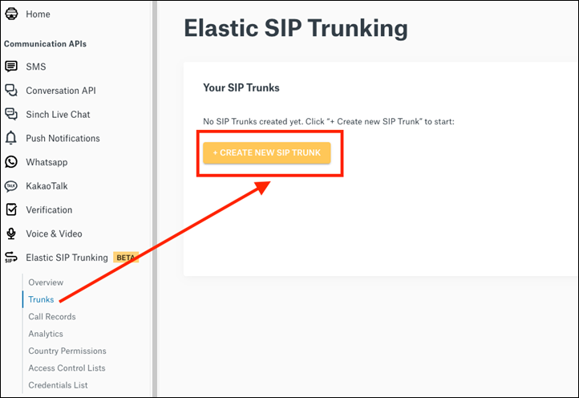<figcaption></figcaption></figure>

***

#### Step 2: Configure the SIP Trunk

After you click **Create New SIP Trunk**, the SIP trunk creation page is displayed. On this page, you can define the trunk name and create the SIP domain that will be used to route calls through the trunk.

<figure>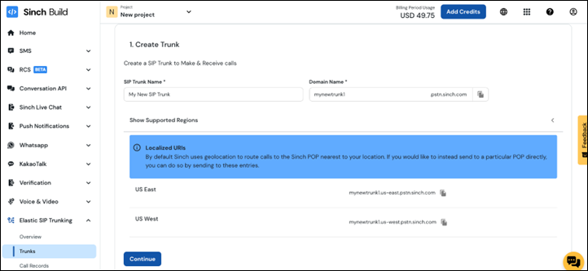<figcaption></figcaption></figure>

1.  In the **SIP Trunk Name** field, enter a clear and descriptive name for the trunk.

    Use a name that helps you distinguish this trunk from other SIP trunks in your Sinch account.
2.  Create the **SIP Domain** that will be used when sending calls to this trunk.

    The value you enter becomes the base domain name, and Sinch appends `.pstn.sinch.com` to it.

    For example, if you enter: `mycompany`, the fully qualified SIP domain becomes: `mycompany.pstn.sinch.com`
3. Click **Continue** to proceed to the SIP endpoint configuration.

***

#### Step 3: Configure the SIP Endpoint

A SIP endpoint defines how Sinch sends calls to your PortSIP PBX. It also authorizes your PBX to send outbound calls through the SIP trunk by using either a trusted public IP address or SIP registration credentials.

<figure>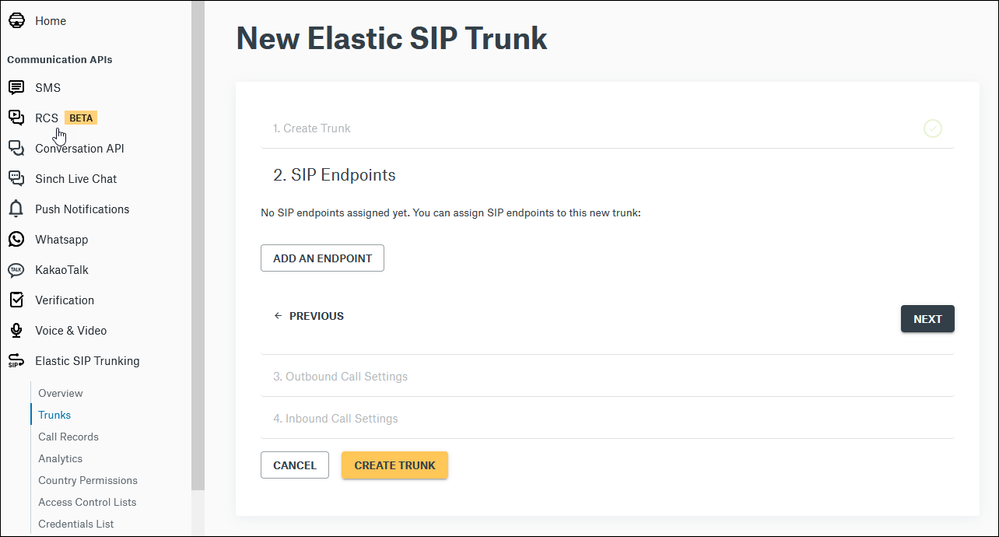<figcaption></figcaption></figure>

1. Click **Add an Endpoint** to configure a SIP endpoint now.
2. After you click **Add SIP Endpoint**, the endpoint configuration page is displayed.
3.  Choose the endpoint type.

    Each SIP endpoint can be configured in one of the following ways:

    * **Static IP address**: Use this option when your PortSIP PBX has a fixed public IP address. Sinch will authorize traffic from this IP address.
    * **SIP registration**: Use this option when your PortSIP PBX registers to Sinch using SIP authentication credentials.

For this guide, select **Static IP address** to configure an IP authentication SIP trunk for PortSIP PBX.

***

#### Step 4: Configure the Static IP Address Endpoint

Configure the SIP endpoint that Sinch will use to communicate with your PortSIP PBX.

1.  In the **SIP Endpoint Name** field, enter a descriptive name for the endpoint.

    Use a name that helps you identify the PBX, site, or location associated with this endpoint. For example: `San Diego Office`
2.  Enter the **public IP address** of your PortSIP PBX.

    This must be the static public IP address from which your PortSIP PBX sends SIP traffic to Sinch.
3.  Enter the SIP **port** used by your PortSIP PBX.

    For UDP transport, the default SIP port is usually `5060`.
4.  Select the **transport protocol** for the SIP endpoint.

    Choose the protocol that matches the SIP transport configured on your PortSIP PBX.

    If you require encrypted SIP signaling, select **TLS**.

<figure>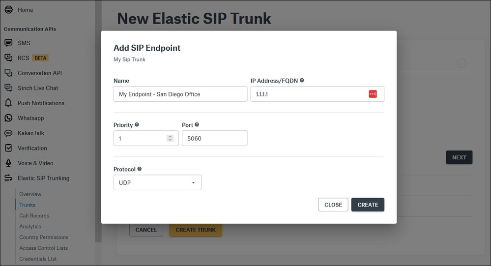<figcaption></figcaption></figure>

***

#### Step 5: Complete the SIP Endpoint Configuration

Configure the endpoint priority and complete the SIP trunk setup.

1.  Leave **Priority** set to the default value of `1`, unless you need to configure multiple SIP endpoints for failover or load sharing.

    Priority controls how Sinch routes inbound calls when multiple SIP endpoints are configured.

    * The endpoint with the **lowest priority value** receives inbound calls first.
    * Endpoints with higher priority values receive calls only if the primary endpoint is unavailable.
    * If multiple endpoints have the same priority, Sinch distributes calls between them using round-robin routing.
2. Click **Create** to finish creating the SIP endpoint.
3. Review the endpoint settings.
   * If the settings are correct, click **Next** to continue.
   * To make changes, click the endpoint name to reopen and edit the endpoint configuration.

<figure>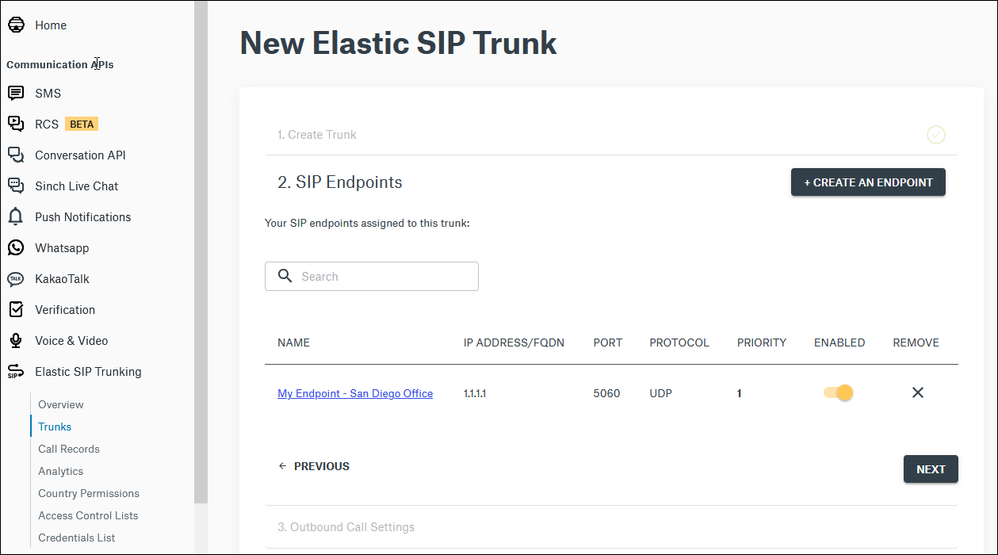<figcaption></figcaption></figure>

***

#### Step 6: Configure Outbound Call Settings

After configuring the SIP endpoint, configure the outbound call settings for the SIP trunk.

<figure>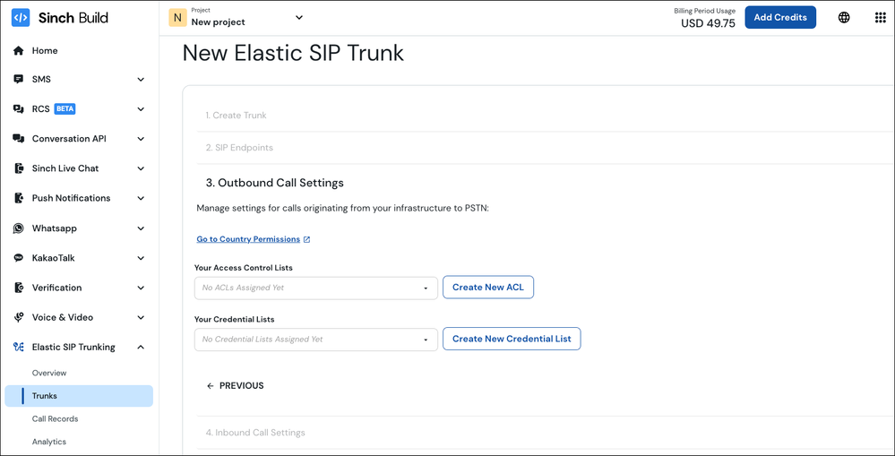<figcaption></figcaption></figure>

1.  Configure **Country Permissions** if needed.

    This setting controls which countries or regions can be called through the trunk. By default, calls to the **United States**, **Canada**, **Puerto Rico**, and the **U.S. Virgin Islands** are allowed.
2.  Configure outbound call authentication.

    To send calls to the PSTN, you must use either **Access Control List (ACL)** or **Digest Authentication**.

    * **ACL** allows calls only from approved IP addresses.
    * **Digest Authentication** uses SIP credentials to authenticate calls.
3.  If you use **ACL**, add the public IP address of your PortSIP PBX.

    Calls from allowed IP addresses are accepted. Calls from other IP addresses are rejected with SIP `403 Forbidden`.

***

#### Step 7: Create and Add an ACL

Click **CREATE NEW ACL** to open the ACL creation wizard.

<figure>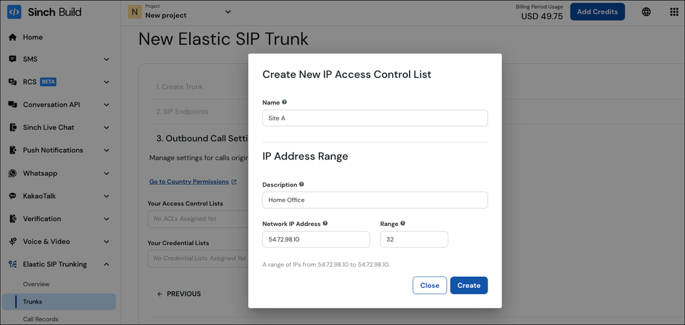<figcaption></figcaption></figure>

1. Enter a name for the ACL.
2.  Enter the static public IP address of your PortSIP PBX in **CIDR** format.

    For a single public IP address, use `/32`. For example:

    `203.0.113.10/32`
3.  Review the IP address range shown at the bottom of the wizard.

    This confirms which IP addresses will be allowed.
4. Click **CREATE**.
5. You can add more IP address ranges to the ACL later if needed.

After the ACL is created, select it from the drop-down menu and add it to the SIP trunk.

<figure>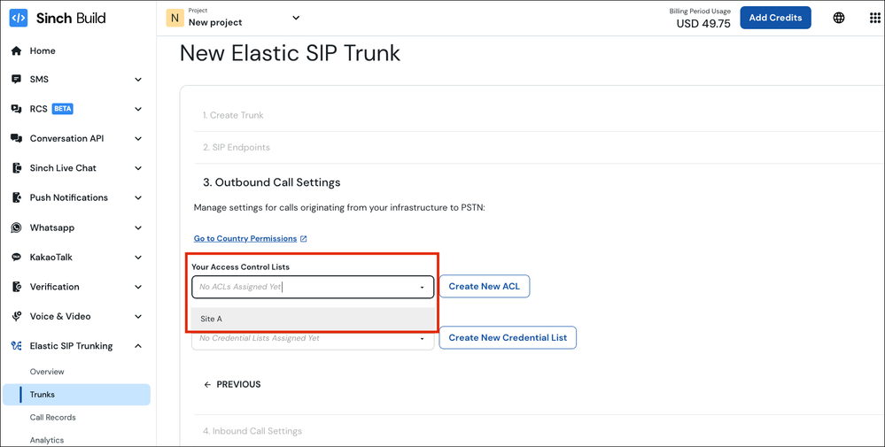<figcaption></figcaption></figure>

***

#### Step 8: Configure Inbound Call Settings

Enable **CNAM** if you want Sinch to retrieve and pass caller name information for inbound calls to your numbers.

<figure>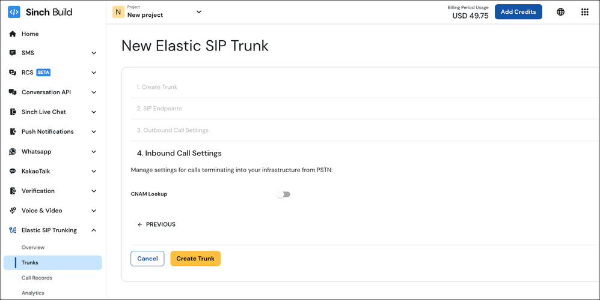<figcaption></figcaption></figure>

**Note:** CNAM is optional and may incur additional charges.

Click **Finish** to complete the SIP trunk setup.

Your SIP trunk is now ready. You can now configure PortSIP PBX to use the SIP domain you created and send outbound calls through the trunk.

***

### Configure an IP Authentication Trunk in PortSIP PBX

The **Sinch IP Authentication Trunk** corresponds to an **IP-Based Trunk** in PortSIP PBX.

> ❗**Important**\
> IP-Based Trunks **must be configured at the System Administrator level**.\
> Once created, the trunk can be **shared with one or more tenants**.

***

#### Step 1: Create the IP-Based Trunk

1. Sign in to the PortSIP PBX Web Portal as a **System Administrator**.
2. From the left-hand navigation menu, go to **Call Manager > Trunks**.
3. Click **Add**, then select **IP Based Trunk**.

<figure>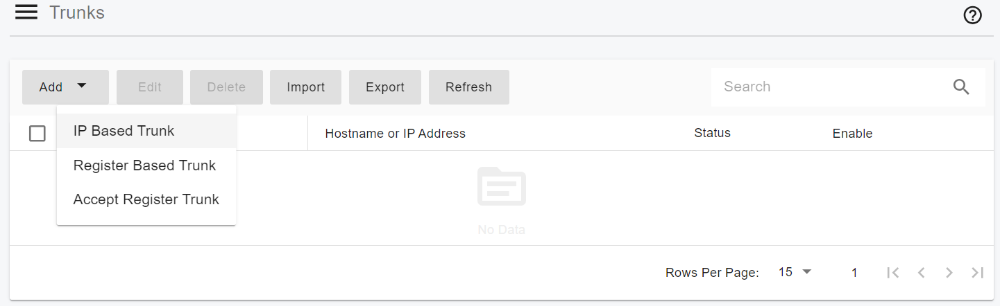<figcaption></figcaption></figure>

***

#### Step 2: Configure Basic Trunk Settings

Enter the following information:

* **Name**\
  Enter a friendly name for the trunk (for example, `Sinch Trunk`).
* **Brand**\
  Select a **Sinch**.
* Enter the domain name that you created in the [Step 2: Configure the SIP Trunk](configuring-sinch-ip-authentication-trunk.md#step-2-configure-the-sip-trunk) for Hostname. In case is `mycompany.pstn.sinch.com`.

Click **Next** to continue.

<figure>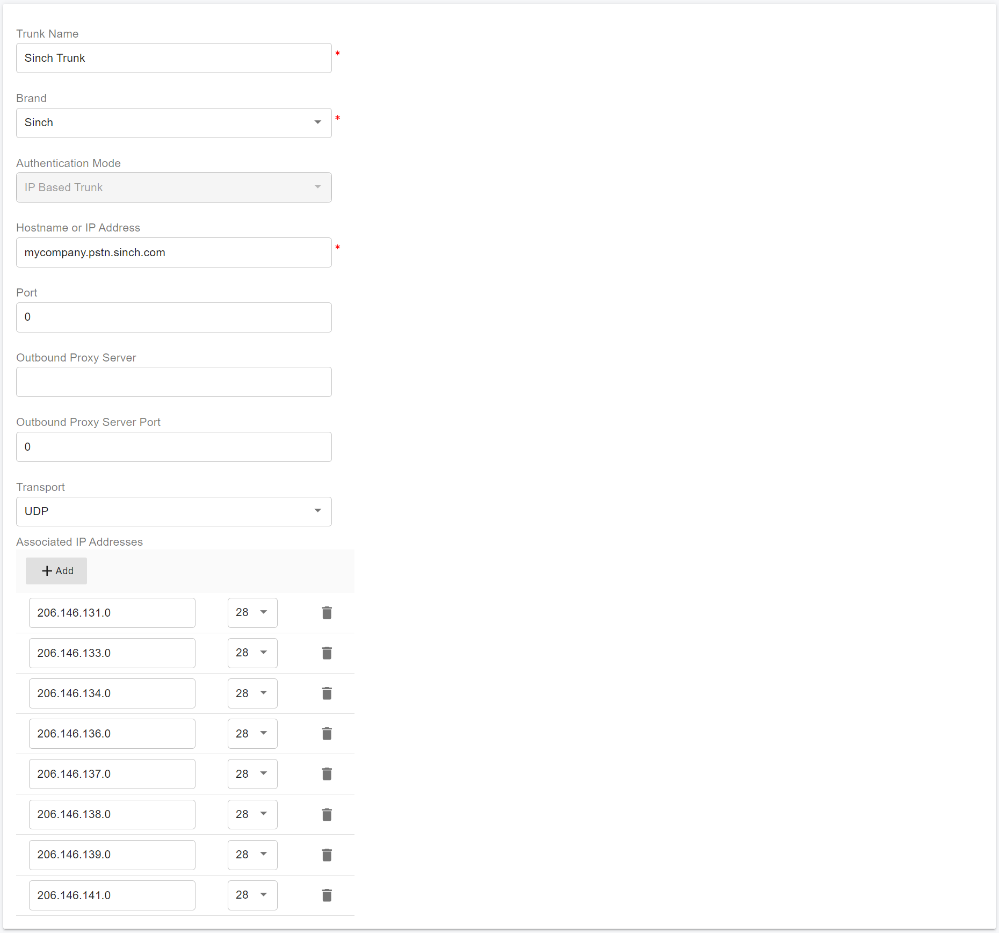<figcaption></figcaption></figure>

***

#### Step 3: Configure Call Capacity

* **Max Concurrent Calls**\
  Defines the maximum number of simultaneous calls that PortSIP PBX can establish through this trunk.
  * Adjust this value according to your Sinch service plan and expected call volume.
  * For most deployments, the default value is sufficient.

Leave all other options at their default values unless you have specific requirements.

Click **Next** to continue.

<figure>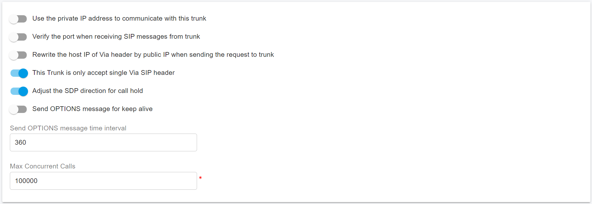<figcaption></figcaption></figure>

***

#### Step 4: Assign Tenants and DID Pool

1. Assign the trunk to one or more tenants.
2. Provide Sinch DID numbers to each tenant using the **DID Pool**.

> ❗**Important**
>
> * Each DID can be assigned to **only one tenant**.
> * A tenant assigned to this trunk can use **only the DID numbers in its DID pool** to:
>   * Create inbound and outbound call rules
>   * Configure outbound caller IDs for extensions

**DID Pool Format Examples**

The DID pool may contain a single number, multiple numbers, ranges, or a combination:

```
16468097065
16468097065;16468097066
16468097065-16468097066;16468097069
16468097065-16468097066;16468097070-16468097080
```

Click **OK** to save the configuration.

<figure>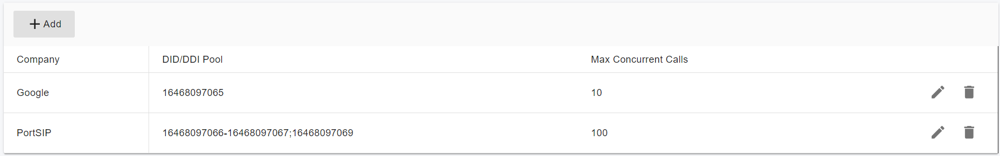<figcaption></figcaption></figure>

***

#### Expected Result

* The IP-Based trunk configuration is now complete.
* In the trunk list, the trunk status will display **Online**.
  * This is **expected behavior** for IP-Based Trunks, which always show a _Registered_ status.

In the trunk list, you will see the status displayed as **Online** (for IP Based Trunk it always displays Registered).

<figure>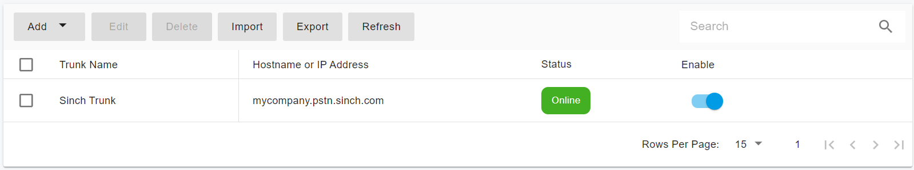<figcaption></figcaption></figure>

***

### Next Steps

You can now proceed to [Configuring Outbound & Inbound Calls](configuring-sinch-ip-authentication-trunk.md) to complete your call routing setup.
