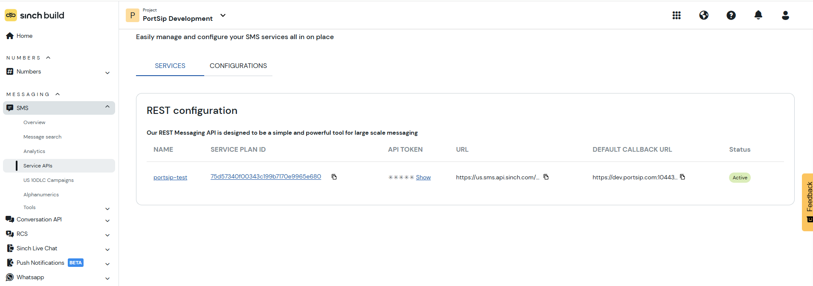
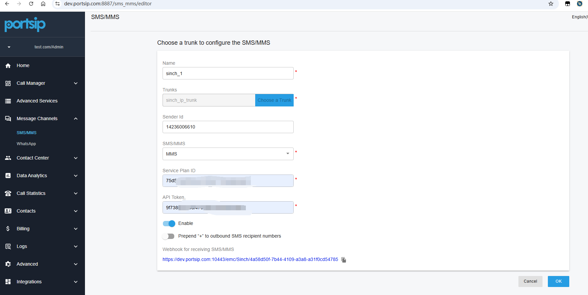
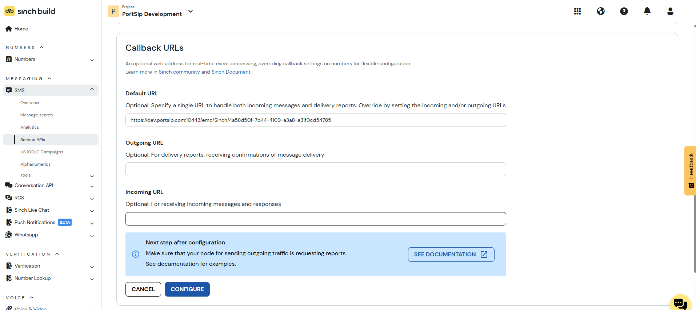

# Sinch SMS Integration


According to US legislation (A2P 10DLC SMS), 10DLC (10-digit Long Code) phone numbers that are used for A2P (Application-to-Person) messaging MUST be registered, otherwise SMS messages sent to US numbers from the unregistered 10DLC numbers will be blocked.

If your business communicates with US-based customers, you should contact the SMS service provider to complete 10DLC registration for your DID number to avoid disruption in message delivery.


Before proceeding with the next steps, you need to [purchase a DID on the Sinch platform](purchase-a-did-on-telnyx-platform.md) with **SMS/MMS enabled**.

***

### Purchase DID Numbers on the Sinch Platform

Follow these steps to purchase a DID number that supports SMS/MMS.

#### Step 1: Sign In to the Sinch Customer Portal

1. Sign in to the [Sinch Customer Portal](https://dashboard.sinch.com/dashboard).
2. In the left navigation menu, go to **Numbers > Get virtual numbers**.
3. Search for and purchase a virtual number that supports SMS.

***

### Obtain Sinch Account Information for SMS API Integration

To integrate Sinch SMS with PortSIP PBX, you need to create a Sinch REST configuration to obtain the **Service Plan ID** and **API Token**.

#### Step 1: Obtain the Service Plan ID and API Token

After the REST configuration is created:

1. Go to **SMS > Service APIs**.
2. Open the **REST configuration** tab.
3. Copy the **Service Plan ID** and **API Token**.

<figure><figcaption></figcaption></figure>

***

### Configure SMS with the Sinch Trunk in PortSIP PBX

This section explains how to configure SMS/MMS integration in PortSIP PBX using a Sinch trunk.

#### Prerequisites

Before you begin, make sure that:

* A Sinch SIP trunk has already been configured in PortSIP PBX.
* You have copied the **Service Plan ID** and **API Token** from Sinch.
* The DID numbers used for SMS/MMS are enabled for messaging on the Sinch platform.

***

### Sign In to the PortSIP PBX Web Portal

Sign in to the PortSIP PBX Web Portal using one of the following methods.

#### Option 1: PBX System Administrator

1. Sign in as a **PBX System Administrator**.
2. Go to **Tenants**.
3. Select the target tenant.
4. Click **Manage** to switch to that tenant’s settings.

#### Option 2: Tenant Administrator

Sign in directly as a **Tenant Administrator** to manage the tenant’s settings.

> **Note**\
> For more details, see [Tenant Management](https://chatgpt.com/portsip-communications-solution/portsip-pbx-administration-guide/3-tenant-management.md).

***

### Add an SMS Configuration in PortSIP PBX

#### Step 1: Create the SMS Configuration

1. In the PortSIP PBX Web Portal, go to **SMS/MMS**.
2. Click **Add**.
3. From the trunk list, select the **Sinch trunk**.

#### Step 2: Configure SMS Settings

Configure the following fields:

* **Sender ID** _(Optional)_\
  Enter the Sender ID created on the Sinch platform if you want to use a custom sender.\
  Leave this field empty to use the DID associated with the Sinch trunk.
* **Service Plan ID**\
  Enter the Service Plan ID copied from the Sinch REST configuration.
* **API Token**\
  Enter the API Token copied from the Sinch REST configuration.

Click **OK** to save the configuration.

<figure><figcaption></figcaption></figure>

***

### Copy the PortSIP PBX Webhook URL

Inbound SMS/MMS messages are delivered to PortSIP PBX through a webhook.

1. On the **SMS/MMS** list page, select the SMS configuration you created.
2.  Click **Copy Webhook**.

    Alternatively, double-click the SMS configuration to open its details, and then copy the **Webhook URL**.

You will need this Webhook URL when configuring the SMS callback URL on the Sinch platform.

***

### Configure the Webhook in Sinch

Configure the SMS/MMS webhook in the Sinch portal so inbound messages are delivered to PortSIP PBX.

#### Step 1: Open the REST Configuration

1. Sign in to the Sinch Customer Portal.
2. In the left navigation menu, go to **SMS > Service APIs**.
3. Locate the REST configuration used for this integration.
4. Click the REST configuration name to open it.
5. Click **Callback URLs & Edit**.

#### Step 2: Configure the Webhook URL

1. In the **Callback URLs** section, paste the Webhook URL copied from PortSIP PBX into the **Default URL** field.
2. Click **CONFIGURE** to save the changes.

<figure><figcaption></figcaption></figure>

***

### Verify the Configuration

The Sinch SMS/MMS integration is now complete.

You can now [create outbound and inbound rules](../questblue-sip-trunk/configuring-outbound-and-inbound-calls.md) in PortSIP PBX to send and receive SMS/MMS messages using the QuestBlue trunk, just as you would configure rules for outbound and inbound voice calls.

