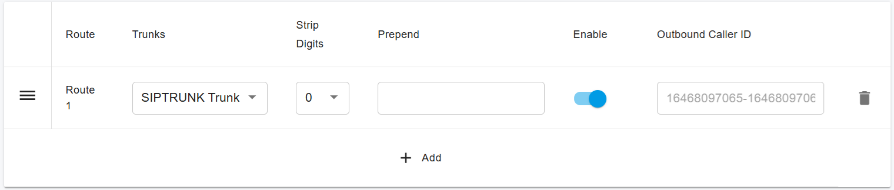
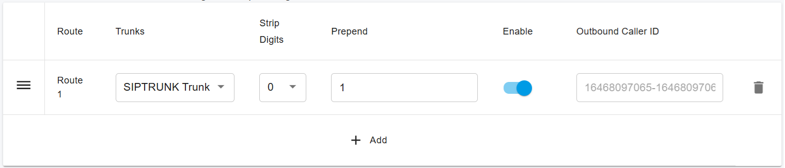
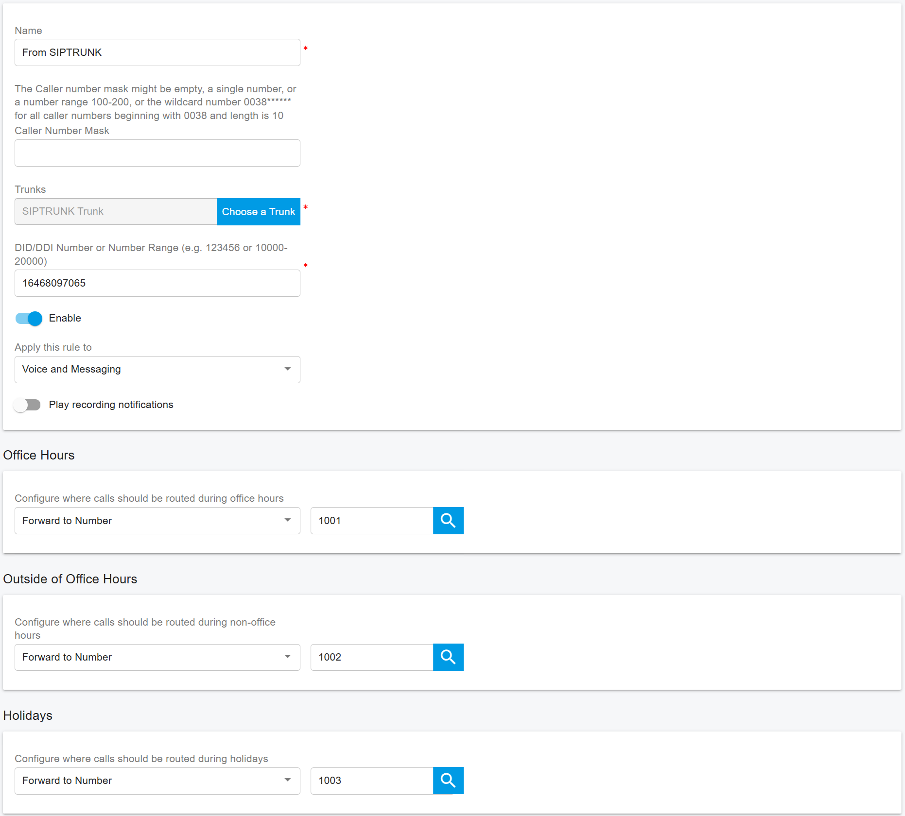

# Configuring Outbound & Inbound Calls

To configure outbound and inbound call routing, you must first sign in to the PortSIP PBX Web Portal.

You can access the Web Portal in one of the following ways:

* **Sign in as a System Administrator**\
  After signing in, select a tenant and click **Manage** to switch to that tenant’s management view.
* **Sign in as a Tenant Administrator**\
  This allows you to manage settings for your own tenant directly.

For more details, refer to [Tenant Management](../../portsip-pbx-administration-guide/3-tenant-management/).

***

### Configure Outbound Rules

Outbound Rules determine how extensions place outbound calls through trunks.

#### Add an Outbound Rule

1. Sign in to the PortSIP PBX Web Portal.
2. Navigate to **Call Manager > Outbound Rules**.
3. Click **Add**.
4. Enter a **Name** for the outbound rule.
5. Under **Apply this rule to the following calls**, configure at least one condition to define which calls this rule applies to.

<figure><figcaption></figcaption></figure>

6. Scroll to **Place outbound calls using the following trunk routes**.
7. Click the **Add** icon, select the **SIPTRUNK Trunk**, and then save the rule.

<figure><figcaption></figcaption></figure>

***

#### Dialing Format Best Practices

When configuring Outbound Rules, ensure that all dialed numbers follow one of the supported formats:

* **10-digit format** (e.g., `3322496213`)
* **11-digit format** (e.g., `13322496213`)
* **E.164 format** (e.g., `+13322496213`)

Depending on your users’ dialing habits, you may need to:

* **Strip leading digits**, or
* **Prepend a country code**

For example, if users typically dial U.S. domestic numbers without the leading country code, you can configure the rule to automatically **prepend `1`** to all dialed numbers.

<figure><figcaption></figcaption></figure>

***

### Configure Inbound Rules

Inbound Rules define how incoming calls from trunks are routed to extensions, ring groups, or other destinations.

#### Add an Inbound Rule

1. Sign in to the PortSIP PBX Web Portal.
2. Navigate to **Call Manager > Inbound Rules**.
3. Click **Add**.
4. Enter a **Name** for the inbound rule.
5. Click **Choose a Trunk** and select the appropriate trunk.
6. In the **DID/DDI Number** or **Number Range** field, enter the inbound number.
   * The number must fall within the **DID pool range** of the selected trunk.
7. Specify the **destination extension** (or other target) to route incoming calls to.
8. Click **OK** to save the rule.

<figure><figcaption></figcaption></figure>

***

#### Office Hours and Call Routing Options

Based on your business requirements, you can optionally configure **Office Hours** for inbound rules. This allows you to:

* Route calls to different extensions
* Send calls to voicemail
* Automatically reject calls outside business hours

For more information, refer to [Office Hours and Holiday Schedule](../../portsip-pbx-administration-guide/office-hours-and-holiday-schedule/).

***

### Additional References

For detailed explanations and advanced scenarios related to call routing, see:

* [Call Route Management](../../portsip-pbx-administration-guide/8-call-route-management/)

