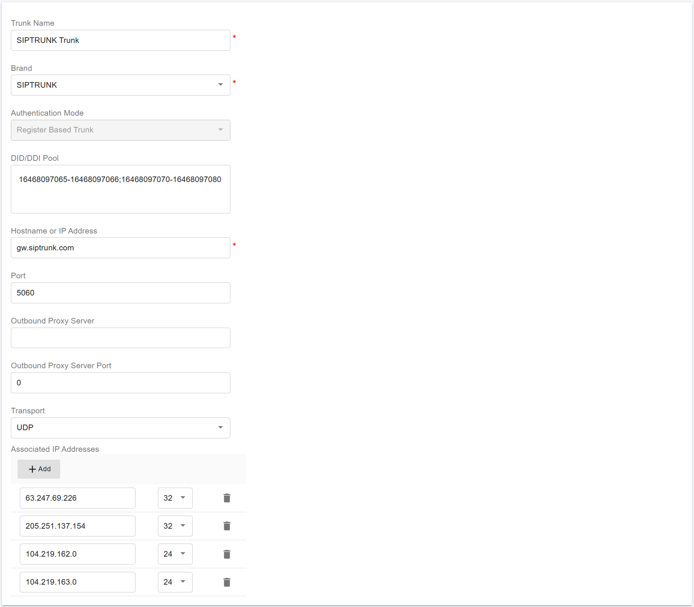
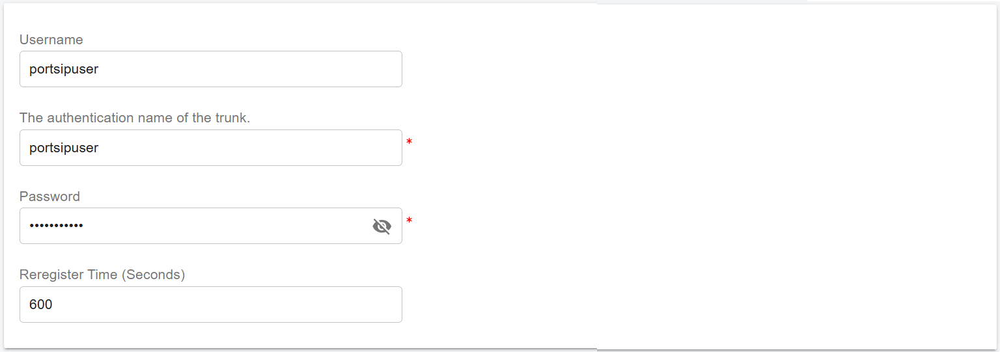
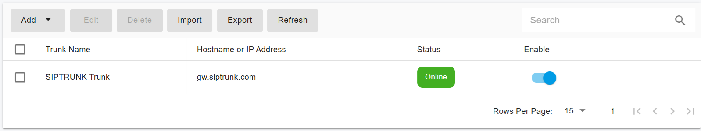

# Configuring SIPTRUNK Register Authentication Trunk

Before proceeding with trunk configuration, ensure that you have purchased at least one DID on the [SIPTRUNK ](https://www.siptrunk.com)platform.

***

### SIPTRUNK Setup Guide

To enable inbound calling, you must first complete the required configuration on the SIPTRUNK platform.

1. Sign in to your [SIPTRUNK ](https://login.siptrunk.com/)account.
2. &#x20;Your SIP trunk will also need to be configured via the customer portal. You must implement the following whitelisting requirements detailed in the article [Interconnecting with SIPTRUNK](https://support.siptrunk.com/hc/en-us/articles/38762945316379).

Once completed, continue with the trunk configuration in PortSIP PBX.

***

### Configure a Register-Based Trunk in PortSIP PBX

A **SIPTRUNK Registration Trunk** corresponds to a **Register-Based Trunk** in **PortSIP PBX**.

You can configure a Register-Based Trunk at **either** of the following levels:

* **System Administrator level**\
  The trunk can be **shared with one or more tenants**.
* **Tenant Administrator level**\
  The trunk can be used **only by the tenant** who created it.

***

### Create a Register-Based Trunk

#### Step 1: Open the Trunks Page

1. Sign in to the PortSIP PBX Web Portal as a **System Administrator** or **Tenant Administrator**.
2. From the left navigation menu, go to **Call Manager > Trunks**.
3. Click **Add**, then select **Register Based Trunk**.

<figure><figcaption></figcaption></figure>

***

#### Step 2: Enter Basic Trunk Information

Configure the following fields:

* **Name**\
  Enter a friendly name for the trunk.
* **Brand**\
  Select **SIPTRUNK**.
*   **DID Pool** _(Tenant Admin level only)_\
    If you are configuring this Register-Based Trunk at the **Tenant Admin level**, you must define the **SIPTRUNK DID numbers** for this trunk.

    The tenant can:

    * Use **only** the DID numbers defined in the **DID Pool**
    * Create **inbound and outbound routing rules** using those DID numbers
    * Configure **outbound caller IDs** for extensions using those DID numbers

    The DID Pool can include a **single number**, **multiple numbers**, or **number ranges**, separated by **semicolons**. For example:

    ```
    16468097065
    16468097065-16468097066
    16468097065-16468097066;16468097069
    16468097065-16468097066;16468097070-16468097080
    ```

Click **Next** to continue.

<figure><figcaption></figcaption></figure>

***

#### Step 3: Configure Trunk Credentials

Enter the registration credentials provided by CM.com:

* **Authentication Name**\
  Enter the **SIPTRUNK username** configured on the **SIPTRUNK** platform\
  (for example: `portsipuser`).
* **Password**\
  Enter the **SIP trunk password** obtained from the CM.com platform.

Click **Next** to continue.

<figure><figcaption></figcaption></figure>

***

#### Step 4: Configure Trunk Options

* **Max Concurrent Calls**\
  Set the maximum number of simultaneous calls that PortSIP PBX can establish using this trunk.

> ❗**Recommendation**\
> Keep the default values for other options unless you have specific requirements.

Click **Next** to continue.

<figure><figcaption></figcaption></figure>

***

#### Step 5: Assign the Trunk to Tenants _(System Administrator level only)_

This step is available **only** when configuring the Register-Based Trunk at the **System Administrator level**.

1. Assign the trunk to one or more **tenants**.
2. Define the **DID Pool(DID numbers)** for each tenant. Separated by **semicolons**.

> ❗**Important**
>
> * A DID can be assigned to **only one tenant**
> * Each tenant can use **only the DID numbers** within its assigned DID Pool

**DID Pool examples:**

```
16468097065
16468097065;16468097066
16468097065-16468097066;16468097069
16468097065-16468097066;16468097070-16468097080
```

***

#### Step 6: Save the Configuration

Click **OK** to save the settings. The trunk configuration is now complete.

***

### Expected Result

* PortSIP PBX successfully registers the trunk with the **CM.com** platform.
* On the **Trunks** page, the trunk status is displayed as **Online**.

<figure><figcaption></figcaption></figure>

***

> ❗**Note**\
> Ensure that your **SIPTRUNK** SIP credentials are correct and that outbound network access from the PBX is allowed.

Now you can follow the article to [Configuring inbound and outbound calls](configuring-outbound-and-inbound-calls.md).


