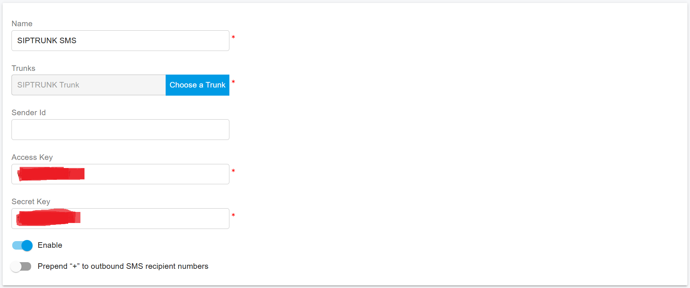

# SIPTRUNK SMS Integration

Before proceeding with the next steps, ensure that you have [purchased an SMS-enabled DID number on the SIPTRUNK platform](purchase-a-did-on-siptrunk-platform.md).

> **Important — U.S. A2P 10DLC Compliance**
>
> Under U.S. regulations for **A2P 10DLC (Application-to-Person SMS)**, SMS-enabled numbers must be **registered with mobile carriers** to avoid message blocking.
>
> * This requirement applies **only to A2P messaging** (application-generated messages sent to users).
> * It does **not** apply to **P2P (Person-to-Person)** messaging.
>
> Make sure your messaging use case is properly registered and approved on the **SIPTRUNK** platform before sending production SMS traffic.

***

### Obtain Integration Details from SIPTRUNK

To integrate the SIPTRUNK SMS with PortSIP PBX, you must obtain an **Access Key** and **Secret Key**, which are used to authenticate communication between PortSIP PBX and the SIPTRUNK platform.

#### Obtain the Keys

1. Sign in to the SIPTRUNK platform.
2. Follow the SIPTRUNK guide [Textable SMS App Configuration](https://support.siptrunk.com/hc/en-us/articles/38757133932059-Textable-SMS-App-Configuration).
3. Copy the **Access Key** and **Secret Key** and keep it available for later configuration in PortSIP PBX.

The **Access Key** and **Secret Key** are required to securely authenticate API requests between **PortSIP PBX** and **SIPTRUNK.**

***

### Configure SMS with a SIPTRUNK Trunk in PortSIP PBX

Before configuring SMS in PortSIP PBX, ensure that you have already configured a SIPTRUNK trunk using one of the following guides:

* [Configuring a SIP TRUNK IP Authentication Trunk](configuring-siptrunk-ip-authentication-trunk.md)
* [Configuring a SIP TRUNK Register Authentication Trunk](configuring-siptrunk-register-authentication-trunk.md)

***

### Sign In to the PortSIP PBX Web Portal

You can sign in to the PortSIP PBX Web Portal using one of the following methods:

* **System Administrator**\
  Sign in as a PBX system administrator, navigate to **Tenants**, select a tenant, and click **Manage** to switch to that tenant’s management view.
* **Tenant Administrator**\
  Sign in directly as a tenant administrator to manage your own tenant.

For more information, refer to [Tenant Management](../../portsip-pbx-administration-guide/3-tenant-management/).

***

### Add an SMS Configuration

Follow the steps below to configure SMS using the **SIPTRUNK** trunk:

1. Sign in to the PortSIP PBX Web Portal.
2. From the left-hand menu, navigate to **SMS/MMS**.
3. Click **Add**.
4. Configure the following settings:
   * **Trunk**\
     Select your previously configured **SIPTRUNK Trunk**.
   * **Sender ID**
     * If you have configured a **Sender ID in the SIPTRUNK  platform**, enter it here.
     * If left empty, PortSIP PBX will use the **DID number associated with the SIPTRUNK  trunk** as the Sender ID.
   * **Access Key** and **Secret Key**\
     Enter the **Access Key** and **Secret Key** obtained in the [Obtaining the Keys](siptrunk-sms-integration.md#obtain-integration-details-from-siptrunk) step.
5. Click **OK** to save the configuration.

After saving, you will be redirected to the **SMS/MMS list** page.

<figure><figcaption></figcaption></figure>

***

### Copy the Webhook URL

To complete the integration:

* Select the SMS configuration you just created and click **Copy Webhook**, **or**
* Double-click the SMS configuration and manually copy the **Webhook URL**.

This Webhook URL is required for receiving inbound SMS/MMS messages from the **SIPTRUNK** platform.

#### Configure the Webhook in the SIPTRUNK Portal

1. Sign in to the **SIPTRUNK Customer Portal**.
2. Navigate to the **Messaging** tab.
3. Click **Webhooks**.
4. Click **Create New Webhook**.
5. In the **URL** field, paste the **Webhook URL** copied from **PortSIP PBX**.
6. In the **Description** field, enter a meaningful name for the webhook.
7. Submit the form to create the webhook.
8. Once the webhook is created, assign it to the appropriate **DID number** using the available dropdown list.

This webhook enables SIPTRUNK to deliver inbound SMS events to PortSIP PBX.

For more detailed information, refer to the SIPTRUNK documentation:

* [Textable SMS App Configuration](https://support.siptrunk.com/hc/en-us/articles/38757133932059-Textable-SMS-App-Configuration)

***

### Verify the Configuration

Once the SMS configuration is complete:

* [Create Outbound Rules and Inbound Rules](configuring-outbound-and-inbound-calls.md) in PortSIP PBX for sending and receiving SMS/MMS using the **SIPTRUNK** trunk.
* The rule creation process is the same as configuring call routing rules.

