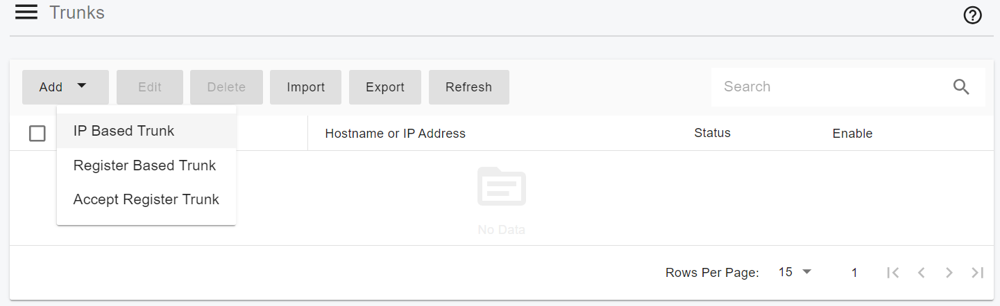
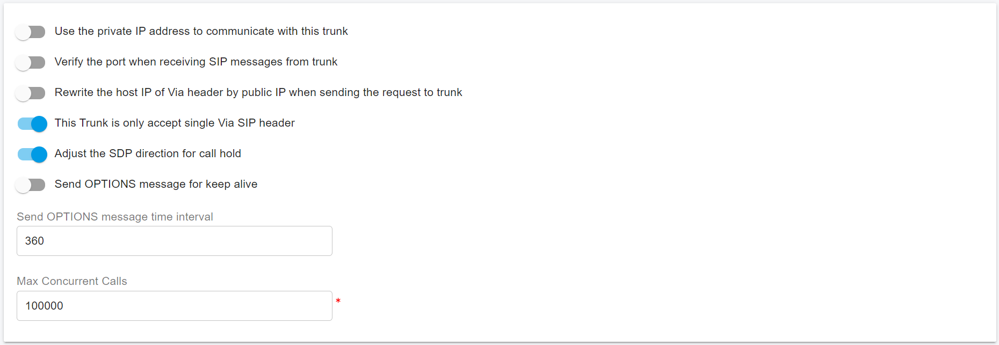
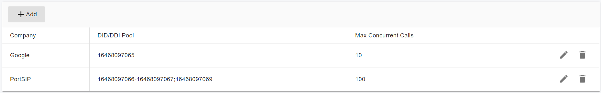

# Configuring Flowroute IP Authentication Trunk

Before proceeding with the next steps, you need to purchase a DID on the [Flowroute ](https://www.flowroute.com)platform.

## Flowroute Setup Guide

To configure the Flowroute trunk in the PortSIP PBX, there are two key sections to configure in the Flowroute portal: **Inbound Routes** and **IP Authentication**.

### IP Authentication Configuration

In the **IP Authentication** section, you'll need to set up the public static IP address of your PortSIP PBX system. Additionally, this section will provide the **SIP Host** for your trunk, as well as the **Call Prefix**. The Call Prefix will be used later when configuring the outbound routes on your PBX.

<figure><figcaption></figcaption></figure>

### Configuring the Inbound Routes

In the **Inbound Routes** section, you’ll need to create a route pointing to your PortSIP PBX server. To do this:

* Select the **Host** route type.
* In the **Route** field, enter the IP address of your server in the format:\
  `sip:1.2.3.4:5060`(Replace "1.2.3.4" with your actual PBX Server static public IP.)

If your SIP trunk is using a port other than the default port 5060, be sure to use the correct port in the format:\
`sip:1.2.3.4:5081`(for example).

Also, in the **Edge Strategy** drop-down, select the **SIP Proxy** host you noted from the **IP Authentication** section.&#x20;

<figure><figcaption></figcaption></figure>

### Associating DIDs with Inbound Routes

Lastly, go to the **DIDs** section in the portal and ensure your **DIDs** are associated with the correct inbound routes. This step is crucial to ensure that calls to your DIDs are properly routed to your PBX.

## Configure IP Authentication Trunk in PortSIP PBX

You must configure the [Flowroute ](https://www.flowroute.com)as **IP Based Trunk** at the PortSIP PBX system administrator level. Once successfully configured, you can share this trunk with tenants.

Please follow the below steps:

1. Sign in to the PortSIP PBX Web Portal as a System Administrator. Navigate to the left menu and select **Call Manager > Trunks**.&#x20;
2. Click the **Add** button to open a menu. From the menu, choose **IP Based Trunk**.

<figure><figcaption></figcaption></figure>

3. Enter the trunk name and choose the brand:
   * **Name**: Enter a friendly name for the trunk.
   * **Brand**: Select **Flowroute**.
   * **Hostname or IP address**: us-west-or.sip.flowroute.com.
   * Associated IP Addresses: Please contact your[ Flowroute Support Team ](https://flowroute.com/contact-us/)to obtain the IP addresses of the Flowroute trunk. Usually, it comes with one or more IP addresses. Please add them to the **Associated IP Addresses**. For example, 210.82.221.12 and 210.82.221.13.

<figure><figcaption></figcaption></figure>

4. Click the **Next** button, you can adjust the options for the trunk.
   * &#x20;**Max Concurrent Calls:** This field sets the maximum number of calls that PortSIP can establish with this trunk. You can adjust it to an appropriate value.
   * We recommend keeping the default settings for other options unless you have specific requirements.

<figure><figcaption></figcaption></figure>

5. Click the **Next** button to assign this trunk to the tenants and provide your Flowroute DIDs/Numbers to them with the DID Pool (DID numbers). A DID can be only assigned to one tenant.

A tenant assigned to this trunk can only use the DID numbers within the DID pool range to create inbound and outbound rules and configure the outbound caller ID for extensions.

<figure><figcaption></figcaption></figure>

* DID Pool: The DID pool can consist of a single number, a range of numbers, or a combination of both. For example:
  * `16468097065`
  * `16468097065;16468097066`
  * `16468097065-16468097066;16468097069`&#x20;
  * `16468097065-16468097066;16468097070-16468097080`

Click the **OK** button to save the changes. The trunk configuration is now complete.

In the trunk list, you will see the status displayed as **Registered** (for IP Based Trunk it always displays Registered).

<figure><figcaption></figcaption></figure>

Now you can follow the article to [Configuring inbound and outbound calls](../flowroute-sip-trunk/configuring-outbound-and-inbound-calls.md). 
