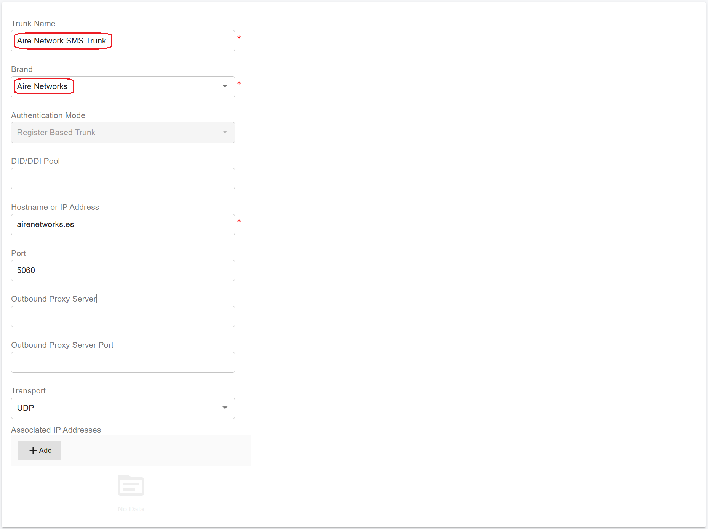
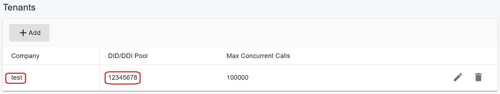
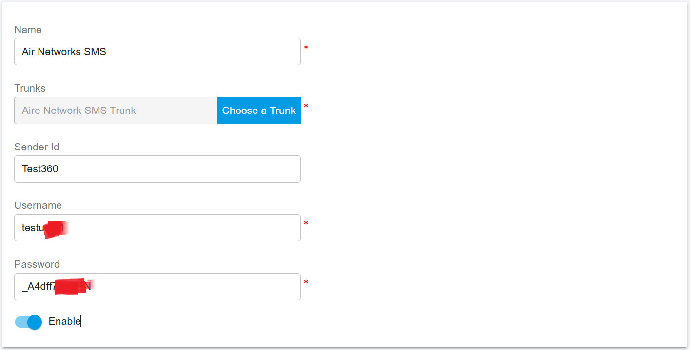
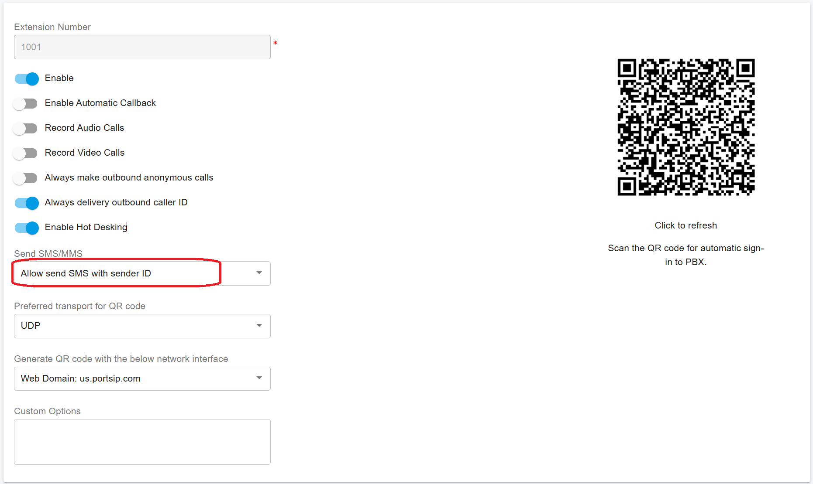
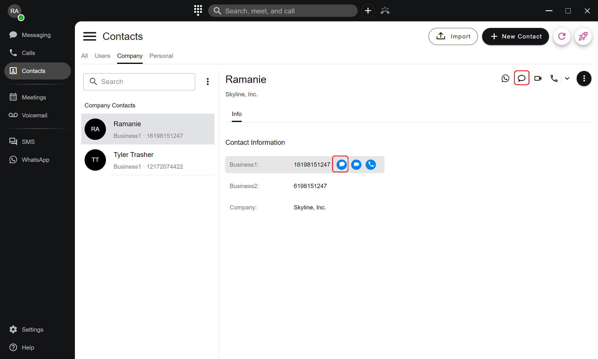
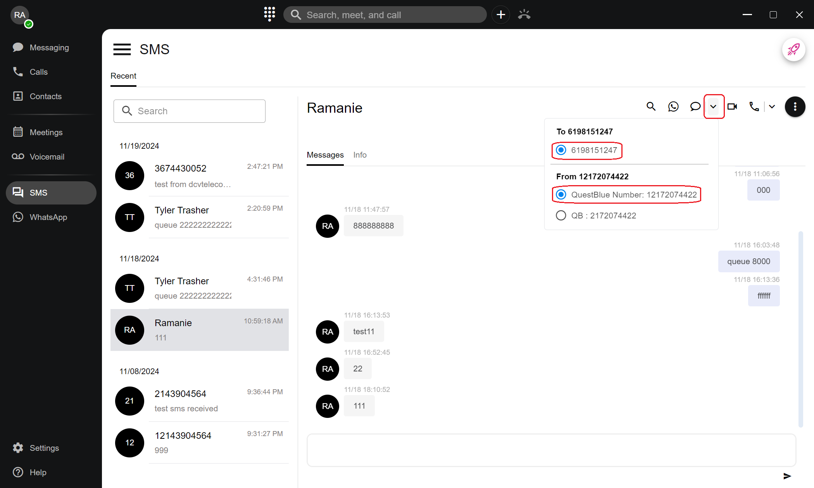
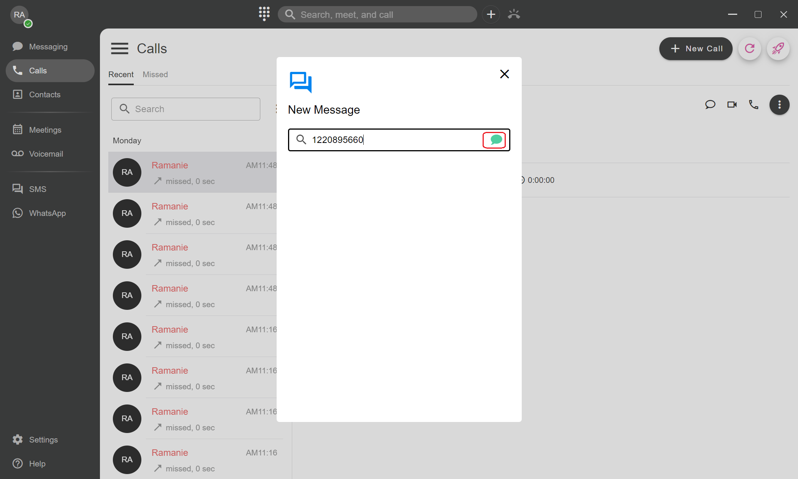

# SMSGlobal SIP Trunk

[Aire Networks](https://airenetworks.es/) is a leading wholesale telecommunications operator in the Spanish market that belongs to Grupo Aire. Aire Networks Trunk SIP Trunks allows you to send SMS to your customers from the PortSIP ONE app for market campaigns. This guide will demonstrate how to configure the Aire Networks SIP Trunk to send the SMS.

Configuring the Aire Networks SIP trunk into your PortSIP PBX is straightforward. Please follow the steps below:

## Sign Up and Purchase

You will need to contact Aire Networks to purchase the account and receive the credentials. Typically you will have the following details:

* Username
* Password
* Sender ID

## Configuring Aire Networks Trunk in PortSIP PBX

To add a trunk, follow these steps:

1. Navigate to **Call Manager > Trunks**, then click the arrow button to select the Register Based Trunk to add.
2. Enter a friendly name for the trunk.
3. From the **Brand** combo box, choose **Aire Networks**, keep the default settings.

<figure><figcaption></figcaption></figure>

4. Click the **Next** button, enter _**any string**_ for the **Username/Authentication Name** and **password**, and click the **Next** button and keep all the default settings.
5. If you are using the **System Admin** to add this trunk, in the last step for the **Tenants**, please select one or more tenants to grant them access to this trunk so they can use the Aire Networks Trunk to send the SMS.&#x20;

<figure><figcaption></figcaption></figure>

Click the OK button to complete the trunk setup.

## Add an SMS Configuration

Please follow the below steps:

1. In the PortSIP PBX web portal, navigate to the left menu, select **SMS/MMS**, and click the **Add** button.&#x20;
2. Choose your configured Aire Networks trunk and enter the following values:
   * **Sender ID**: The sender ID you received from Aire Networks
   * **Username**: Paste your Aire Networks SMS account username here.
   * **Password**: Paste your Aire Networks SMS password username here.

<figure><figcaption></figcaption></figure>

3. Click **OK** to be brought to the SMS/MMS list page.&#x20;

## Granting SMS Permissions to an Extension

By default, extensions are not permitted to send SMS. To enable an extension to send outbound SMS, the tenant administrator must grant permission. Follow these steps to allow SMS for an extension:

1. Sign in to the PortSIP PBX web portal.
2. Navigate to **Call Manager > Users**, double-click the desired extension, and go to the **Extension** tab.
3. Under the **Send SMS/MMS** option, since AireNetworks SMS always sends the SMS by Sender ID, you must choose **Allow Send SMS with Sender ID**.&#x20;

Refer to the screenshot below for further guidance.

<figure><figcaption></figcaption></figure>

## Sending an SMS to a Contact

To send an SMS to a contact using the PortSIP ONE app:

1. **Open Contacts**: In the PortSIP ONE app, go to the **Contacts** menu, select a contact, and click the SMS icon to open the SMS chat UI.

<figure><figcaption></figcaption></figure>

2. **Send SMS**: Type your message as you would in a regular chat. You can also select the destination number and the sender's number to display to the recipient.

<figure><figcaption></figcaption></figure>

## Sending an SMS Directly to a Phone Number

To send an SMS directly to a contact's phone number using the PortSIP ONE app, follow these steps:

1. Click the **+** button at the top of the PortSIP ONE app and select **Send a Message**.
2. In the pop-up window:
   * You can choose an extension (to send an IM) or an existing contact to send the SMS.
   * To send an SMS directly to a number, simply enter the phone number in the provided field.
3. Click the green message icon to open the SMS chat interface.

<figure><figcaption></figcaption></figure>

4. Send SMS:
   * Type your message in the chat window, just as you would in a regular chat.
   * You can also select the destination phone number and specify the sender's number that will appear to the recipient.

