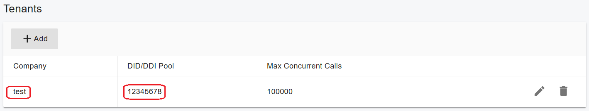

# SMSGlobal Trunk

[SMSGlobal ](https://www.smsglobal.com/us/)has been providing businesses with innovative communication solutions for over 17 years, from humble beginnings in a South Melbourne garage.

Using the SMSGlobal Trunk, you can send SMS messages to your customers directly from the PortSIP ONE app, enabling use cases such as marketing campaigns and customer notifications.

This guide explains how to configure the SMSGlobal in PortSIP PBX to enable outbound SMS.

***

### Sign Up and Purchase

To get started, contact **SMSGlobal** to purchase an account and obtain your SMS credentials.

Typically, you will receive the following information:

* **API Key**
* **API Secret**

Keep these details available, as they are required during the SMS configuration process.

***

### Configure the SMSGlobal Trunk in PortSIP PBX

Follow the steps below to add the SMSGlobal trunk.

#### Add Register-Based Trunk

1. Sign in to the PortSIP PBX Web Portal.
2. Navigate to **Call Manager > Trunks**.
3. Click the **Add** button and select **Register Based Trunk**.
4. Enter a **friendly name** for the trunk.
5. From the **Brand** drop-down list, select **SMSGlobal** and keep the default settings.
6. **DID Pool** _(Tenant Admin level only)_\
   If you are configuring this Register-Based Trunk at the **Tenant Admin level**, you must define the **SMSGlobal DID numbers** for this trunk.

*   The tenant can:

    * Use **only** the DID numbers defined in the **DID Pool**
    * Create **inbound and outbound routing rules** using those DID numbers
    * Configure **outbound caller IDs** for extensions using those DID numbers

    The DID Pool can include a **single number**, **multiple numbers**, or **number ranges**, separated by **semicolons**. For example:

    ```
    16468097065
    16468097065-16468097066
    16468097065-16468097066;16468097069
    16468097065-16468097066;16468097070-16468097080
    ```

<figure><figcaption></figcaption></figure>

7. Click **Next**, then:
   * Enter any value for **Username / Authentication Name**.
   * Enter any value for **Password**.
8. Click **Next** again and keep all remaining settings at their default values.
9. If you are logged in as a **System Administrator** to add this trunk, select one or more **tenants** in the final step to grant them access to this trunk.
10. Click **OK** to complete the trunk setup.

<figure><figcaption></figcaption></figure>

***

### Add an SMS Configuration

After the trunk is configured, add an SMS configuration for SMSGlobal.

1. In the PortSIP PBX Web Portal, navigate to **SMS/MMS**.
2. Click **Add**.
3. Select your configured **SMSGlobal Trunk**.
4. Enter the following values:
   * **Sender ID**
     * If you have configured a **Sender ID** in the **SMSGlobal** platform, enter it here.
     * If left empty, PortSIP PBX will use the **DID number associated with the SMSGlobal trunk** as the Sender ID.
   * **API Key**: Enter the **API key** you obtained from the SMSGlobal platform.
   * **API Secret**: Enter the **API Secret** you obtained from the SMSGlobal platform.
5. Click **OK** to save the configuration and return to the **SMS/MMS list** page.

<figure><figcaption></figcaption></figure>

***

### Grant SMS Permissions to an Extension

By default, extensions are **not allowed to send SMS**. A tenant administrator must explicitly enable this permission.

1. Sign in to the **PortSIP PBX Web Portal** as a tenant administrator.
2. Navigate to **Call Manager > Users**.
3. Double-click the target extension and open the **Extension** tab.
4. Under **Send SMS/MMS**, select: **Allow Send SMS with Sender ID**
5. Save the changes.

<figure><figcaption></figcaption></figure>

***

### Send an SMS to a Contact (PortSIP ONE App)

To send an SMS to an existing contact:

1. Open the **PortSIP ONE** app.
2. Go to **Contacts**.
3. Select a contact and click the **SMS** icon to open the chat window.

<figure><figcaption></figcaption></figure>

4. Type your message and send it.&#x20;
5. You can also select the destination number and the sender's number to display to the recipient.

<figure><figcaption></figcaption></figure>

***

### Send an SMS Directly to a Phone Number

To send an SMS to a phone number that is not saved as a contact:

1. Open the **PortSIP ONE** app.
2. Click the **+** button at the top of the app and select **Send a Message**.
3. In the dialog:
   * Choose an extension (for internal IM), **or**
   * Enter a phone number directly to send an SMS.
4. Click the **message icon** to open the SMS chat interface.

<figure><figcaption></figcaption></figure>

5. Type and send your message.
6. You can also select the destination phone number and specify the sender's number that will appear to the recipient.


