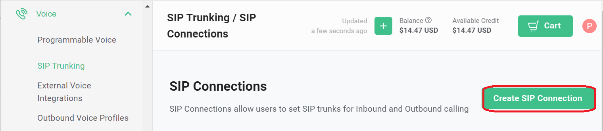
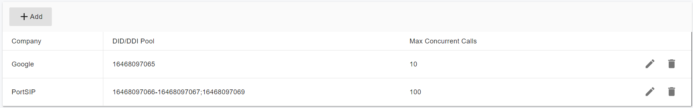

# Configuring Telnyx IP Authentication Trunk

Before proceeding with the next steps, you need to [purchase a DID on the Telnyx platform](purchase-a-did-on-telnyx-platform.md).

### Create a SIP Trunk on the Telnyx Platform

To create a new SIP trunk on the **Telnyx** platform, follow these steps.

#### Step 1: Create a SIP Connection

1. Sign in to your Telnyx account.
2. From the left-hand navigation menu, go to **Voice > SIP Trunking**.
3. Click **Create SIP Connection**.

<figure><figcaption></figcaption></figure>

***

#### Step 2: Configure Basic Connection Settings

4. Enter a **friendly name** for the SIP connection.
5. For **Type**, select **IP Address**.
6. Click **Create**.
   * You will be redirected to the **Connection Details** page.

<figure><figcaption></figcaption></figure>

***

#### Step 3: Add Your PBX IP Address

7. In the **Connection Details** page, click **Add IP Address**.
8. Enter your PortSIP PBX public static IP address.
9. Specify your PortSIP PBX SIP signaling port (typically `5060`).

<figure><figcaption></figcaption></figure>

***

#### Step 4: Assign DID Numbers

10. Click the **Numbers** tab.
11. Click **Assign Number**.
12. Select the DID numbers you want to associate with this SIP connection.
13. Click **Assign Selected Numbers**.
14. Click **Save** to apply and store the changes.

<figure><figcaption></figcaption></figure>

***

#### Create an Outbound Voice Profile

To enable outbound calling for your SIP connection, you must create and associate an **Outbound Voice Profile** on the **Telnyx** platform.

Follow these steps:

1. Sign in to your Telnyx account.
2. From the left-hand navigation menu, go to **Voice > Outbound Voice Profiles**.
3. Click **Add New Profile**.
4. Enter a **friendly name** for the profile (for example, `PortSIP Outbound`), then click **Create**.
   * You will be redirected to the **Outbound Voice Profile details** page.

**Associate the SIP Connection**

5. In the Associated Connections and Applications section, click Add connections/apps to profile.
6. Select the SIP connection you created earlier.
7. Click Add connections/apps to profile to associate it with this outbound profile.
8. Click Save to apply the changes.

<figure><figcaption></figcaption></figure>

***

### Configure an IP Authentication Trunk in PortSIP PBX

The **Telnyx IP Authentication Trunk** corresponds to an **IP-Based Trunk** in PortSIP PBX.

> ❗**Important**\
> IP-Based Trunks **must be configured at the System Administrator level**.\
> Once created, the trunk can be **shared with one or more tenants**.

***

#### Step 1: Create the IP-Based Trunk

1. Sign in to the PortSIP PBX Web Portal as a **System Administrator**.
2. From the left-hand navigation menu, go to **Call Manager > Trunks**.
3. Click **Add**, then select **IP Based Trunk**.

<figure><figcaption></figcaption></figure>

***

#### Step 2: Configure Basic Trunk Settings

Enter the following information:

* **Name**\
  Enter a friendly name for the trunk (for example, `Telnyx-IP-Trunk`).
* **Brand**\
  Select a **Telnyx** location closest to your PBX deployment, for example:
  * `Telnyx - US`

Click **Next** to continue.

<figure><figcaption></figcaption></figure>

***

#### Step 3: Configure Call Capacity

* **Max Concurrent Calls**\
  Defines the maximum number of simultaneous calls that PortSIP PBX can establish through this trunk.
  * Adjust this value according to your Telnyx service plan and expected call volume.
  * For most deployments, the default value is sufficient.

Leave all other options at their default values unless you have specific requirements.

Click **Next** to continue.

<figure><figcaption></figcaption></figure>

***

#### Step 4: Assign Tenants and DID Pool

1. Assign the trunk to one or more tenants.
2. Provide Telnyx DID numbers to each tenant using the **DID Pool**.

> ❗**Important**
>
> * Each DID can be assigned to **only one tenant**.
> * A tenant assigned to this trunk can use **only the DID numbers in its DID pool** to:
>   * Create inbound and outbound call rules
>   * Configure outbound caller IDs for extensions

**DID Pool Format Examples**

The DID pool may contain a single number, multiple numbers, ranges, or a combination:

```
16468097065
16468097065;16468097066
16468097065-16468097066;16468097069
16468097065-16468097066;16468097070-16468097080
```

Click **OK** to save the configuration.

<figure><figcaption></figcaption></figure>

***

#### Expected Result

* The IP-Based trunk configuration is now complete.
* In the trunk list, the trunk status will display **Online**.
  * This is **expected behavior** for IP-Based Trunks, which always show a _Registered_ status.

In the trunk list, you will see the status displayed as **Online** (for IP Based Trunk it always displays Registered).

<figure><figcaption></figcaption></figure>

***

### Next Steps

You can now proceed to [Configuring Outbound & Inbound Calls](configuring-outbound-and-inbound-calls.md) to complete your call routing setup.


