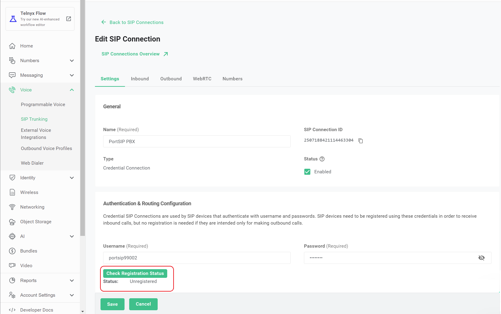
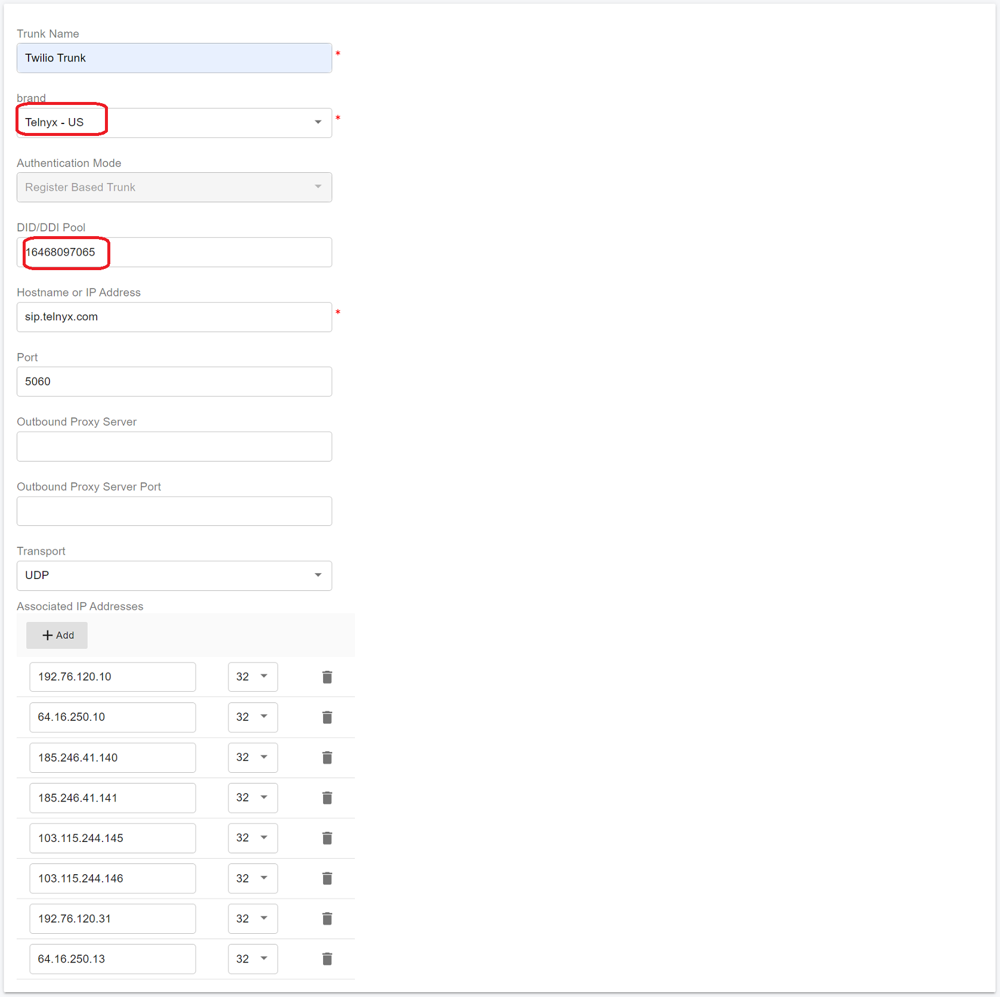
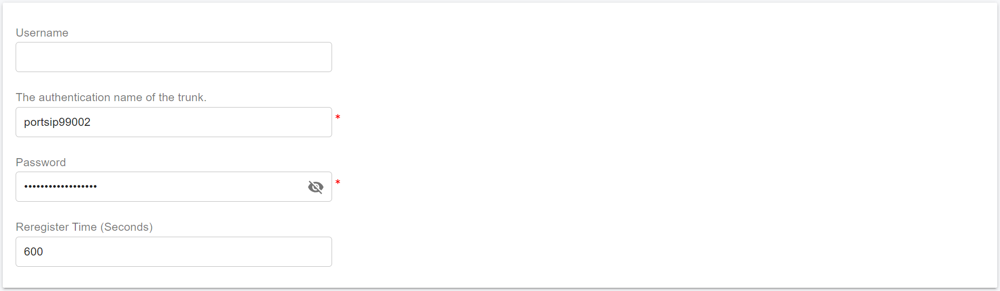

# Configuring Telnyx Register Authentication Trunk

Before proceeding with the next steps, you need to [purchase a DID on the Telnyx platform](purchase-a-did-on-telnyx-platform.md).

### Create a SIP Trunk on the Telnyx Platform

To create a new SIP trunk on the **Telnyx** platform using **credential-based authentication**, follow these steps.

#### Step 1: Create a SIP Connection

1. Sign in to your Telnyx account.
2. From the left-hand navigation menu, go to **Voice > SIP Trunking**.
3. Click **Create SIP Connection**.

<figure><figcaption></figcaption></figure>

***

#### Step 2: Configure Basic Connection Settings

1. Enter a **friendly name** for the SIP connection.
2. For **Type**, select **Credentials**.
3. Enter a **Username** and **Password** of your choosing.
   * Choose strong, secure credentials, as they will be used by PortSIP PBX for SIP authentication.

<figure><figcaption></figcaption></figure>

4. Click **Create**.&#x20;
   * You will be redirected to the **Connection Details** page.

> ❗**Note**\
> After the trunk is configured in PortSIP PBX, you can return to this page and click **Check Registration Status** to verify whether PortSIP PBX is successfully registered to the Telnyx trunk.

<figure><figcaption></figcaption></figure>

***

#### Step 3: Assign DID Numbers

1. Click the **Numbers** tab.
2. Click **Assign Number**.
3. Select the DID numbers you want to associate with this SIP connection.
4. Click **Assign Selected Numbers**.
5. Click **Save** to apply and store the changes.

<figure><figcaption></figcaption></figure>

***

#### Create an Outbound Voice Profile

To enable outbound calling for your SIP connection, you must create and associate an **Outbound Voice Profile** on the **Telnyx** platform.

Follow these steps:

1. Sign in to your Telnyx account.
2. From the left-hand navigation menu, go to **Voice > Outbound Voice Profiles**.
3. Click **Add New Profile**.
4. Enter a **friendly name** for the profile (for example, `PortSIP Outbound`), then click **Create**.
   * You will be redirected to the **Outbound Voice Profile Details** page.

**Associate the SIP Connection**

5. In the **Associated Connections and Applications** section, click **Add connections/apps to profile**.
6. Select the **SIP connection** you created earlier.
7. Click **Add connections/apps to profile** to associate it with this outbound profile.
8. Click **Save** to apply the changes.

<figure><figcaption></figcaption></figure>

***

### Configure Register Authentication Trunk in PortSIP PBX

The **Register Authentication Telnyx trunk** corresponds to a **Register-Based Trunk** in PortSIP PBX.

> ❗**Important**\
> Register-Based Trunks **must be configured at the System Administrator level**.\
> Once successfully configured, the trunk can be **shared with one or more tenants**.

***

#### Step 1: Create the Register-Based Trunk

1. Sign in to the PortSIP PBX Web Portal as a **System Administrator**.
2. Navigate to **Call Manager > Trunks**.
3. Click **Add**, then select **Register Based Trunk**.

<figure><figcaption></figcaption></figure>

***

#### Step 2: Configure Basic Trunk Settings

Enter the following information:

* **Name**\
  Enter a friendly name for the trunk (for example, `Telnyx-Reg-Trunk`).
* **Brand**\
  Select a nearby **Telnyx** location from the Brand field\
  (for example, **Telnyx – US**).
*   **DID Pool** _(Tenant Admin level only)_\
    If this trunk is being configured at the **Tenant Administrator level**, specify the Telnyx DID numbers assigned to this tenant.

    > ❗**Important**
    >
    > The tenant can use **only the DID numbers in its DID pool** to:
    >
    > * Create inbound and outbound call rules
    > * Configure outbound caller IDs for extensions

**DID Pool Format Examples**

```
16468097065
16468097065;16468097066
16468097065-16468097066;16468097069
16468097065-16468097066;16468097070-16468097080
```

Click **Next** to continue.

<figure><figcaption></figcaption></figure>

#### Step 3: Configure Trunk Credentials

Enter the credentials created earlier when you **created the Telnyx SIP connection**:

* **Authentication Name**\
  Enter the **username** configured in the [_Create SIP Connection_](configuring-telnyx-register-authentication-trunk.md#step-1-create-a-sip-connection) step.
* **Password**\
  Enter the corresponding **password**.

Click **Next** to continue.

<figure><figcaption></figcaption></figure>

***

#### Step 4: Configure Trunk Options

* **Max Concurrent Calls**\
  Specifies the maximum number of simultaneous calls that PortSIP PBX can establish using this trunk.
  * Adjust this value based on your Telnyx service plan and expected call volume.

Leave all other options at their default values unless you have specific requirements.

Click **Next** to continue.

<figure><figcaption></figcaption></figure>

***

#### Step 5: Assign Tenants and DID Pool _(System Admin level only)_

> ❗**Note**\
> This step is available **only** when configuring the trunk at the **System Administrator level**.

1. Assign the trunk to one or more tenants.
2. Provide Telnyx DID numbers to each tenant using the **DID Pool**.

> ❗**Important**
>
> * Each DID can be assigned to **only one tenant**.
> * A tenant can use **only the DID numbers in its DID pool** to:
>   * Create inbound and outbound call rules
>   * Configure outbound caller IDs for extensions

**DID Pool Format Examples**

```
16468097065
16468097065;16468097066
16468097065-16468097066;16468097069
16468097065-16468097066;16468097070-16468097080
```

Click **OK** to save the configuration.

<figure><figcaption></figcaption></figure>

***

#### Expected Result

* The trunk configuration is complete.
* Once PortSIP PBX successfully registers with the Telnyx platform, the trunk status will display **Online** in the trunk list.

<figure><figcaption></figcaption></figure>

***

### Next Steps

You can now proceed to [Configuring Outbound & Inbound Calls](configuring-outbound-and-inbound-calls.md) to complete your call routing setup.


