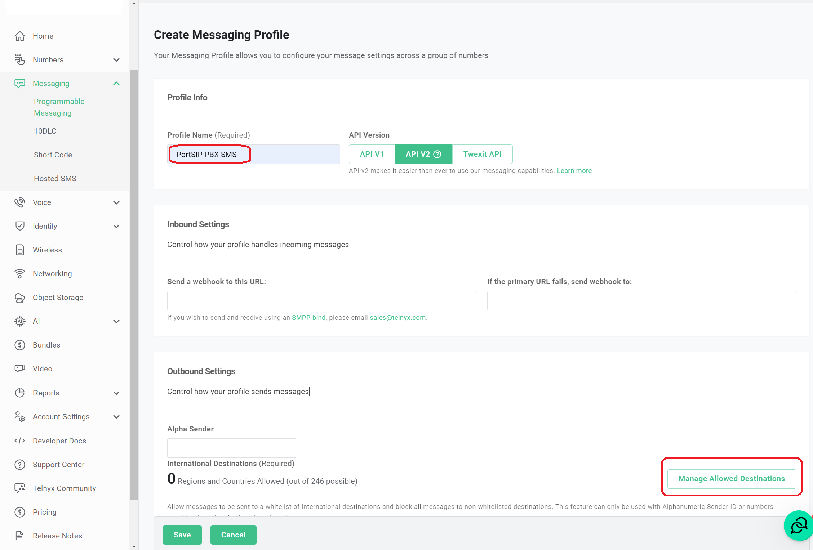
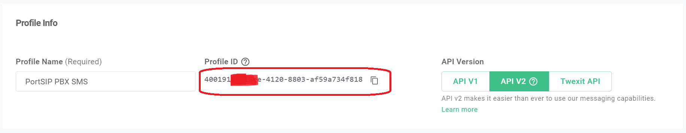
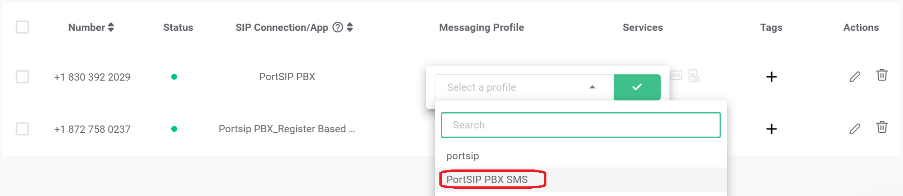
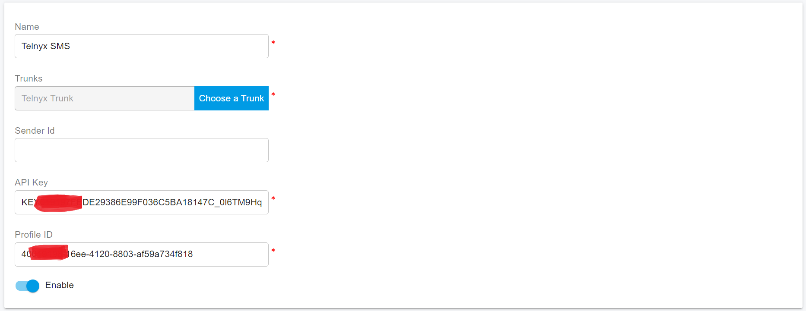
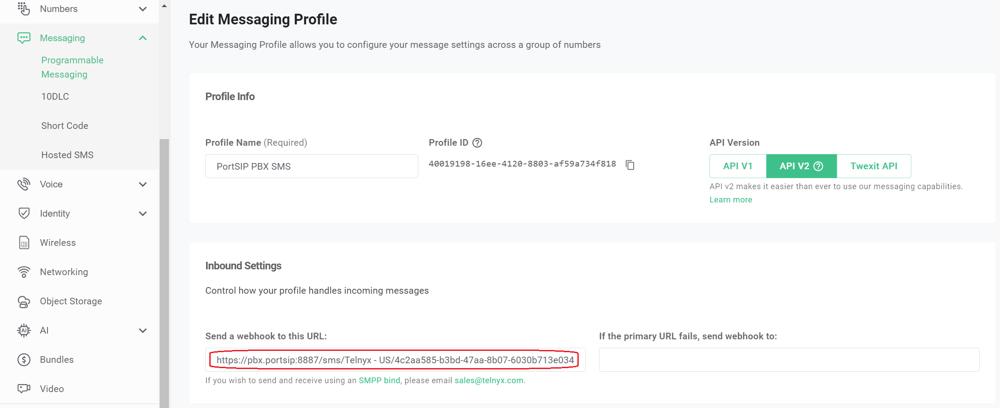

# Telnyx SMS Integration

Before proceeding with the next steps, you need to [purchase a DID on the Telnyx platform](purchase-a-did-on-telnyx-platform.md) with **SMS/MMS enabled**.

### Create a Telnyx API Key

To enable **SMS/MMS sending** from PortSIP PBX, you must generate a **Telnyx API key**.

Follow these steps on the **Telnyx** platform:

1. **Sign in** to your Telnyx account.
2. Navigate to **Account Settings > Keys & Credentials**.
3. Click **Create API Key**.
4. Copy and securely store the **API key**.

> ❗**Important**\
> The API key is shown **only once** at creation time.\
> Make sure to copy and save it securely—you will need it later when configuring SMS/MMS in PortSIP PBX.

> ❗**Security Best Practice**\
> Treat the API key as a sensitive credential.\
> If the key is compromised, revoke it immediately and generate a new one.

<figure><figcaption></figcaption></figure>

***

### Create an SMS Profile

To enable SMS/MMS for your Telnyx numbers, you must first create a **Messaging Profile** and then assign it to your purchased numbers.

***

#### Step 1: Create a Messaging Profile

1. Sign in to your **Telnyx** account.
2. Navigate to **Messaging > Programmable Messaging**.
3. Click **Add New Profile**.
4. On the profile details page:
   * Enter a **Profile Name** (for example, `PortSIP PBX SMS`).
   * Click **Manage Allowed Destinations**.
   * Select **at least one destination** (country or region) where you plan to send SMS.
   * Click **Set Destinations**.

<figure><figcaption></figcaption></figure>

5. Click **Save** to create the messaging profile.

> ❗**Important**\
> After the profile is created, copy and save the **Profile ID** shown on the details page.\
> You will need this value later when configuring SMS in PortSIP PBX.

<figure><figcaption></figcaption></figure>

***

#### Step 2: Assign the Messaging Profile to Phone Numbers

1. Navigate to **Numbers > My Numbers**.
2. Click the **My Numbers** tab to view your purchased phone numbers.
3. Locate the **Messaging Profile** (or **Required for SMS**) column.
4. Click the field for the desired phone number.

<figure><figcaption></figcaption></figure>

6. Select the **Messaging Profile** you created earlier.
7. Save the changes.

<figure><figcaption></figcaption></figure>

***

### Configure SMS with Telnyx Trunk in PortSIP PBX

Before configuring SMS in PortSIP PBX, ensure that a Telnyx SIP trunk has already been configured using one of the following guides:

* [Configuring Telnyx Register Based Trunk](configuring-telnyx-register-authentication-trunk.md)
* [Configuring Telnyx IP Based Trunk](configuring-telnyx-ip-authentication-trunk.md)

***

### Sign in to the PortSIP PBX Web Portal

You can access the tenant configuration using one of the following methods:

#### Option 1: Sign in as System Administrator

1. Sign in to the PortSIP PBX Web Portal as a **System Administrator**.
2. Navigate to **Tenants**.
3. Select the desired tenant and click **Manage** to switch to that tenant’s administration context.

#### Option 2: Sign in as Tenant Administrator

* Sign in directly as a **Tenant Administrator** to manage the tenant.

> ❗**Note**\
> For more information about tenant roles and permissions, refer to **Tenant Management**.

***

### Add an SMS Configuration in PortSIP PBX

#### Step 1: Create the SMS Configuration

1. In the PortSIP PBX Web Portal, navigate to **SMS/MMS** from the left-hand menu.
2. Click **Add**.
3. Select your configured **Telnyx trunk**.
4. Configure the following fields:
   * **API Key**
     * Enter the API key created in **Create Telnyx API Key**.
   * **Profile ID**
     * Enter the **Messaging Profile ID** copied in the previous steps.
5. Click **OK** to save the configuration.

<figure><figcaption></figcaption></figure>

***

#### Step 2: Copy the PortSIP PBX SMS Webhook URL

1. You will be redirected to the **SMS/MMS list** page.
2. Select the SMS configuration and click **Copy Webhook** to copy the **PortSIP PBX SMS Webhook URL**.

Alternatively:

* Double-click the SMS configuration to open its details page, then copy the **Webhook URL** from there.

> ❗**Important**\
> This Webhook URL is required for Telnyx to deliver inbound SMS/MMS messages to PortSIP PBX.

<figure><figcaption></figcaption></figure>

***

### Configure the PortSIP PBX SMS Webhook in Telnyx

#### Step 1: Update the Messaging Profile in Telnyx

1. Sign in to your [Telnyx ](https://portal.telnyx.com/)account.
2. Navigate to Messaging > Programmable Messaging.
3. Locate the Messaging Profile created earlier.
4. Click the Edit (pencil) icon to edit the profile.
5. Paste the copied PortSIP PBX SMS Webhook URL into the field\
   Send a webhook to this URL.
6. Click Save.

<figure><figcaption></figcaption></figure>

***

### Verify the Configuration

At this point, the Telnyx SMS/MMS integration is complete.

You can now [create outbound and inbound rules](configuring-outbound-and-inbound-calls.md) in PortSIP PBX to send and receive SMS/MMS messages using the Telnyx trunk, just as you would configure rules for outbound and inbound voice calls.

