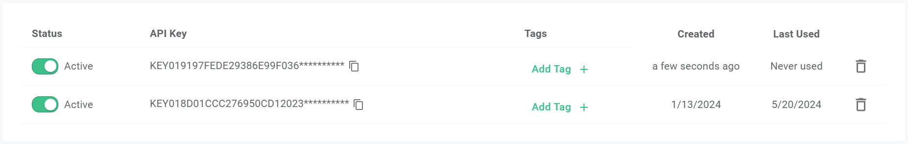
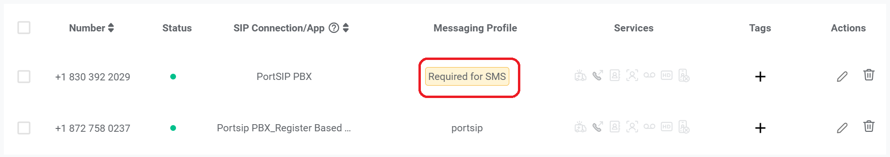
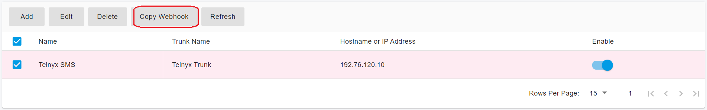

# Telnyx SMS Integration

Before proceeding with the next steps, you need to [purchase a DID on the Telnyx platform](purchase-a-did-on-telnyx-platform.md) with the **SMS/MMS enabled**.

## Create Telnyx API Key

You need to generate a Telnyx API key for the PortSIP PBX to send the SMS/MMS. Please follow the below steps:

1. Log in to your account on the [Telnyx ](https://portal.telnyx.com/)platform
2. Navigate the menu **Account Settings > Keys & Credentials**, press **Create API Key**
3. Be sure to copy the API key because you will need it later

<figure><figcaption></figcaption></figure>

## Create SMS Profile

You must create a Messaging Profile for later assign it to our purchased numbers.

1. Navigate to the menu **Messaging > Programmable Messaging**, and click **Add New Profile**.
2. On the profile details page, input a profile name such as PortSIP PBX SMS, click the **Manage Allowed Destinations**, choose at least one destination, and click **Set Destinations**.

<figure><figcaption></figcaption></figure>

3. Press **Save**, the profile is created, and display the details as the below screenshot, please copy the **Profile ID** you will need later.

<figure><figcaption></figcaption></figure>

4. Navigate to the menu **Numbers > My Numbers**, click the **My Numbers** tab, and the purchased numbers are listed. Click the **Required for SMS** under the column **Messaging Profile.**

<figure><figcaption></figcaption></figure>

5. choose the messaging profile we created previously, and save the changes.

<figure><figcaption></figcaption></figure>

## Configure SMS with Telnyx Trunk in PortSIP PBX

Before configuring SMS in PortSIP PBX, you must have already configured a Telynx SIP trunk using one of the following guides:

* [Configuring Telnyx Register Based Trunk](configuring-telnyx-register-authentication-trunk.md)
* [Configuring Telnyx IP Based Trunk](configuring-telnyx-ip-authentication-trunk.md)

### Sign in PortSIP PBX Web Portal

You can sign in to the PortSIP PBX Web portal using one of the following methods:

1. Sign in as the PBX system administrator, navigate to the **Tenants** menu, choose a tenant, and click the **Manage** button to switch to that tenant.
2. Sign in as a tenant admin to manage the tenant.

For more details please reference [Tenant Management](../../portsip-pbx-administration-guide/3-tenant-management.md).

### Add an SMS configuration

Please follow the below steps:

1. In the PortSIP PBX Web portal, navigate to the left menu, select **SMS/MMS**, and click the **Add** button.&#x20;
2. Choose your configured Telnyx Trunk :
   * **API Key**: Input the API Key you created in [Create Telnyx API Key ](telnyx-sms-integration.md#create-telnyx-api-key)section.
   * **Profile ID**: Enter the copied Profile ID in previous steps.

<figure><figcaption></figcaption></figure>

3. Click **OK** to be brought to the SMS/MMS list page. You can select that SMS configuration, then press the **Copy Webhook** button to copy the Webhook URL. Or Double-click the SMS configuration to edit the SMS configuration, in the details copy the Webhook URL.

<figure><figcaption></figcaption></figure>

## Set up PortSIP PBX SMS Webhook URL in Telnyx

1. Log in to your account on the [Telnyx ](https://portal.telnyx.com/)platform
2. Navigate to the menu **Messaging > Programmable Messaging,** the SMS Profile you created previously listed there, click the pencil Edit icon to edit the profile.
3. Paste the copied PortSIP PBX SMS Webhook URL to the **Send a webhook to this URL** field.

<figure><figcaption></figcaption></figure>

4. Click **Save**.

## Verify Configuration

Now you can [create the outbound and inbound rules](configuring-outbound-and-inbound-calls.md) in PortSIP PBX for sending and receiving SMS/MMS using the Telynx Trunk, just like you create the rules for making and receiving calls.

