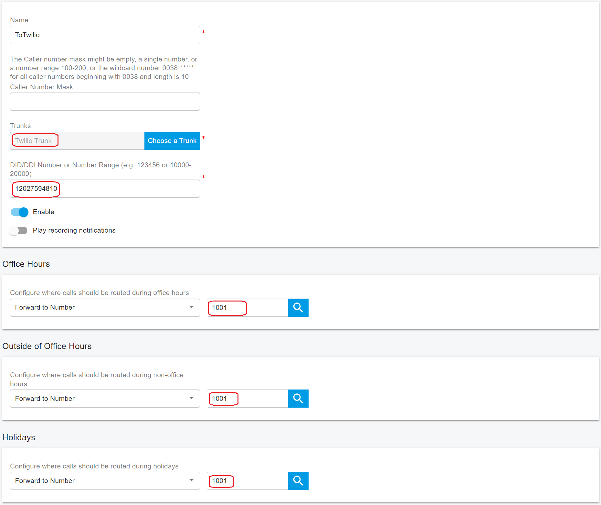

# Configuring Outbound & Inbound Calls

### Sign in to the PortSIP PBX Web Portal

To configure outbound and inbound call routing, you must first sign in to the PortSIP PBX Web Portal.

You can access a tenant in one of the following ways:

#### Option 1: Sign in as System Administrator

1. Sign in to the PortSIP PBX Web Portal as a **System Administrator**.
2. Navigate to **Tenants**.
3. Select the desired tenant and click **Manage** to switch to that tenant’s administration context.

#### Option 2: Sign in as Tenant Administrator

* Sign in directly as a **Tenant Administrator** to manage that tenant.

> ❗**Note**\
> For more information about tenant roles and access control, refer to [Tenant Management](../../portsip-pbx-administration-guide/3-tenant-management/).

***

### Configure Outbound Rules

To place outbound calls, you must create at least one **Outbound Rule**.

#### Add an Outbound Rule in PortSIP PBX

1. From the left-hand navigation menu, go to **Call Manager > Outbound Rules**.
2. Click **Add**.
3. Enter a **Name** for the outbound rule (for example, `Twilio-Outbound`).
4. In the **Apply this rule to the following calls** section, configure **at least one condition** to define which calls this rule applies to.

<figure><figcaption></figcaption></figure>

#### Select the Trunk Route

5. Scroll to **Place outbound calls using the following trunk routes**.
6. Click the **Add (+)** icon.
7. Select the **Twilio trunk**, then save the outbound rule.

<figure><figcaption></figcaption></figure>

#### Number Format and Dial Plan Normalization

When configuring outbound rules, ensure that all dialed numbers are formatted in one of the following ways:

* **10-digit format** (for example, `3322496213`)
* **11-digit format** (for example, `13322496213`)
* **E.164 format** (for example, `+13322496213`)

Depending on your users’ dialing habits, you may need to strip leading digits or prepend a country code.

**Example: Prepending the US Country Code**

If users typically dial US domestic numbers in national format (10 digits), you can configure the outbound rule to **prepend `1`** to all dialed numbers before routing the call to the trunk.

> ❗**Best Practice**\
> Normalizing outbound numbers to **E.164 format** improves compatibility with SIP trunks and ensures consistent routing and caller ID behavior.

<figure><figcaption></figcaption></figure>

***

### Configure Inbound Rules

To receive inbound calls, you must configure at least one **Inbound Rule**.

#### Add an Inbound Rule in PortSIP PBX

Follow these steps to create an inbound routing rule:

1. Sign in to the **PortSIP PBX Web Portal** as a **System Administrator** or **Tenant Administrator**.
2. From the left-hand navigation menu, go to **Call Manager > Inbound Rules**.
3. Click **Add**.

#### Configure the Inbound Rule

4. Enter a **Name** for the inbound rule (for example, `Twilio-Inbound`).
5. Click **Choose a Trunk**, then select the appropriate **Twilio trunk**.
6. In the **DID/DDI Number or Number Range** field, enter the destination number(s).
   * The number must fall within the **DID pool range** assigned to the selected trunk.
7. Select the **Extension**, **Ring Group**, **Queue**, or other destination to which inbound calls should be routed.
8. Click **OK** to save the rule.

<figure><figcaption></figcaption></figure>

***

### Advanced Routing Options (Optional)

Depending on your business requirements, you can further enhance the inbound rule by:

* Defining **office hours** or schedules
* Routing calls to **different destinations** based on time of day
* Sending calls to **voicemail** outside business hours
* Automatically **rejecting or dropping calls** when appropriate

For more details, refer to the article [Office Hours and Holiday Schedule](../../portsip-pbx-administration-guide/office-hours-and-holiday-schedule/).

For comprehensive information about inbound and outbound routing behavior, see [Call Route Management](../../portsip-pbx-administration-guide/8-call-route-management/).

