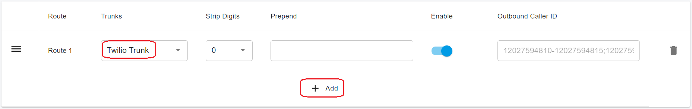
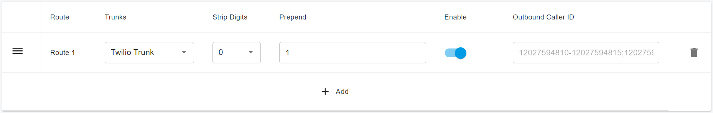

# Configuring Outbound & Inbound Calls

You need to sign in to the PortSIP PBX web portal to create the outbound and inbound rule for make & receive calls.

## Sign in PortSIP PBX Web Portal

You can sign in the Web portal as the following ways:

1. Sin in as PBX system administrator, chose a tenant and click the Manage button to switch to that tenant.
2. Sign in as a tenant admin to manage the tenant.

More details please reference [Tenant Management](../../portsip-pbx-administration-guide/3-tenant-management.md).

## Configure Outbound Rules

### Add Outbound Rule in PortSIP PBX

In order to place outbound calls you need to configure Outbound Rules. Go to **Call Manager > Outbound Rules** in the left hand side menu and click the **Add** button:

1. Give your Outbound Rule a name
2. Set up at least one condition for this outbound rule in section **Apply this rule to the following calls**

<figure><figcaption></figcaption></figure>

3. Scroll to the Place outbound calls using the following trunk routes section, click the Add icon, then select **Twilio Trunk** and save the Outbound Rule.

<figure><figcaption></figcaption></figure>

When configuring your Outbound Rules make sure that all numbers are dialed either in the 10-digit (e.g. `3322496213`), 11-digit format (e.g. `13322496213`) or E164 format (e.g. `+13322496213`).

Depending on your users’ dialing habits, you may want to strip some of the leading digits or prepend the country code. For example, the below configuration can be used to prepend all dialed numbers with the leading 1 in case your users are accustomed to US domestic number in the national format.

<figure><figcaption></figcaption></figure>

## Configure Inbound Rules

### Add Inbound Rule in PortSIP PBX

In order to receive inbound calls you need to configure Inbound Rules. Go to **Call Manager > Outbound Rules** in the left hand side menu and click the **Add** button:

1. Give your Inbound Rule a name
2. Click the **Choose a Trunk** button to select the trunk
3. Enter the number for **DID/DDI Number or Number Range** field, the entered number must in the DID pool range of the selected trunk
4. Set the extension to route calls to.

<figure><figcaption></figcaption></figure>

Click **OK** to save the rule. Depending on your business needs, you may set specific office hours for the rule and route calls to different extensions, voice mailbox or automatically drop the call based on the schedule. Please reference the article [Office Hours and Holiday Schedule](../../portsip-pbx-administration-guide/office-hours-and-holiday-schedule/) for more details.

For more details about the outbound and inbound rules configuration, please refer to the article [Call Route Management](../../portsip-pbx-administration-guide/8-call-route-management/).

