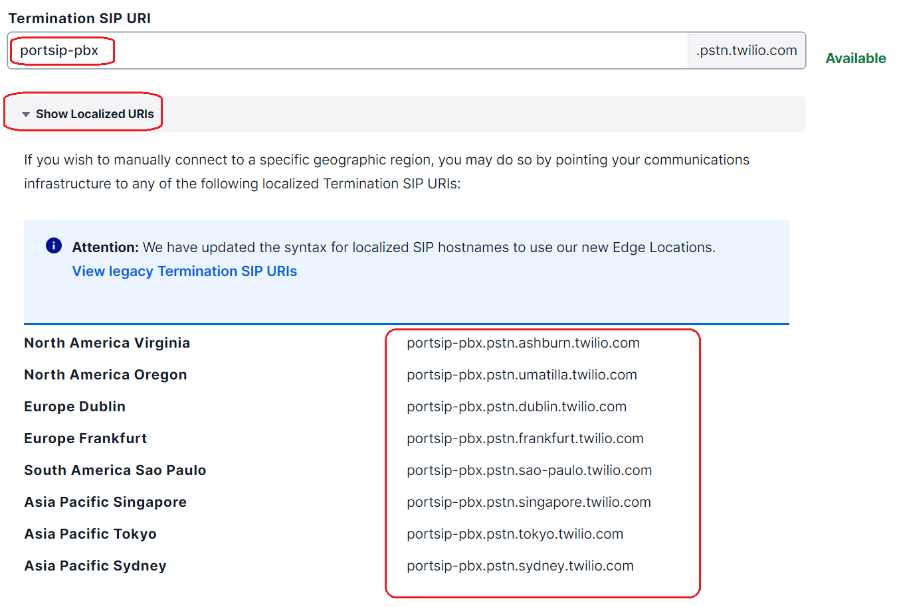
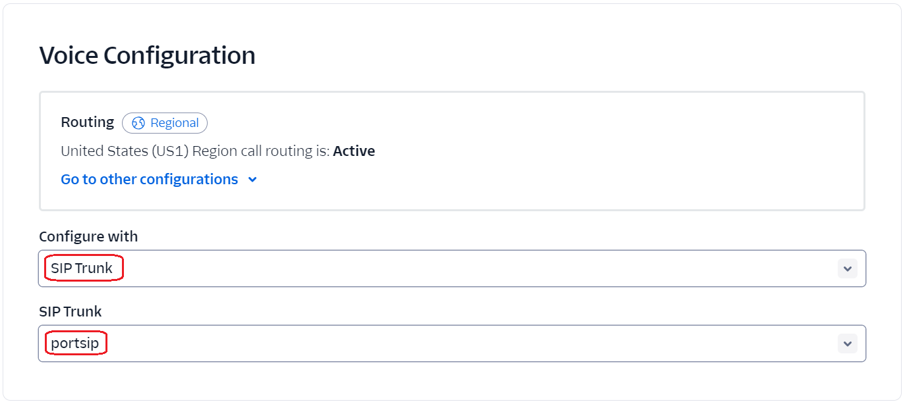
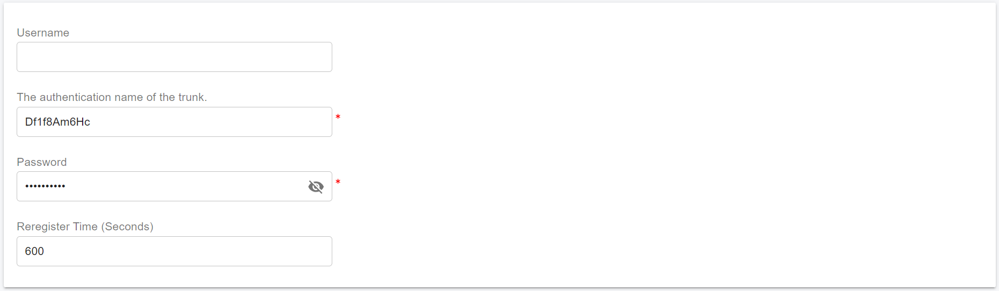

# Configuring Twilio Interconnect Trunk

Before proceeding with the next steps, you need to [purchase a DID on Twilio](purchase-a-did-on-the-twilio.md).

### Twilio Interconnect Trunk

Twilio Interconnect is an alternative to the open Internet that provides private connections between your network and Twilio. It offers the best performance and data throughput and the lowest latency. Since your data never touches the public Internet, it also provides the best security and can guarantee quality from end to end.

For more details please check:

* [Twilio Elastic Trunking](https://www.twilio.com/docs/sip-trunking)
* [Twilio Interconnect](https://www.twilio.com/en-us/interconnect)
* [Interconnect](https://www.twilio.com/docs/interconnect)
* [Configure your Trunk using Twilio Interconnect](https://www.twilio.com/docs/sip-trunking/configure-with-interconnect)

***

### Choose the product that is right for you <a href="#choose-the-product-that-is-right-for-you" id="choose-the-product-that-is-right-for-you"></a>

There are several reasons why Interconnect is the preferred method of connecting to Twilio. _High availability,_ guaranteed data throughput\_, _quality of service,_ and _enterprise-grade security are just a few of the strong arguments for making use of Twilio Interconnect_. If you need highly consistent connectivity between your communication infrastructure and Twilio, then Twilio Interconnect is the right choice likewise, if you have policies (internal or external) that preclude you from sending traffic across the open Internet — for example, HIPAA, PCI, or GDPR.

Twilio Interconnect has several flavors to accommodate various use cases:

* [Cross Connect](https://www.twilio.com/docs/interconnect/crossconnect) allows you to set up a dedicated, physical fiber interconnection with Twilio.
* [Third-Party Exchange](https://www.twilio.com/docs/interconnect/third-party-exchange) is a way of having a private connection through a third-party provider that Twilio has an exchange agreement with.
* [VPN](https://www.twilio.com/docs/interconnect/virtual-private-network) is the best option if you want to quickly try something out and play with some ideas, or if you have no presence in any of our or our partners' data centers and wish to have a secure connection to us.

***

### Create a SIP Trunk on the Twilio Platform

To create a new SIP trunk on the **Twilio** platform, follow these steps:

1. Sign in to your [Twilio Console](https://console.twilio.com/).
2. From the left-hand navigation bar, navigate to **Elastic SIP Trunking**
   * Alternatively, click the **Elastic SIP Trunking** icon in the left vertical navigation bar.
3. Select **Manage > Trunks**.

<figure><figcaption></figcaption></figure>

3. Click **Create new SIP Trunk**.
4. Enter a **friendly name** for the trunk, then click **Create**.

<figure><figcaption></figcaption></figure>

***

### Configure Trunk Termination

After creating the SIP trunk, leave all settings on the **General** page unchanged and switch to the **Termination** section.\
This section defines where outbound calls from PortSIP PBX are sent to Twilio.

<figure><figcaption></figcaption></figure>

***

#### Step 1: Configure the Termination SIP URI

1. In the **Termination** section, enter a **unique Termination SIP URI** of your choice.
2. If the URI status displays **Available** (shown in green), the URI is valid and can be used.
3. Click **Show localized URIs**, then **copy the listed URI values**.
   * These localized URIs will be required later when configuring the trunk in **PortSIP PBX**.

> **Important**\
> Make sure to save the full Termination SIP URI information. It will be referenced directly in the PortSIP PBX trunk configuration.

<figure><figcaption></figcaption></figure>

***

#### Step 2: Configure Authentication (IP ACL)

1. Scroll down to the **Authentication** section.
2. Under **IP Access Control Lists (IP ACLs)**, create a new ACL entry.
3. Add the **public IP address of your PortSIP PBX**.
   * This IP address can be found on the **PortSIP PBX Web Portal Home** page.

> **Security Best Practice**\
> Using an IP ACL ensures that only your PBX is authorized to send SIP traffic to Twilio.

<figure><figcaption></figcaption></figure>

***

#### Step 3: Configure the Credential List

1. In the **Credential List** section, create a **username and password** pair.
2. Save the credentials.

> **Note**\
> These credentials will also be used later when configuring the **Twilio trunk in PortSIP PBX**.

3. Click **Create** to save the Termination configuration.
4. After saving, proceed to the **Origination** page to continue the Twilio SIP trunk setup.

<figure><figcaption></figcaption></figure>

***

### Configure Trunk Origination

In the **Origination** section of the configuration, configure your origination SIP URI, which identifies the network element entry point into your PortSIP PBX. To ensure your calls go over your private connection, include the `edge` parameter in the URI with the value of the Twilio [Interconnect Edge Location](https://www.twilio.com/docs/global-infrastructure/edge-locations#private-interconnect) where your private connection is configured.

#### Origination SIP URI Format

Use one of the following formats, depending on whether you reference your PBX by **IP address** or **FQDN**.

**Using a Public Static IP Address**

```
sip:151.101.2.3;edge=EDGE_LOCATION
```

**Using a Fully Qualified Domain Name (FQDN)**

```
sip:pbx.portsip.com;edge=EDGE_LOCATION
```

***

#### Example (Edge Location: Ashburn)

> **Note**\
> Do **not** include curly braces `{}` in the actual configuration.

```
sip:151.101.2.3;edge=ashburn-ix
sip:pbx.portsip.com;edge=ashburn-ix
```

<figure><figcaption></figcaption></figure>

***

### Assign DID Numbers to Your Elastic SIP Trunk

After creating the Elastic SIP Trunk, you must assign one or more DID numbers to it.

Follow these steps in the Twilio Console:

1. From the left-hand navigation menu, go to:\
   **Phone Numbers > Manage > Active Numbers**.
2. Click the **phone number** you want to assign to the SIP trunk.
3. On the number details page, locate the **Voice Configuration** section.
4. For **Configure with**, select **SIP Trunk**.
5. From the **SIP Trunk** drop-down list, choose the **Elastic SIP Trunk** you created earlier.
6. Click **Save Configuration**.

<figure><figcaption></figcaption></figure>

***

### Configure the Twilio Interconnect Trunk in PortSIP PBX

The **Twilio Interconnect Trunk** is configured in PortSIP PBX as a **Register-Based Trunk**.

You can configure this trunk at **either** of the following levels:

* **System Administrator level**
  * The trunk can be **shared with one or more tenants**.
* **Tenant Administrator level**
  * The trunk can be **used only by that tenant** and cannot be shared.

***

#### Step 1: Create the Register-Based Trunk

1. Sign in to the PortSIP PBX Web Portal as a **System Administrator** or **Tenant Administrator**.
2. From the left-hand navigation menu, go to **Call Manager > Trunks**.
3. Click **Add**, then select **Register Based Trunk**.

<figure><figcaption></figcaption></figure>

***

#### Step 2: Configure Basic Trunk Settings

Enter the following information:

* **Name**\
  Enter a friendly name for the trunk (for example, `Twilio-Interconnect-Trunk`).
*   **Brand**\
    Select **Twilio Interconnect**.

    > **Important**\
    > Selecting the correct brand ensures proper trunk behavior and option defaults.
*   **DID Pool** _(Tenant Admin level only)_\
    If configuring this trunk at the **Tenant Administrator level**, specify the Twilio DID numbers assigned to this tenant.

    > **Important**
    >
    > The tenant can use **only the DID numbers in its DID pool** to:
    >
    > * Create inbound and outbound call rules
    > * Configure outbound caller IDs for extensions

**DID Pool Format Examples**

```
12027594810
12027594810;12027594815
12027594810-12027594815;12027594820
12027594810-12027594815;12027594830-12027594845
```

* **Hostname or IP Address**\
  Enter **one of the Twilio Interconnect Termination URIs** saved earlier, based on the geographic location closest to your PortSIP PBX:

```
portsip-pbx.pstn.ashburn.twilio.com
portsip-pbx.pstn.umatilla.twilio.com
portsip-pbx.pstn.dublin.twilio.com
portsip-pbx.pstn.frankfurt.twilio.com
portsip-pbx.pstn.sao-paulo.twilio.com
portsip-pbx.pstn.singapore.twilio.com
portsip-pbx.pstn.tokyo.twilio.com
portsip-pbx.pstn.sydney.twilio.com
```

Click **Next** to continue.

<figure><figcaption></figcaption></figure>

***

#### Step 3: Configure Authentication Credentials

1. Enter the **Authentication Name** and **Password** created earlier in the **Twilio Credential List**.
2. Click **Next**.

<figure><figcaption></figcaption></figure>

***

#### Step 4: Configure Trunk Options

*   **Need Registration**\
    **Disable** this option.

    > Twilio Interconnect trunks do **not** accept SIP `REGISTER` messages.
* **Max Concurrent Calls**\
  Defines the maximum number of simultaneous calls that PortSIP PBX can establish using this trunk.
  * Adjust this value based on your Twilio Interconnect capacity and expected traffic.

Leave all other settings at their default values unless you have specific requirements.

Click **Next** to continue.

<figure><figcaption></figcaption></figure>

***

#### Step 5: Assign Tenants and DID Pool _(System Admin level only)_

> **Note**\
> This step is available **only** when configuring the trunk at the **System Administrator level**.

1. Assign the trunk to one or more tenants.
2. Provide Twilio DID numbers to each tenant using the **DID Pool**.

> **Important**
>
> * Each DID can be assigned to **only one tenant**.
> * A tenant can use **only the DID numbers in its DID pool** to:
>   * Create inbound and outbound call rules
>   * Configure outbound caller IDs for extensions

**DID Pool Format Examples**

```
12027594810
12027594810;12027594815
12027594810-12027594815;12027594820
12027594810-12027594815;12027594830-12027594845
```

Click **OK** to save the configuration.

<figure><figcaption></figcaption></figure>

***

#### Expected Result

* The trunk configuration is now complete.
* Because **Need Registration** is disabled, the trunk status will **always display as&#x20;**_**Registered**_ in the trunk list.
  * This is expected and correct behavior for **Twilio Interconnect** trunks.

<figure><figcaption></figcaption></figure>

***

### Next Steps

* Refer to[ Twilio Elastic SIP Trunking](https://www.twilio.com/docs/sip-trunking) documentation for platform-specific details.
* Proceed to [Configuring inbound and outbound calls](configuring-outbound-and-inbound-calls.md) in PortSIP PBX.


