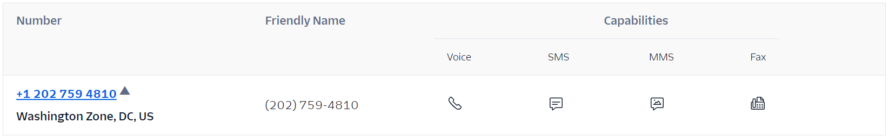

# Purchase a DID on the Twilio

### Purchase a DID on the Twilio Platform

To purchase a DID on your Twilio account, follow these steps:

1. Sign in to the [Twilio Console](https://console.twilio.com/).
2. Follow the Twilio guide “[How to Search for and Buy a Twilio Phone Number from the Console](https://help.twilio.com/articles/223135247)” to purchase one or more DID numbers.
3. If you plan to use **SMS/MMS**, ensure that you **enable the SMS and MMS options** when selecting the phone number.

<figure><figcaption></figcaption></figure>

#### View Purchased Numbers

After purchase, you can find your active phone numbers in the [Twilio Console](https://www.twilio.com/console/phone-numbers/search) under:

**Develop > Phone Numbers > Manage > Active Numbers**

<figure><figcaption></figcaption></figure>

***

### Next Steps

Once the DID numbers are available, proceed with one of the following guides to configure the Twilio trunk in PortSIP PBX:

* [Configuring Twilio Register Based Trunk](configuring-twilio-register-based-trunk.md)
* [Configuring Twilio Interconnect Trunk](configuring-twilio-interconnect-trunk.md)

