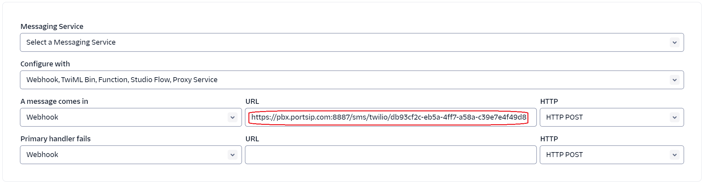

# Twilio SMS Integration

Before proceeding with the next steps, you need to [purchase a DID on the Twilio platform](purchase-a-did-on-the-twilio.md) with SMS/MMS enabled.


According to US legislation (A2P 10DLC SMS), 10DLC (10-digit Long Code) phone numbers that are used for A2P (Application-to-Person) messaging MUST be registered, otherwise, SMS messages sent to US numbers from the unregistered 10DLC numbers will be blocked.

If your business communicates with US-based customers, you should confirm the registration requirements with the SMS service provider and [complete the phone number registration](https://support.twilio.com/hc/en-us/articles/1260801864489-How-do-I-register-to-use-A2P-10DLC-messaging-) to avoid disruption in message delivery.


### Obtain the Twilio Account Information

To configure SMS with Twilio, you must first obtain your **Twilio account credentials**.

Follow these steps in the [Twilio Console](https://console.twilio.com/):

1. Sign in to the Twilio Console.
2. Open the **Account Dashboard**.
3. In the **Account Info** section, copy and securely record the following values:
   * **Account SID**
   * **Auth Token**

> ❗**Security Note**\
> The Auth Token is a sensitive credential. Store it securely and do not share it publicly. If it is compromised, regenerate it immediately from the Twilio Console.

<figure><figcaption></figcaption></figure>

***

### Register an Alphanumeric Sender ID (Optional)

An Alphanumeric Sender ID allows you to display your company name or brand as the sender when sending one-way SMS messages to [supported countries](https://help.twilio.com/hc/en-us/articles/223133767-International-support-for-Alphanumeric-Sender-ID).

#### Sender ID Rules and Limitations

* Maximum length: **11 characters**
* Allowed characters:
  * Upper- and lower-case ASCII letters (`A–Z`, `a–z`)
  * Digits (`0–9`)
  * Space character
* The Sender ID must not consist of digits only.
* Sender IDs are supported only in certain countries and cannot receive replies.

#### Register a Sender ID in Twilio

To register an Alphanumeric Sender ID:

1. In the Twilio Console, navigate to:\
   **Develop > Phone Numbers > Alphanumeric Sender IDs**
2. Follow the on-screen instructions to submit and register your Sender ID.

For more details and country-specific requirements, refer to the [Alphanumeric Sender ID](https://www.twilio.com/docs/glossary/what-alphanumeric-sender-id) documentation.

<figure><figcaption></figcaption></figure>

***

### Configure SMS with a Twilio Trunk in PortSIP PBX

Before configuring SMS in PortSIP PBX, ensure that a Twilio SIP trunk has already been configured using one of the following guides:

* [Configuring Twilio Register Based Trunk](configuring-twilio-register-based-trunk.md)
* [Configuring Twilio Interconnect Trunk](configuring-twilio-interconnect-trunk.md)

***

#### Sign in to the PortSIP PBX Web Portal

You can access the tenant configuration in one of the following ways:

#### Option 1: Sign in as System Administrator

1. Sign in to the PortSIP PBX Web Portal as a **System Administrator**.
2. Navigate to **Tenants**.
3. Select the desired tenant and click **Manage** to switch to that tenant’s administration context.

#### Option 2: Sign in as Tenant Administrator

* Sign in directly as a **Tenant Administrator** to manage the tenant.

> ❗**Note**\
> For more information about tenant roles and access, refer to [Tenant Management](../../portsip-pbx-administration-guide/3-tenant-management/).

***

#### Add an SMS Configuration

Follow these steps to configure SMS using the **Twilio** trunk:

1. In the PortSIP PBX Web Portal, navigate to **SMS/MMS** from the left-hand menu.
2. Click **Add**.
3. From the **Trunk** drop-down list, select your configured **Twilio trunk**.
4. Configure the following fields:
   * **Sender ID**
     * Optional. Enter the **Alphanumeric Sender ID** you [registered earlier](twilio-sms-integration.md#register-an-alphanumeric-sender-id-optional) if you want to send SMS using a brand name.
     * Leave this field empty if you want to send SMS using a DID number instead.
   * **Account SID**
     * Paste your **Twilio Account SID**.
   * **Auth Token**
     * Paste your **Twilio Auth Token**.
5. Click **OK** to save the configuration.

<figure><figcaption></figcaption></figure>

***

#### Copy the Webhook URL

After the SMS configuration is created:

* You will be redirected to the **SMS/MMS list** page.
* Select the SMS configuration and click **Copy Webhook** to copy the **Webhook URL**.

Alternatively:

* Double-click the SMS configuration to open its details page, then copy the **Webhook URL** from there.

> ❗**Important**\
> The Webhook URL is required for Twilio to deliver inbound SMS messages to PortSIP PBX.\
> Do not modify this URL unless instructed, and update it in Twilio if the URL changes.

***

### Configure SMS in Twilio

To enable inbound and outbound SMS with PortSIP PBX, you must configure the messaging webhook for your Twilio phone numbers.

Follow these steps in the **Twilio Console**:

#### Step 1: Open Your Active Phone Numbers

1. Sign in to the [Twilio Console](https://console.twilio.com/).
2. Navigate to **Develop > Phone Numbers > Manage > Active Numbers**.
   * All purchased phone numbers will be displayed.

<figure><figcaption></figcaption></figure>

***

#### Step 2: Configure the Messaging Webhook

3. Click the **phone number** you want to use for SMS.
4. In the **Messaging** section, locate the **Webhook** (or **Messaging webhook**) field.
5. Paste the **PortSIP PBX Webhook URL** that you copied earlier from the PortSIP PBX SMS configuration.
6. Save the changes.

> ❗**Important**\
> This webhook allows Twilio to forward inbound SMS messages to PortSIP PBX.\
> If the webhook URL is incorrect or missing, inbound SMS will not be delivered.

<figure><figcaption></figcaption></figure>

***

#### Step 3: Enable Geographic Permissions

7. In the same phone number configuration page, locate **Geographic Permissions**.
8. Enable the region(s) or country codes where you intend to send SMS messages.
   * Messages will fail if the destination country or region is not permitted.

> ❗**Best Practice**\
> Enable only the regions you need to reduce the risk of unauthorized or unintended SMS traffic.

<figure><figcaption></figcaption></figure>

***

### Verify the Configuration

At this point, the Twilio SMS/MMS integration is complete.

You can now [create outbound and inbound rules](configuring-outbound-and-inbound-calls.md) in PortSIP PBX to send and receive SMS/MMS messages using the Twilio trunk—just as you would configure rules for outbound and inbound voice calls.

