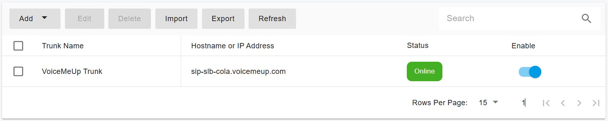

# VoiceMeUp SIP Trunk

[VoiceMeUp](https://www.voicemeup.com/index.html) is a VoIP service provider available to commercial customers anywhere in the world. VoiceMeUp SIP Trunks connect your cloud PBX and on-premise PBX phone system directly into the VoiceMeUp network via an internet connection to carry and terminate your calls across the public telephone network.

Configuring the [VoiceMeUp SIP trunk](https://www.voicemeup.com/index.html) into your PortSIP PBX is straightforward. Please follow the steps below.

## Sign Up and Purchase DID Numbers

You will need to contact [VoiceMeUp](https://www.voicemeup.com/index.html) to sign up for the account and purchase the DID numbers. Typically, you will receive the below information:

* **Trunk username**: The username for authentication with the VoiceMeUp trunk
* **Trunk Password**: The password for authentication with the VoiceMeUp trunk

## Configure VoiceMeUp Trunk in PortSIP PBX

You can configure the VoiceMeUp SIP trunk as Register Based Trunk at either the PortSIP PBX **system administrator level** or the **Tenant Admin level**:

* If configured at the system administrator level, you can share this trunk with tenants.
* If configured at the tenant admin level, this trunk can only be used by the tenant itself.

Please follow the below steps:

1. Sign in to the PortSIP PBX Web Portal as a System Administrator or Tenant Admin. Navigate to the left menu and select **Call Manager > Trunks**.&#x20;
2. Click the **Add** button to open a menu. From the menu, choose **Register Based Trunk**.

<figure><figcaption></figcaption></figure>

3. Enter the trunk name and choose the brand:
   * **Name**: Enter a friendly name for the trunk.
   * **Brand**: Select **VoiceMeUp** for this field.
   * **DID Pool**: This step is only for you at the _**Tenant admin Level**_ to configure this **Register Based Trunk**,  you will need to set up your **VoiceMeUp** DID numbers for this DID pool for this trunk.
     * This tenant can only use the DID numbers within the DID pool range to create inbound and outbound rules and configure the outbound caller ID for extensions.
     * &#x20;The DID pool can consist of a single number, a range of numbers, or a combination of both. For example:
       * `16468097065`
       * `16468097065-16468097066`
       * `16468097065-16468097066;16468097069`&#x20;
       * `16468097065-16468097066;16468097070-16468097080`

<figure><figcaption></figcaption></figure>

4. Click the **Next** button, and set up the trunk credentials.
   * Authentication name: Enter the username of the VoiceMeUp trunk.
   * Password: The password of the VoiceMeUp trunk.

<figure><figcaption></figcaption></figure>

5. Click the **Next** button, you can adjust the options for the trunk.
   * &#x20;**Max Concurrent Calls:** This field sets the maximum number of calls that PortSIP can establish with this trunk. You can adjust it to an appropriate value.
   * We recommend keeping the default settings for other options unless you have specific requirements.

<figure><figcaption></figcaption></figure>

6. This step is only available when configuring the Register-Based Trunk at the _**System Administrator Level**_. Click the **Next** button to assign this trunk to the tenants and provide your VoiceMeUp DIDs/Numbers to them with the DID Pool (DID numbers). A DID can be only assigned to one tenant.
   * A tenant assigned to this trunk can only use the DID numbers within the DID pool range to create inbound and outbound rules and configure the outbound caller ID for extensions.
   * DID Pool: The DID pool can consist of a single number, a range of numbers, or a combination of both. For example:
     * `16468097065`
     * `16468097065;16468097066`
     * `16468097065-16468097066;16468097069`&#x20;
     * `16468097065-16468097066;16468097070-16468097080`

<figure><figcaption></figcaption></figure>

Click the **OK** button to save the changes; the trunk configuration is completed.

Once the PortSIP PBX successfully registers this trunk to the VoiceMeUp platform, in the trunk list page you will see the status displayed as **Registered**.

<figure><figcaption></figcaption></figure>

## Adjust Outbound Parameters

For outbound calls, VoiceMeUp requires specific configurations. Ensure to review the settings carefully.

Double-click the configured VoiceMeUp trunk, click on the **Outbound Parameters** tab, and adjust the following parameters:

### Contact: User part

Choose `"OutboundCallerID" Outbound caller Id taken from Web Portal` for this field.

<figure><figcaption></figcaption></figure>

### From: User part

Choose `"OutboundCallerID" Outbound caller Id taken from Web Portal` for this field.

<figure><figcaption></figcaption></figure>

### P-Asserted-Identity: User part

Choose `"OutboundCallerID" Outbound caller Id taken from Web Portal` for this field.

### P-Asserted-Identity: Host part

Choose `"TrunkHostPort" Trunk host/port` for this field.

<figure><figcaption></figcaption></figure>

## Set Up Outbound Caller ID

VoiceMeUp trunk requires the CLI presentation (outbound caller ID) to be in E164 format. When setting the Outbound Caller ID for an extension, ensure the number is prefixed with a `+`. Refer to the screenshot below for a visual guide.

<figure><figcaption></figcaption></figure>

## Create Outbound Rules

Now you can follow the article [Configuring inbound and outbound calls](questblue-sip-trunk/configuring-outbound-and-inbound-calls.md) for the VoiceMeUp trunk to make outbound calls.

