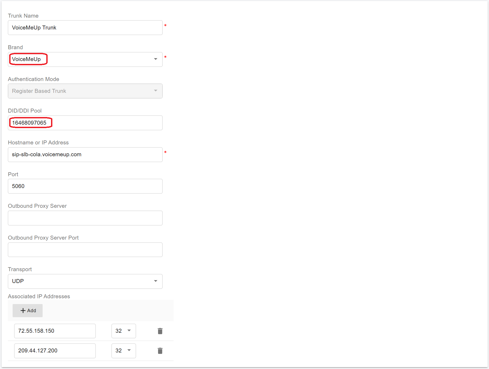
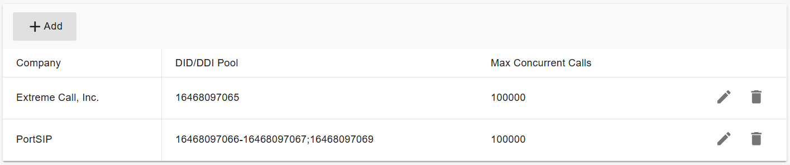
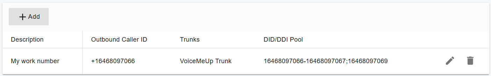

# Configuring VoiceMeUp Trunk

Configuring the [VoiceMeUp SIP trunk](https://www.voicemeup.com/index.html) in PortSIP PBX is straightforward. Follow the steps below to complete the setup.

***

### Prerequisite: Sign Up and Purchase DID Numbers

Before configuring the trunk, you must contact **VoiceMeUp** to create an account and purchase DID numbers.

After signup, you will typically receive the following credentials:

* **Trunk Username** – Used for SIP authentication with the VoiceMeUp trunk
* **Trunk Password** – Used for SIP authentication with the VoiceMeUp trunk

Keep these details available—you will need them during trunk configuration.

***

### Configure the VoiceMeUp Trunk in PortSIP PBX

VoiceMeUp SIP trunks are configured as **Register-Based Trunks** in PortSIP PBX.\
You can configure the trunk at either level:

* **System Administrator level**
  * The trunk can be **shared with one or more tenants**
* **Tenant Administrator level**
  * The trunk can be used **only by that tenant**

***

#### Step 1: Create a Register-Based Trunk

1. Sign in to the **PortSIP PBX Web Portal** as a **System Administrator** or **Tenant Admin**.
2. From the left-hand navigation menu, go to:\
   **Call Manager > Trunks**
3. Click **Add**.
4. From the menu, select **Register Based Trunk**.

<figure><figcaption></figcaption></figure>

***

#### Step 2: Configure Basic Trunk Settings

Enter the following information:

* **Name**\
  Enter a friendly name for the trunk\
  (for example, _VoiceMeUp-Trunk_).
* **Brand**\
  Select **VoiceMeUp**.
* **DID Pool** _(Tenant Admin level only)_
  * Configure the VoiceMeUp DID numbers assigned to this tenant.
  * The tenant can use **only the DIDs in this DID Pool** to:
    * Create inbound rules
    * Create outbound rules
    * Configure outbound caller ID for extensions

**DID Pool format examples:**

```
16468097065
16468097065-16468097066
16468097065-16468097066;16468097069
16468097065-16468097066;16468097070-16468097080
```

5. Click **Next**.

<figure><figcaption></figcaption></figure>

***

#### Step 3: Configure Trunk Credentials

1. Enter the authentication details provided by VoiceMeUp:
   * **Authentication Name**\
     Enter the **VoiceMeUp trunk username**.
   * **Password**\
     Enter the **VoiceMeUp trunk password**.
2. Click **Next**.

<figure><figcaption></figcaption></figure>

***

#### Step 4: Configure Trunk Options

1. Review the trunk options.
2. Configure the following field if required:
   * **Max Concurrent Calls**\
     Sets the maximum number of simultaneous calls PortSIP PBX can establish using this trunk.\
     Adjust this value according to your service agreement with VoiceMeUp.

> **Best Practice**\
> Keep all other options at their default values unless VoiceMeUp has provided specific requirements.

3. Click **Next**.

<figure><figcaption></figcaption></figure>

***

#### Step 5: Assign Tenants and DID Pool (System Admin Only)

This step is **available only when configuring the trunk at the System Administrator level**.

1. Select one or more **tenants** to grant access to the trunk.
2. Configure the **DID Pool** for each tenant.

> **Important**
>
> * Each DID can be assigned to **only one tenant**.
> * A tenant can use **only the DIDs in its assigned DID Pool**.

**DID Pool format examples:**

```
16468097065
16468097065;16468097066
16468097065-16468097066;16468097069
16468097065-16468097066;16468097070-16468097080
```

3. Click **OK** to save the configuration.

<figure><figcaption></figcaption></figure>

***

#### Expected Result

* The VoiceMeUp trunk is successfully created.
* Once PortSIP PBX registers with the VoiceMeUp platform, the trunk status displays as **Online** on the trunk list page.

<figure><figcaption></figcaption></figure>

***

### Adjust Outbound Parameters for the VoiceMeUp Trunk

For outbound calls, VoiceMeUp requires specific SIP header mappings to ensure correct caller ID presentation. Review and configure these settings carefully.

***

#### Step 1: Configure Outbound Parameters

1. In the **PortSIP PBX Web Portal**, navigate to **Call Manager > Trunks**.
2. **Double-click** the configured **VoiceMeUp trunk**.
3. Open the **Outbound Parameters** tab.
4.  Configure the following fields:

    **Contact: User part**

    * Choose `OutboundCallerID`\
      &#xNAN;_(Outbound caller ID taken from the Web Portal)_

<figure><figcaption></figcaption></figure>

**From: User part**

* Choose `OutboundCallerID`\
  &#xNAN;_(Outbound caller ID taken from the Web Portal)_

<figure><figcaption></figcaption></figure>

**P-Asserted-Identity: User part**

* Choose `OutboundCallerID`\
  &#xNAN;_(Outbound caller ID taken from the Web Portal)_

**P-Asserted-Identity: Host part**

* Choose `TrunkHostPort`\
  &#xNAN;_(Trunk host and port information)_

<figure><figcaption></figcaption></figure>

***

### Set Up Outbound Caller ID (CLI)

VoiceMeUp requires the **CLI (outbound caller ID)** to be in **E.164 format**.

#### Requirements

* The outbound caller ID **must be prefixed with `+`**
*   Example:

    ```
    +16468097065
    ```

When configuring the outbound caller ID for an extension in PortSIP PBX, ensure the number follows this format.

<figure><figcaption></figcaption></figure>

***

### Next Steps

The Bandwidth Register Authentication Trunk is now ready for use.

You can proceed to:

* Configure outbound call routing rules
* Configure inbound DID routing
* Assign outbound caller IDs

Refer to the next guide: [Route Management](../../portsip-pbx-administration-guide/8-call-route-management/).<br>


