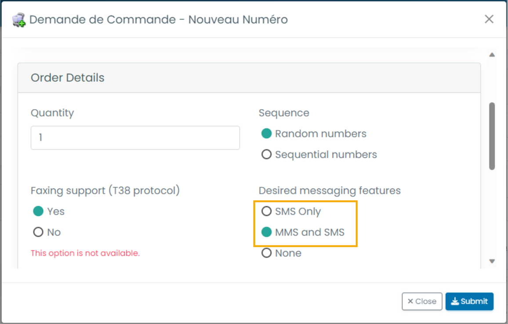
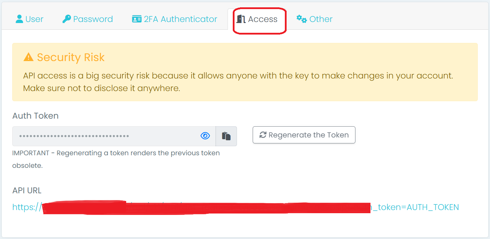
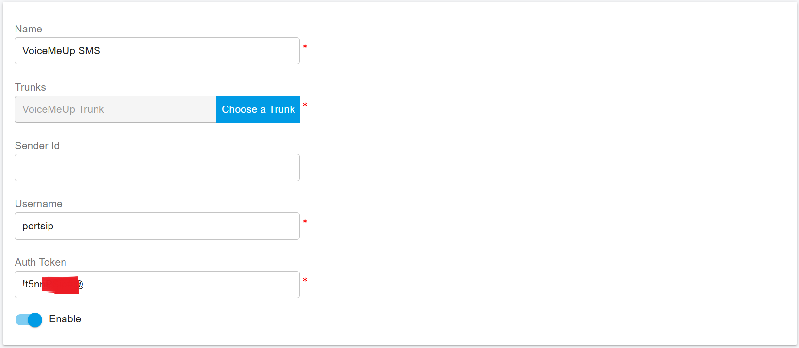
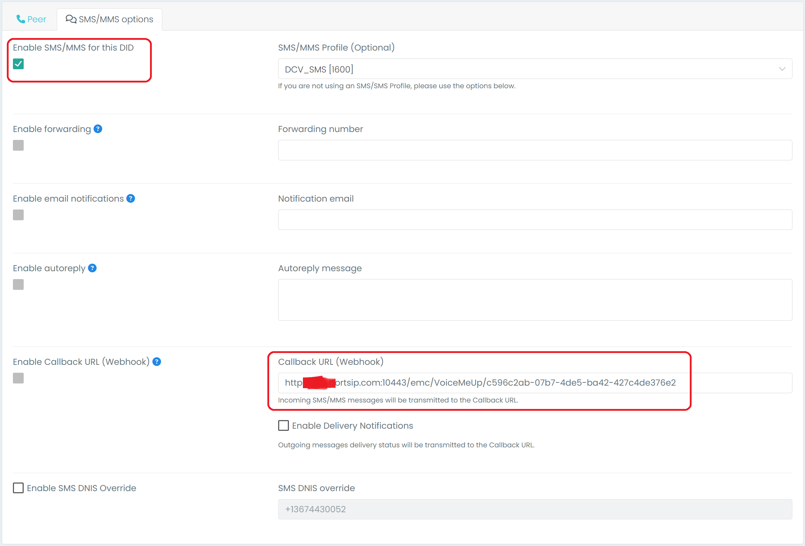

# VoiceMeUp SMS Integration

Before proceeding with the next steps, you need to purchase a DID on the VoiceMeUp platform with the SMS/MMS enabled.

## Purchase DID Numbers

Log in to the [VoiceMeUp customer portal](https://clients.voicemeup.com/v3/login) and complete the following settings:


According to US legislation (A2P 10DLC SMS), 10DLC (10-digit Long Code) phone numbers that are used for A2P (Application-to-Person) messaging MUST be registered, otherwise SMS messages sent to US numbers from the unregistered 10DLC numbers will be blocked.

If your business communicates with US-based customers, you should contact the SMS service provider to complete 10DLC registration for your DID number to avoid disruption in message delivery.


1. In the left-hand menu, navigate to **Services > DID Numbers**.
2. Click the **New** button located at the top of the page.
3. In the pop-up window, select either **SMS Only** or **MMS/SMS** as the desired option.
4. Click the **Submit** button to complete the process.

<figure><figcaption></figcaption></figure>

## Obtain the VoiceMeUp Account Info

Please follow the below steps to create the user, and then you can use it in the PortSIP PBX to integrate the VoiceMeUp SMS API.

* Navigate to the menu Account < Users & Access, and then click the New button.
* Configure the account information and enable API access for the account.
  * User type: Choose Standard.
  * Username: Enter a name, for example, **portsip**. Note it down, as you will need it later.

Once the account is created successfully, you are redirected to the user account list.

* Navigate to the account's details page and obtain the Auth Token for the integration.

To integrate the VoiceMeUp SMS API with PortSIP PBX, follow these steps to create a user account with API access and retrieve the necessary authentication token:

1. **Access the Users & Access Section**:
   * Log in to your VoiceMeUp account.
   * Navigate to **Account** > **Users & Access** from the main menu.
2. **Create a New User**:
   * Click the **New** button to initiate the creation of a new user account.
   * In the account information form, provide the following details:
     * **User Type**: Select **Standard**.
     * **Username**: Enter a desired username (e.g., `portsip`). Ensure you note this username for later use.
     * **First Name**, **Last Name**, and **Email**: Fill in the appropriate details.
   * Navigate to the **Access** tab.
     * Click the **Regenerate the Token** button to generate a new Auth Token.
     * Copy the Auth Token by clicking the copy icon next to the token field. Store this token securely, as it will be required for integration.
   * Click the **Save** button to finalize the creation of the new user account.

By completing these steps, you will have established a user account with API access and obtained the necessary Auth Token to integrate the VoiceMeUp SMS API with your PortSIP PBX system.

In the future, you can retrieve the access token as below:

* On the user account list page
* Locate the user and click the **Edit** button to access the account details.
* In the **Access** tab, copy the Auth Token by clicking the copy icon. Ensure this token is stored securely for integration purposes.

<figure><figcaption></figcaption></figure>

## Configure SMS with VoiceUpMe Trunk in PortSIP PBX

Before you begin configuring SMS in PortSIP PBX, ensure that you have already set up a **VoiceMeUp SIP trunk**. You can follow the appropriate guide to configure the trunk.

* [Configuring VoiceMeUp Trunk](configuring-voicemeup-trunk.md)

### Sign in to the PortSIP PBX Web Portal

To configure SMS integration, sign in to the **PortSIP PBX Web Portal** using one of the following methods:

* **Sign in as the PBX System Administrator**:
  * Navigate to the **Tenants** menu.
  * Choose the desired tenant.
  * Click the **Manage** button to switch to that tenant’s settings.
* **Sign in as a Tenant Administrator**: If you are a tenant admin, sign in directly to manage the tenant’s settings.

For more details on managing tenants, refer to the [Tenant Management](../../portsip-pbx-administration-guide/3-tenant-management.md) guide.

### Add an SMS Configuration

Follow these steps to configure SMS in the PortSIP PBX Web Portal:

1. **Navigate to SMS/MMS Settings**:
   * In the PortSIP PBX Web Portal, go to the left-hand menu and select **SMS/MMS**.
   * Click the **Add** button to create a new configuration.
2. **Select the Trunk**: From the list, choose the **VoiceMeUp** trunk that you previously configured.
3. **Configure SMS Settings**:
   * **Sender ID**: (Optional)\
     If you want to send SMS with a custom **Sender ID**, enter the **Sender ID** created in the VoiceMeUp platform. Leave this field blank if no Sender ID is required.
   * **Username**: Paste the **VoiceMeUp username** created in the earlier steps (e.g., `portsip`).
   * **Auth Token**: Paste the **VoiceMeUp Auth Token** obtained during user creation.
4. **Save the Configuration**: After entering the required information, click **Save** to apply the configuration.

<figure><figcaption></figcaption></figure>

5. Click **OK** to be brought to the SMS/MMS list page. You can select that SMS configuration, then press the **Copy Webhook** button to copy the Webhook URL. Or Double-click the SMS configuration to edit the SMS configuration, in the details copy the Webhook URL.

## Configure the Webhook in VoiceMeUp

1. Log in to the [VoiceMeUp customer portal](https://clients.voicemeup.com/v3/login) and navigate to **Services > DID Numbers**.
2. Edit the DID number you want to use for receiving SMS.
3. In the **Available Options** section, ensure the **SMS/MMS** option is enabled.
4. Paste the Webhook URL you copied from the PortSIP PBX configuration into the **Callback URL** field.

<figure><figcaption></figcaption></figure>

5. In the next section, navigate to the **SMS/MMS Options** tab. Enable the **SMS/MMS for this DID** option, and paste the Webhook URL you copied from the PortSIP PBX configuration into the **Callback URL (Webhook)** field.

<figure><figcaption></figcaption></figure>

6. Click the **Save** button to apply your changes.

Congratulations! You have successfully configured SMS integration with VoiceMeUp.

## Verify Configuration

Now you can [create the outbound and inbound](../twilio-sip-trunk/configuring-outbound-and-inbound-calls.md) rules in PortSIP PBX for sending and receiving SMS/MMS using the VoiceMeUpTrunk, just like you create the rules for making and receiving calls.

