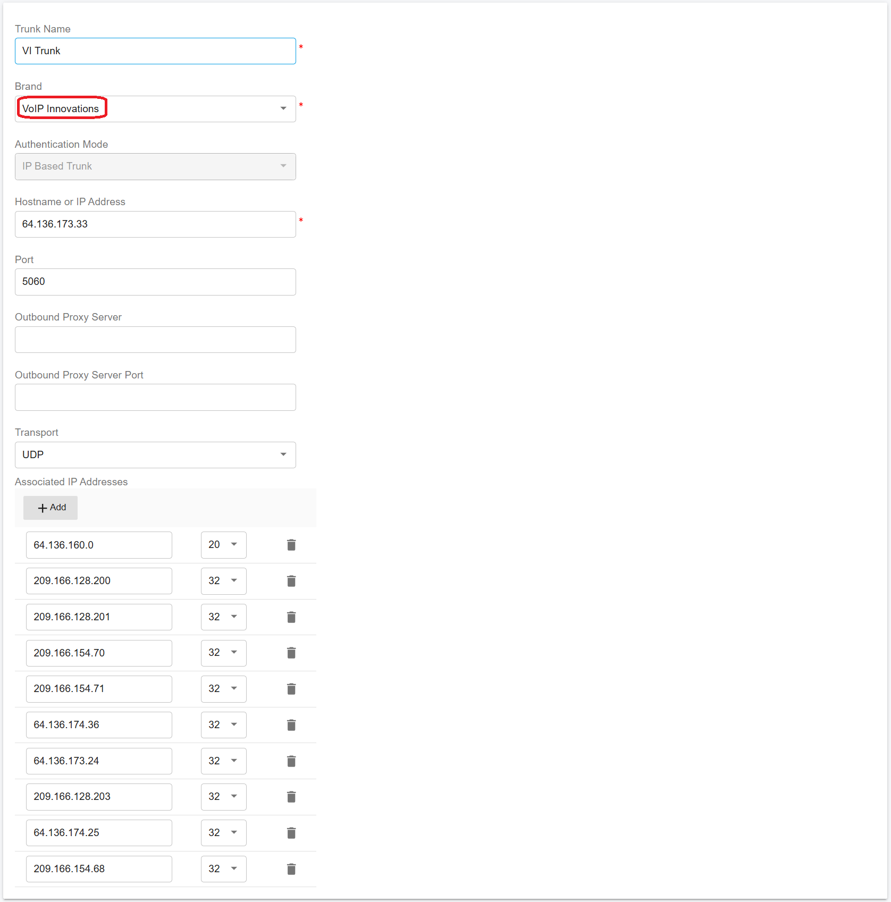
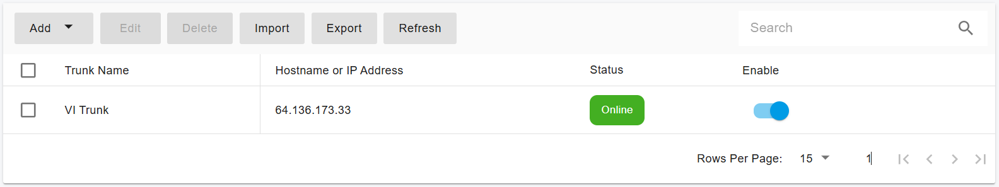

# Configuring VoIP Innovations IP Authentication Trunk

Before proceeding with the next steps, you need to purchase a DID on the [VoIP Innovations](purchase-a-did-on-voip-innovations-platform.md) platform.

***

### Configure a VoIP Innovations IP Authentication Trunk in PortSIP PBX

Before proceeding, ensure that you have **purchased at least one DID** on the VoIP Innovations platform.

VoIP Innovations must be configured as an **IP-Based Trunk** at the **PortSIP PBX System Administrator** level.\
Once configured, the trunk can be **shared with one or more tenants**, and DIDs can be assigned through a **DID Pool**.

***

#### Step 1: Create the IP-Based Trunk

1. Sign in to the **PortSIP PBX Web Portal** as a **System Administrator**.
2. From the left-hand menu, navigate to:\
   **Call Manager > Trunks**
3. Click **Add** to open the trunk type menu.
4. Select **IP Based Trunk**.

<figure><figcaption></figcaption></figure>

***

#### Step 2: Configure Basic Trunk Settings

1. Enter the trunk details:
   * **Name**\
     Enter a friendly name for the trunk (for example, _VoIP Innovations Trunk_).
   * **Brand**\
     Select **VoIP Innovations**.
2. Click **Next**.

<figure><figcaption></figcaption></figure>

***

#### Step 3: Configure Trunk Options

1. Review the trunk options and adjust settings as needed.
2. Configure the following field if required:
   * **Max Concurrent Calls**\
     Defines the maximum number of simultaneous calls PortSIP PBX can establish using this trunk.\
     Set this value according to your capacity planning and service agreement with VoIP Innovations.

> **Best Practice**\
> Keep all other options at their default values unless you have specific requirements provided by VoIP Innovations.

3. Click **Next**.

<figure><figcaption></figcaption></figure>

***

#### Step 4: Assign the Trunk to Tenants and Configure the DID Pool

1. Select one or more **tenants** to grant access to this trunk.
2. Configure the **DID Pool** to assign VoIP Innovations numbers to tenants.

> **Important**
>
> * Each DID can be assigned to **only one tenant**.
> * A tenant can use **only the DIDs in its assigned DID Pool** to:
>   * Create inbound rules
>   * Create outbound rules
>   * Configure outbound caller ID for extensions

**DID Pool Format Examples**

The DID Pool can include:

*   A single number

    ```
    16468097065
    ```
*   Multiple individual numbers

    ```
    16468097065;16468097066
    ```
*   A range of numbers

    ```
    16468097065-16468097066
    ```
*   A combination of ranges and individual numbers

    ```
    16468097065-16468097066;16468097070-16468097080
    ```

3. Click **OK** to save the configuration.

<figure><figcaption></figcaption></figure>

***

#### Expected Result

* The VoIP Innovations trunk is created successfully.
* In the trunk list, the trunk status displays as **Online.**\
  (for **IP-Based Trunks**, the status always shows _Online_).

<figure><figcaption></figcaption></figure>

***

### Next Steps

The Vonage IP Authentication Trunk is now ready for use.

You can proceed to:

* Configure outbound call routing rules
* Configure inbound DID routing
* Assign outbound caller IDs

Refer to the next guide section: [Configuring inbound and outbound calls](configuring-outbound-and-inbound-calls.md).


