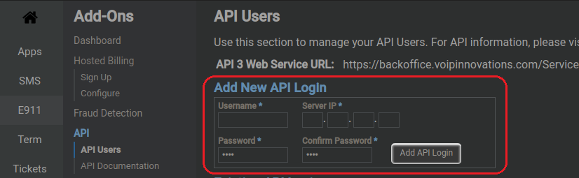
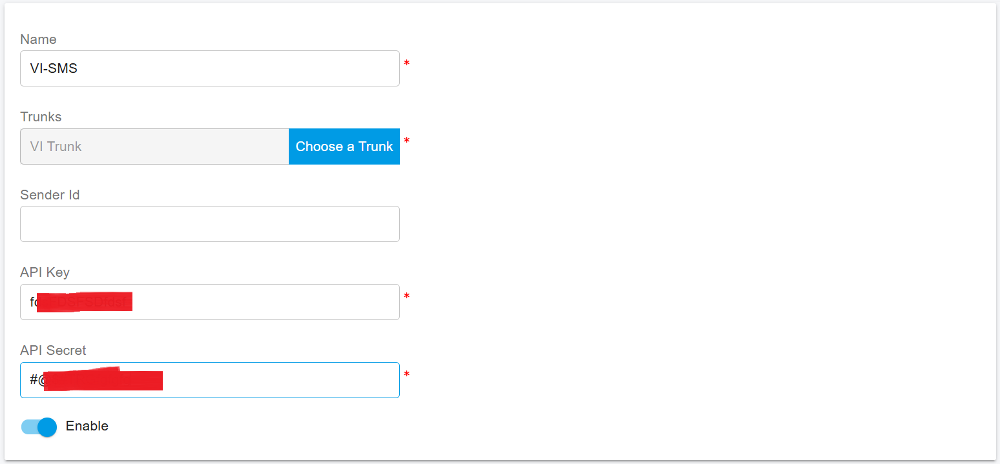
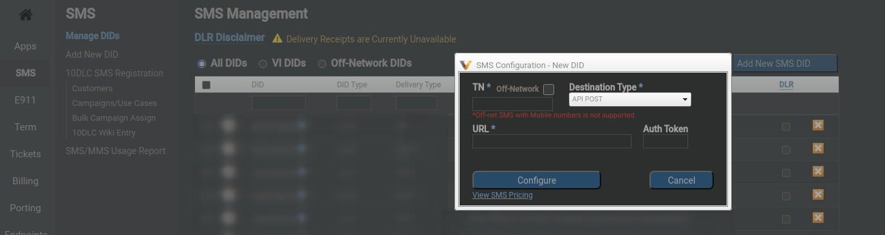

# VoIP Innovations SMS Integration

Before proceeding with the next steps, you need to [purchase a DID on the VoIP Innovations platform](../vonage-sip-trunk/purchase-a-did-on-vonage-platform.md) with the SMS feature activated.

Note: If you are using a newly added phone number or carrier account or have had messaging stop working unexpectedly, please make sure you have completed your carrier's 10DLC registration process before attempting to utilize PortSIP PBX. 10DLC registration is required by ALL supported carriers due to the requirements set by the wireless carriers.

## **Integration Details from VoIP Innovations Side**

### Creating API Credentials:

1. Log in to your VoIP Innovations account at [backoffice.voipinnovations.com](https://backoffice.voipinnovations.com).
2. In the main navigation menu, go to **Add-Ons** and select **API Users**.
3. Under the **API Users** section, click **Add New API Login**.
4. Fill in the required fields, including the **Username** and **Password**. The user name also refers to the **API Key**, and the Password refers to the **API Secret**-we will need to use them in a later step.
5. In the **Server IP** field, enter the Public IP address of your PortSIP PBX.
6. Once all fields are completed, click **Add API Login** to save your settings.

<figure><figcaption></figcaption></figure>

## Configure SMS with VoIP Innovations Trunk in PortSIP PBX

Before configuring SMS in PortSIP PBX, you must have already configured a VoIP Innovation SIP trunk using one of the following guides:

* [Configuring VoIP Innovation IP Authentication Trunk](configuring-voip-innovations-ip-authentication-trunk.md)

### Sign in PortSIP PBX Web Portal

You can sign in to the PortSIP PBX Web portal using one of the following methods:

1. Sign in as the PBX system administrator, navigate to the **Tenants** menu, choose a tenant, and click the **Manage** button to switch to that tenant.
2. Sign in as a tenant admin to manage the tenant.

For more details, please reference [Tenant Management](../../portsip-pbx-administration-guide/3-tenant-management/).

### Add an SMS configuration

Please follow the below steps:

1. In the PortSIP PBX Web portal, navigate to the left menu, select **SMS/MMS**, and click the **Add** button.&#x20;
2. Choose your configured VoIP Innovations Trunk:
   * **Sender ID**: If you want to use the Sender ID that you created in the VoIP Innovation platform, please enter that Sender ID in this field. Otherwise, leave it empty, and the PortSIP PBX will use the DID number you configured for that VoIP Innovation trunk as the Sender ID.
   * **API Key**: Enter the **Username** you created in the [Integration Details from VoIP Innovations Side](voip-innovations-sms-integration.md#integration-details-from-voip-innovations-side) for this field.
   * **API Secret**: Enter the **Password** you created in the [Integration Details from VoIP Innovations Side ](voip-innovations-sms-integration.md#integration-details-from-voip-innovations-side)for this field.

<figure><figcaption></figcaption></figure>

4. Click **OK** to be brought to the SMS/MMS list page. You can select that SMS configuration and click the **Copy Webhook** button to copy it. Or Double-click the SMS configuration you created and copy the Webhook URL.

## Adding an SMS DID on VoIP Innovations

1. Log in to your VoIP Innovations account at [backoffice.voipinnovations.com](https://backoffice.voipinnovations.com).
2. Navigate to **SMS >** **Add New SMS DID**.
3. Set the **Destination Type** to **API POST**.
4. Enter the **SMS Number** you wish to add.
5. In the **URL** field, enter your copied Webhook URL from PortSIP PBX for this number.
6. Click **Configure** button to save the settings.

<figure><figcaption></figcaption></figure>

## Verify Configuration

Now you can [create the outbound and inbound rules](../wavix-sip-trunk/configuring-outbound-and-inbound-calls.md) in PortSIP PBX for sending and receiving SMS/MMS using the VoIP Innovation Trunk, just like you create the rules for making and receiving calls.

