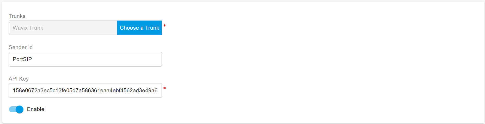

# VoIP Innovations SMS Integration

Before proceeding with the next steps, you need to [purchase a DID on the Wavix platform](../wavix-sip-trunk/purchase-a-did-on-wavix-platform.md).

## Register a Sender ID

Before sending an SMS or MMS message, you need to activate a Sender ID on the Wavix platform. A Sender ID is the message sender details recipients will see on their devices. Sender IDs can be either numeric or alphanumeric presenting your brand or service name.


You must use Numeric Sender IDs, if you want to enable 2-way messaging service. For one-way SMS you can use both Numeric and AlphanumericSender IDs.


Assume you have purchased DID phone numbers as per the guide on[Purchase a DID on the Wavix platform](../wavix-sip-trunk/purchase-a-did-on-wavix-platform.md).

The following step [SMS-enable your number](voip-innovations-sms-integration.md#sms-enable-your-number) is mandatory only if you have purchased U.S. or Canadian numbers to send messages using a U.S. or Canadian phone number as the Sender ID.

If you have purchased other countries' phone numbers and wish to use them as the Sender ID, please skip  [SMS-enable your number](voip-innovations-sms-integration.md#sms-enable-your-number) and scroll down to [Create a Sender ID on the Wavix Platform](voip-innovations-sms-integration.md#create-a-sender-id-on-the-wavix-platform) section.

### SMS-enable your number

Inbound SMS can be enabled on US and Canadian phone numbers only. To activate support of inbound SMS and MMS:

1. Select **Numbers & trunks** in the top menu and click **My Numbers**
2. Select a number you want to activate inbound SMS on
3. Click on the down arrow to see additional details
4. Click **Activate** next to **Inbound SMS**

<figure><figcaption></figcaption></figure>


In case of any questions, please raise a ticket in the support tab or email [support@wavix.com](mailto:support@wavix.com)


## Create a Sender ID on the Wavix Platform

To create a Sender ID:

1. Select **SMS** in the top menu and click on **Sender IDs**
2. Then click **Add New Sender ID** and select the Sender ID type, i.e. Alphanumeric or Numeric

<figure><figcaption></figcaption></figure>

Alphanumeric Sender ID can be up to 11 characters long and can only include upper- and lower-case letters and the digits from 0 through 9, and space. A numeric Sender ID can be associated with an SMS-enabled number in your account only.


If you have chosen the Numeric Sender ID type, but do not see any of your numbers in the Sender ID drop-down list, make sure the number you are looking for is actually SMS-enabled.


3. Select the country(-ies) you will be sending SMS to. Depending on the destination countries, additional restrictions for Sender IDs may apply. Hover over the i icon next to the country name to see the details. If the Sender ID Type you’ve selected is not supported for the destination, the country will be greyed out.


Alphanumeric Sender IDs are not supported in a variety of countries, including the US and Canada, and may require pre-registration by local carriers in some others.


<figure><figcaption></figcaption></figure>

4. Review your Sender ID and the list of destinations. Your Sender ID will be automatically listed in countries that do not require additional paperwork. A member of the Wavix provisioning team will reach out to you with additional information regarding the process of Sender ID registration in countries that do.

## Configure SMS with Wavix Trunk in PortSIP PBX

Before configuring SMS in PortSIP PBX, you must have already configured a Wavix SIP trunk using one of the following guides:

* [Configuring Wavix IP Authentication Trunk](../wavix-sip-trunk/configuring-wavix-ip-authentication-trunk.md)
* [Configuring Wavix Digest Trunk](../wavix-sip-trunk/configuring-wavix-digest-trunk.md)

### Sign in PortSIP PBX Web Portal

You can sign in to the PortSIP PBX Web portal using one of the following methods:

1. Sign in as the PBX system administrator, navigate to the **Tenants** menu, choose a tenant, and click the **Manage** button to switch to that tenant.
2. Sign in as a tenant admin to manage the tenant.

For more details please reference [Tenant Management](../../portsip-pbx-administration-guide/3-tenant-management.md).

### Add an SMS configuration

Please follow the below steps:

1. In the [Wavix account](https://app.wavix.com/profile/api-keys), click the top menu Administration, click the **Create New** button to create an API key for the PortSIP PBX to send the SMS, and copy it. Or copy an existing API Key.
2. In PortSIP PBX Web portal, navigate to the left menu, select **SMS/MMS**, and click the **Add** button.&#x20;
3. Choose your configured Wavix Trunk:
   * **Sender ID**: If you want to use the Sender ID that you created in the [Create a Sender ID on the Wavix Platform](voip-innovations-sms-integration.md#create-a-sender-id-on-the-wavix-platform) section, please enter that Sender ID in this field. Otherwise, leave it empty, and the PortSIP PBX will use the DID number you configured for that Wavix trunk as the Sender ID.
   * **API Key**: Paste your copied Wavix API key here.

<figure><figcaption></figcaption></figure>

4. Click **OK** to be brought to the SMS/MMS list page. You can select that SMS configuration and click the **Copy Webhook** button to copy it. Or Double-click the SMS configuration you created and copy the Webhook URL.
5. In the [Wavix account](https://app.wavix.com/profile/api-keys), click on the **My account** icon in the top-right corner, then click **Default destinations** tab, paste the copied PortSIP PBX Webhook to **Inbound SMS webhook** field, and click **Save changes**.

<figure><figcaption></figcaption></figure>

6. You can also navigate to **Numbers & Trunks > My Numbers** in the [Wavix account](https://app.wavix.com/profile/api-keys),  select the number you want to edit, and paste the Webhook URL in the **Inbound SMS Endpoint** field.

<figure><figcaption></figcaption></figure>

## Verify Configuration

Now you can [create the outbound and inbound rules](../wavix-sip-trunk/configuring-outbound-and-inbound-calls.md) in PortSIP PBX for sending and receiving SMS/MMS using the Wavix Trunk, just like you create the rules for making and receiving calls.

